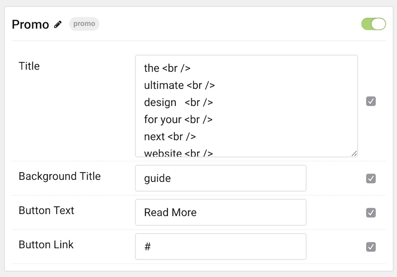

## Introduction

The **Promo** particle is a clean, two-layer promotional content block you can use to draw interest to an important feature of your website.

Here are the topics covered in this guide:

* [Configuration](#configuration)
    - [Main Options](#main-options)

## Configuration

### Main Options 

| Option           | Description                                                                                 |
| :-----           | :-----                                                                                      |
| Particle Name    | Enter the name you would like to assign to the particle. This only appears in the back end. |
| Title            | Enter the title of the particle, as it will appear on the front end.                        |
| Background Title | Enter a background title you would like to have appear on the front end.                    |
| Button Text      | Enter text that will appears as the button link for the particle.                           |
| Button Link      | Add the link you would like the button text to go to.                                       |