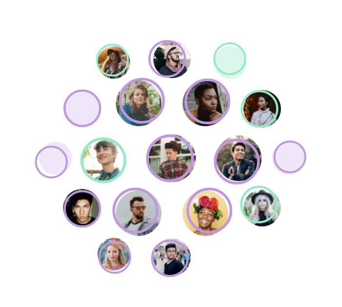
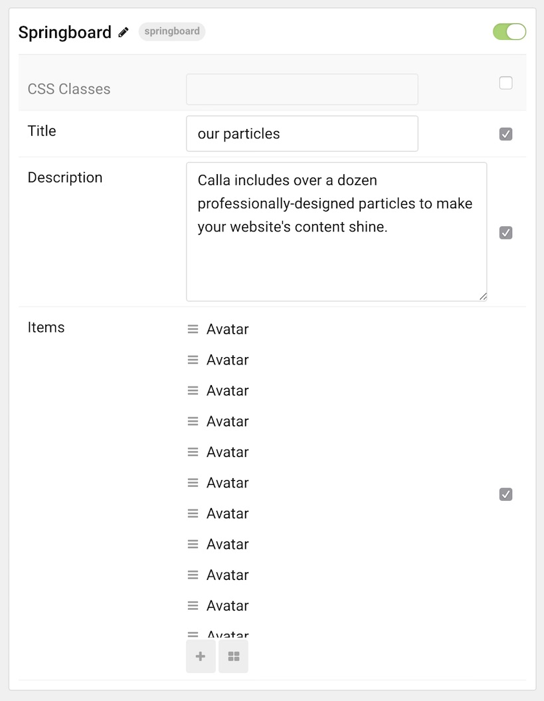
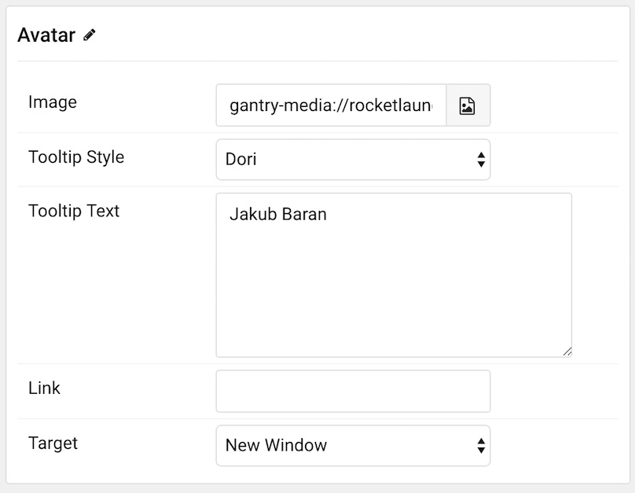

## Introduction

The **Springboard** particle is a unique way to introduce visitors to your team. Rounded avatar images and colorful accents make it a perfect addition to the Calla design.

Here are the topics covered in this guide:

* [Configuration](#configuration)
    - [Main Options](#main-options)
    - [Item Options](#item-options)

## Configuration

### Main Options 

These options affect the main area of the particle, and not the individual items within.

| Option        | Description                                                                                 |
| :-----        | :-----                                                                                      |
| Particle Name | Enter the name you would like to assign to the particle. This only appears in the back end. |
| CSS Classes   | Enter the CSS class(es) you want to use in the content of the particle.                     |
| Title         | Enter a title for the particle.                                                             |
| Description   | Enter a description for your particle.                                                      |

### Item Options

These items make up the individual featured items in the particle.

| Option        | Description                                                         |
| :-----        | :-----                                                              |
| Image         | Point the item to the image you wish to have featured in this item. |
| Tooltip Style | Select a style of tooltip to appear on hover.                       |
| Tooltip Text  | Enter text to appear in the tooltip for the item.                   |
| Link          | Enter any link you wish the item to sent the visitor to.            |
| Target        | Select a target window for the link to open in.                     |

