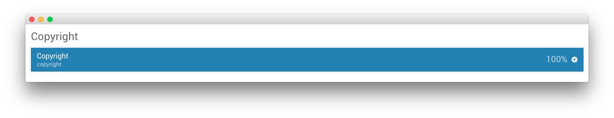

## Introduction

The **Copyright** section is made up of a single particle displaying the site's **copyright** information.

Settings used in the demo for the particle used in this section can be found below.

### Custom HTML (Particle)

#### Particle Settings

| Field           | Setting            |
| :-----          | :-----             |
| Particle Name   | `Copyright`        |
| Start Year      | `2007`             |
| End Year        | Now                |
| Copyright Owner | `RocketTheme, LLC` |

#### Block Settings

| Field          | Setting  |
| :-----         | :-----   |
| CSS ID         | Blank    |
| CSS Classes    | `center` |
| Variations     | Blank    |
| Tag Attributes | Blank    |
| Block Size     | `100%`   |