## Introduction

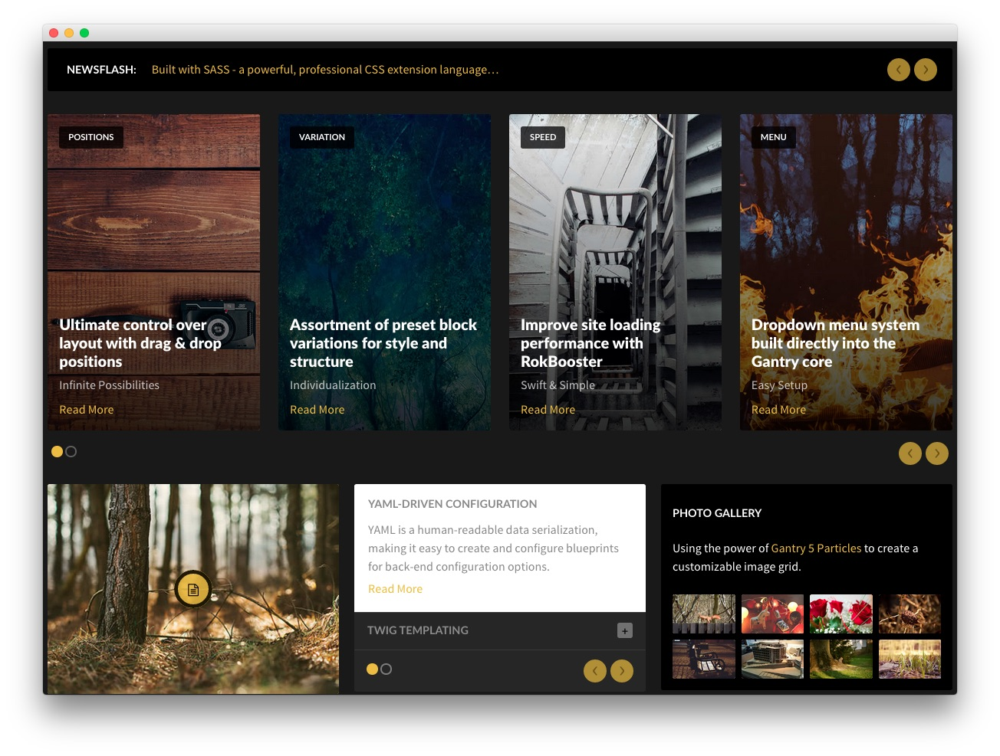

:   1. **Module Position (extension-a)** [7%, 5%, se]
    2. **Module Position (extension-b)** [17%, 5%, se]
    3. **Promo Image (Particle)** [65%, 5%, se]
    4. **Module Position (extension-c)** [65%, 37%, se]
    5. **Image Grid (Particle)** [65%, 68%, se]

The **Extension** section is made up three **Module Positions**, a **Promo Image** particle, and an **Image Grid** particle. These particles and positions span three rows.

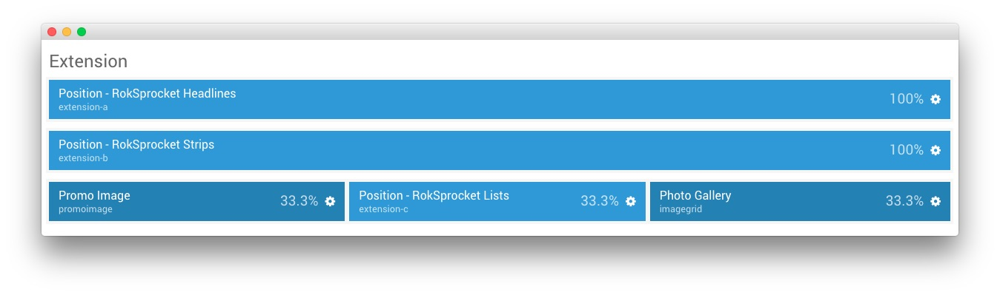

Settings used in our demo for each of these particles can be found below.

## Section Settings

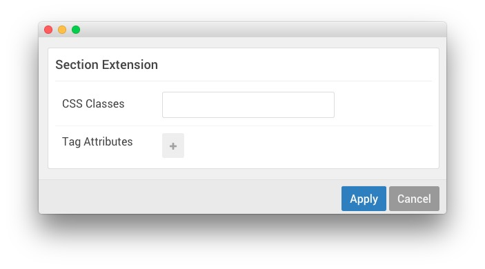

| Field          | Setting |
| :-----         | :-----  |
| CSS Classes    | Blank   |
| Tag Attributes | Blank   |

## Module Position (extension-a)

### Particle Settings

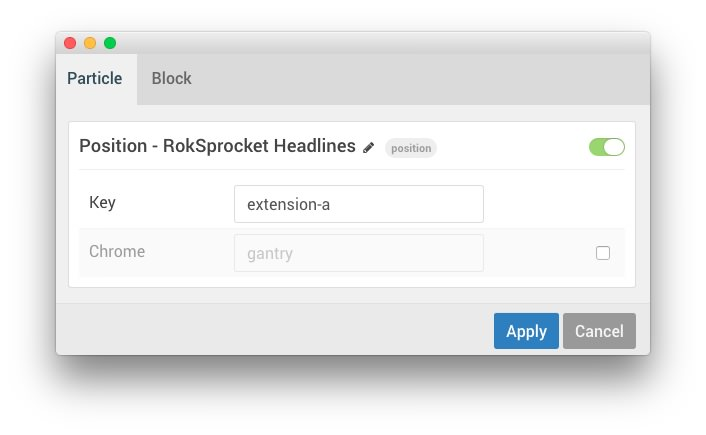

| Field         | Setting                            |
| :-----        | :-----                             |
| Particle Name | `Position - RokSprocket Headlines` |
| Key           | `extension-a`                      |
| Chrome        | `gantry`                           |

### Block Settings

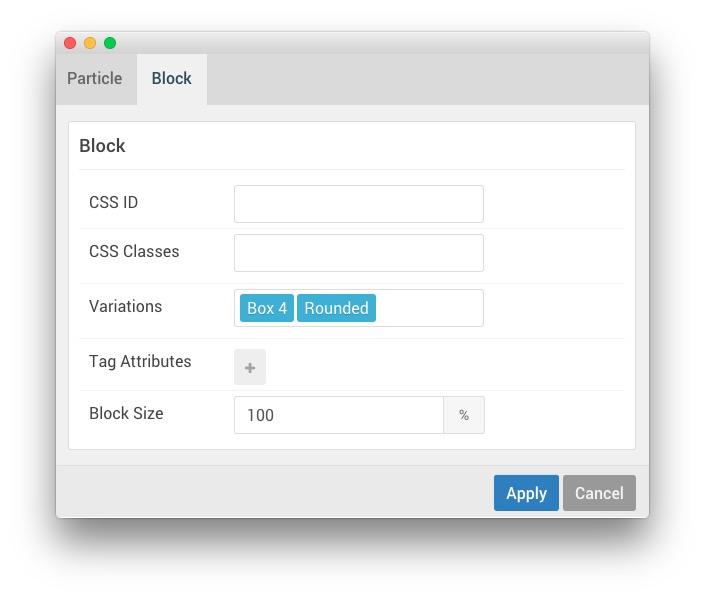

| Field          | Setting          |
| :-----         | :-----           |
| CSS ID         | Blank            |
| CSS Classes    | Blank            |
| Variations     | `Box 4, Rounded` |
| Tag Attributes | Blank            |
| Block Size     | `100%`           |

## Assigned Module(s)

The **RokSprocket** module used here utilizes the **Headlines** layout type to present interesting information to visitors in a way that maximizes a relatively small amount of space.

### Details

| Option           | Setting                    |
| :-----           | :-----                     |
| Title            | `FP RokSprocket Headlines` |
| Show Title       | Hide                       |
| Access           | Public                     |
| Position         | extension-a                |
| Status           | Published                  |
| Content Provider | Simple                     |
| Type             | Headlines                  |

### Simple Content Provider

In this instance, we used the **Simple** content provider to enable us to create custom content for the module without having to create entire articles for it. Below is an example of the settings used on a **Simple Item** in this module.

| Option      | Setting                                                              |
| :-----      | :------                                                              |
| Image       | None                                                                 |
| Link        | `#`                                                                  |
| Description | `Built with SASS - a powerful, professional CSS extension language…` |

### Layout Options

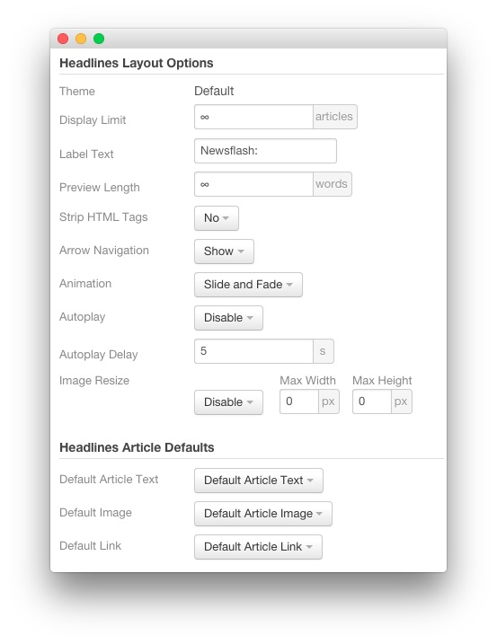

| Option           | Setting        |
| :------          | :------        |
| Theme            | Default        |
| Display Limit    | `∞`            |
| Label Text       | `Newsflash:`   |
| Preview Length   | `∞`            |
| Strip HTML Tags  | No             |
| Arrow Navigation | Show           |
| Animation        | Slide and Fade |
| Autoplay         | Disable        |
| Autoplay Delay   | 5              |
| Image Resize     | Disable        |

### Advanced

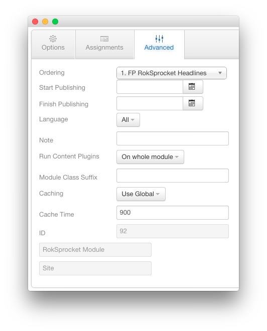

| Option              | Setting |
| :------             | :------ |
| Module Class Suffix |         |

## Module Position (extension-b)

### Particle Settings

| Field         | Setting                            |
| :-----        | :-----                             |
| Particle Name | `Position - RokSprocket Strips` |
| Key           | `extension-b`                      |
| Chrome        | `gantry`                           |

### Block Settings

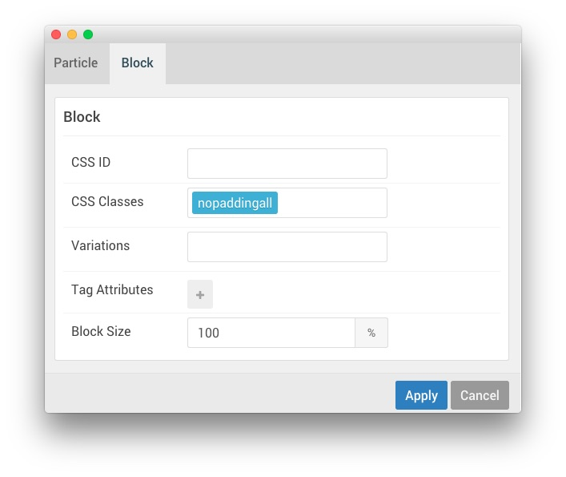

| Field          | Setting        |
| :-----         | :-----         |
| CSS ID         | Blank          |
| CSS Classes    | `nopaddingall` |
| Variations     | Blank          |
| Tag Attributes | Blank          |
| Block Size     | `100%`         |

## Assigned Module(s)

We used a **RokSprocket** module with the **Strips** layout to make up this area of the front page. You will find the settings used in our demo below.

We utilized the **Simple** Content Provider, linking each item in the RokSprocket module to an article. You can find examples of the **Simple** items used in this module in the **Filtered Article List** section below.

### Details

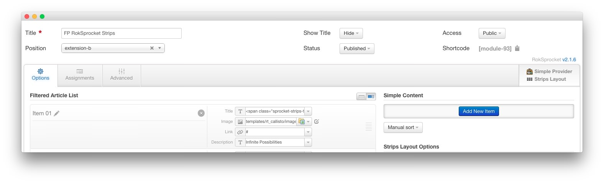

| Option           | Setting                 |
| :-----           | :-----                  |
| Title            | `FP RokSprocket Strips` |
| Show Title       | Hide                    |
| Access           | Public                  |
| Position         | extension-a             |
| Status           | Published               |
| Content Provider | Simple                  |
| Type             | Strips                  |

### Filtered Article List

#### Item 1

| Option      | Setting                                                                                                         |
| :-----      | :------                                                                                                         |
| Title       | `PositionsUltimate control over layout with drag &amp; drop positions` |
| Image       | Custom                                                                                                          |
| Link        | Custom                                                                                                          |
| Description | `Infinite Possibilities`                                                                                        |

#### Item 2

| Option      | Setting                                                                                                           |
| :-----      | :------                                                                                                           |
| Title       | `VariationAssortment of preset block variations for style and structure` |
| Image       | Custom                                                                                                            |
| Link        | Custom                                                                                                            |
| Description | `Individualization`                                                                                               |

#### Item 3

| Option      | Setting                                                                                          |
| :-----      | :------                                                                                          |
| Title       | `SpeedImprove site loading performance with RokBooster` |
| Image       | Custom                                                                                           |
| Link        | Custom                                                                                           |
| Description | `Swift &amp; Simple`                                                                             |

### Layout Options

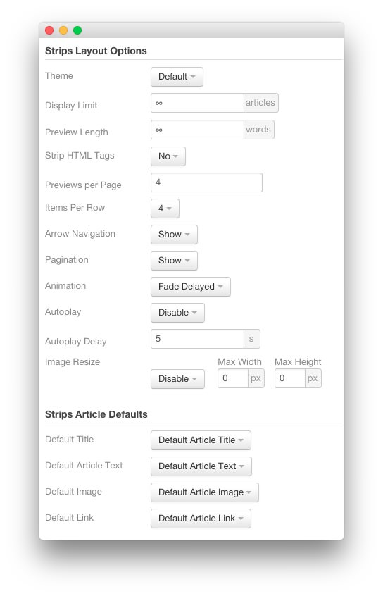

| Option            | Setting      |
| :----------       | :----------  |
| Theme             | Default      |
| Display Limit     | ∞            |
| Preview Length    | ∞            |
| Strip HTML Tags   | No           |
| Previews Per Page | `4`          |
| Items Per Row     | 4            |
| Arrow Navigation  | Show         |
| Pagination        | Show         |
| Animation         | Fade Delayed |
| Autoplay          | Disable      |
| Autoplay Delay    | 5            |
| Image Resize      | Disable      |

### Advanced

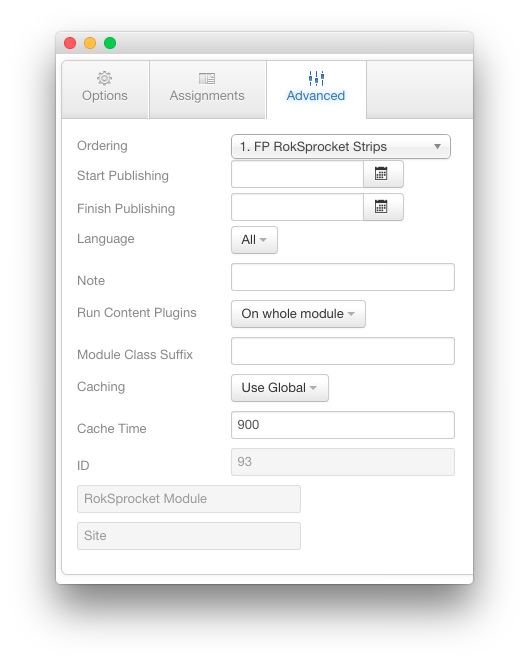

| Option              | Setting     |
| :----------         | :---------- |
| Module Class Suffix |             |

## Promo Image (Particle)

### Particle Settings

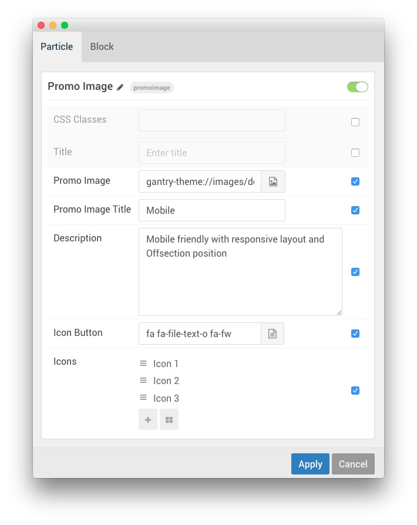

| Field             | Setting                                                          |
| :-----            | :-----                                                           |
| Particle Name     | `Promo Image`                                                    |
| CSS Classes       | Blank                                                            |
| Title             | Blank                                                            |
| Promo Image       | Custom                                                           |
| Promo Image Title | `Mobile`                                                         |
| Description       | `Mobile friendly with responsive layout and Offsection position` |
| Icon Button       | `fa fa-file-text-o fa-fw`                                        |
| Icon Item 1 Title | `Icon 1`                                                         |
| Icon Item 1 Icon  | `fa fa-heart fa-fw`                                              |
| Icon Item 1 Link  | `#`                                                              |
| Icon Item 2 Title | `Icon 2`                                                         |
| Icon Item 2 Icon  | `fa fa-file-text-o fa-fw`                                        |
| Icon Item 2 Link  | `#`                                                              |
| Icon Item 3 Title | `Icon 3`                                                         |
| Icon Item 3 Icon  | `fa fa-paperclip fa-fw`                                          |
| Icon Item 3 Link  | `#`                                                              |

### Block Settings

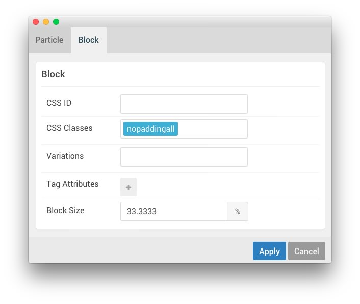

| Field          | Setting        |
| :-----         | :-----         |
| CSS ID         | Blank          |
| CSS Classes    | `nopaddingall` |
| Variations     | Blank          |
| Tag Attributes | Blank          |
| Block Size     | `33.3333%`     |

## Module Position (extension-c)

### Particle Settings

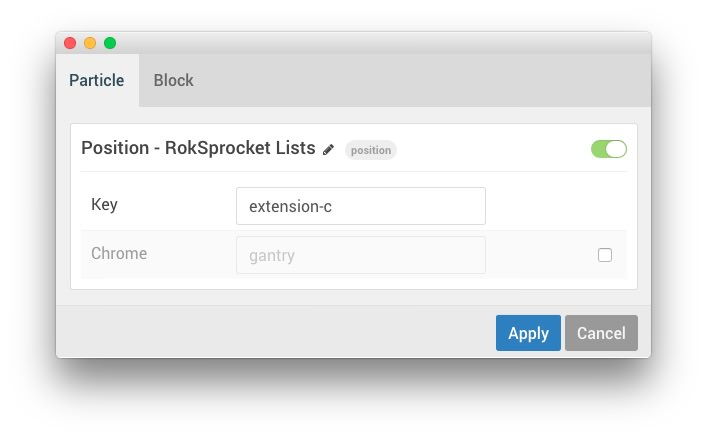

| Field         | Setting                        |
| :-----        | :-----                         |
| Particle Name | `Position - RokSprocket Lists` |
| Key           | `extension-c`                  |
| Chrome        | `gantry`                       |

### Block Settings

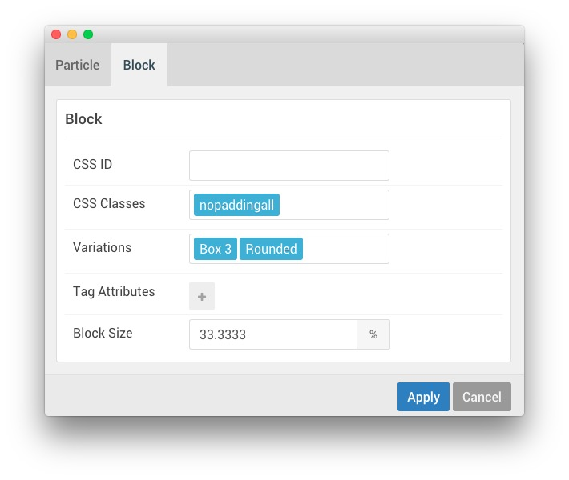

| Field          | Setting        |
| :-----         | :-----         |
| CSS ID         | Blank          |
| CSS Classes    | `nopaddingall` |
| Variations     | Blank          |
| Tag Attributes | Blank          |
| Block Size     | `33.3333%`     |

## Assigned Module(s)

We used a **RokSprocket** module with the **Lists** layout to make up this area of the front page. You will find the settings used in our demo below.

We utilized the **Simple** Content Provider, linking each item in the RokSprocket module to an article. You can find examples of the **Simple** items used in this module in the **Filtered Article List** section below.

### Details

| Option           | Setting                |
| :----------      | :----------            |
| Title            | `FP RokSprocket Lists` |
| Show Title       | Hide                   |
| Access           | Public                 |
| Position         | extension-c            |
| Status           | Published              |
| Content Provider | Simple                 |
| Type             | Lists                  |

### Filtered Article List

#### Item 1

| Option | Setting                                                        |
| :----- | :------                                                        |
| Title  | `YAML-driven Configuration` |
| Image  | None                                                           |
| Link   | Custom                                                         |

**Description**

~~~ .html

YAML is a human-readable data serialization, making it easy to create and configure blueprints for back-end configuration options.

~~~

#### Item 2

| Option | Setting           |
| :----- | :------           |
| Title  | `Twig Templating` |
| Image  | None              |
| Link   | Custom            |

**Description**

~~~ .html

    Gantry 5 utilizes Twig - a flexible,
    fast, and secure template engine for PHP - to make creating powerful, dynamic themes quick and
    easy.

~~~

#### Item 3

| Option | Setting            |
| :----- | :------            |
| Title  | `Particles System` |
| Image  | None               |
| Link   | Custom             |

**Description**

~~~ .html

    Gantry 5's Particles system makes it easy to create, configure, and manage content blocks
    on multiple levels.

    Gantry 5's Particle system for managing content blocks.

~~~

### Layout Options

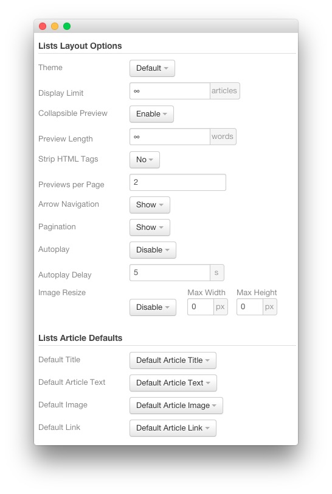

| Option              | Setting     |
| :----------         | :---------- |
| Theme               | Default     |
| Display Limit       | `∞`         |
| Collapsible Preview | Enable      |
| Preview Length      | `∞`         |
| Strip HTML Tags     | No          |
| Previews Per Page   | `2`         |
| Arrow Navigation    | Show        |
| Pagination          | Show        |
| Autoplay            | Disable     |
| Autoplay Delay      | 5           |
| Image Resize        | Disable     |

### Advanced

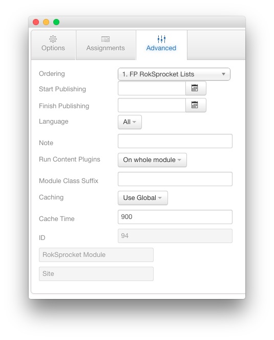

| Option              | Setting     |
| :----------         | :---------- |
| Module Class Suffix |             |

## Image Grid (Particle)

### Particle Settings

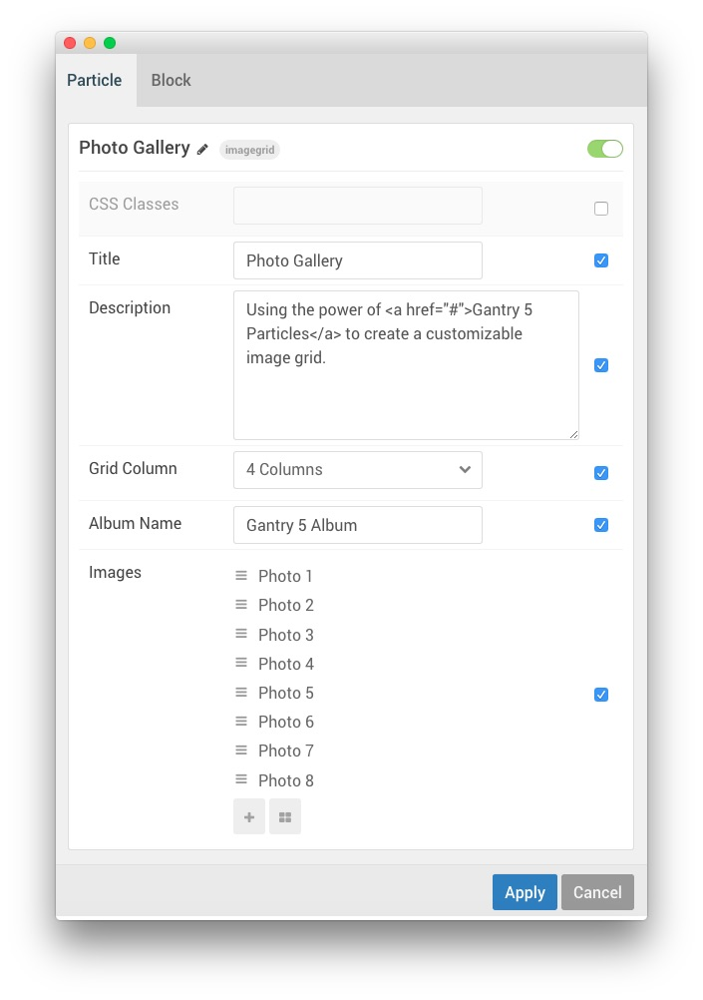

| Field               | Setting                                                                                      |
| :-----              | :-----                                                                                       |
| Particle Name       | `Photo Gallery`                                                                              |
| CSS Classes         | Blank                                                                                        |
| Title               | `Photo Gallery`                                                                              |
| Description         | `Using the power of <a href="#">Gantry 5 Particles</a> to create a customizable image grid.` |
| Grid Column         | 4 Columns                                                                                    |
| Album Name          | `Gantry 5 Album`                                                                             |
| Image 1 Title       | `Photo 1`                                                                                    |
| Image 1 Promo Image | Custom                                                                                       |
| Image 1 Caption     | `RokBox Image 1`                                                                             |
| Image 1 Link        | `#`                                                                                          |
| Image 2 Title       | `Photo 2`                                                                                    |
| Image 2 Promo Image | Custom                                                                                       |
| Image 2 Caption     | `RokBox Image 2`                                                                             |
| Image 2 Link        | `#`                                                                                          |
| Image 3 Title       | `Photo 3`                                                                                    |
| Image 3 Promo Image | Custom                                                                                       |
| Image 3 Caption     | `RokBox Image 3`                                                                             |
| Image 3 Link        | `#`                                                                                          |
| Image 4 Title       | `Photo 4`                                                                                    |
| Image 4 Promo Image | Custom                                                                                       |
| Image 4 Caption     | `RokBox Image 4`                                                                             |
| Image 4 Link        | `#`                                                                                          |
| Image 5 Title       | `Photo 5`                                                                                    |
| Image 5 Promo Image | Custom                                                                                       |
| Image 5 Caption     | `RokBox Image 5`                                                                             |
| Image 5 Link        | `#`                                                                                          |
| Image 6 Title       | `Photo 6`                                                                                    |
| Image 6 Promo Image | Custom                                                                                       |
| Image 6 Caption     | `RokBox Image 6`                                                                             |
| Image 6 Link        | `#`                                                                                          |
| Image 7 Title       | `Photo 7`                                                                                    |
| Image 7 Promo Image | Custom                                                                                       |
| Image 7 Caption     | `RokBox Image 7`                                                                             |
| Image 7 Link        | `#`                                                                                          |
| Image 8 Title       | `Photo 8`                                                                                    |
| Image 8 Promo Image | Custom                                                                                       |
| Image 8 Caption     | `RokBox Image 8`                                                                             |
| Image 8 Link        | `#`                                                                                          |

### Block Settings

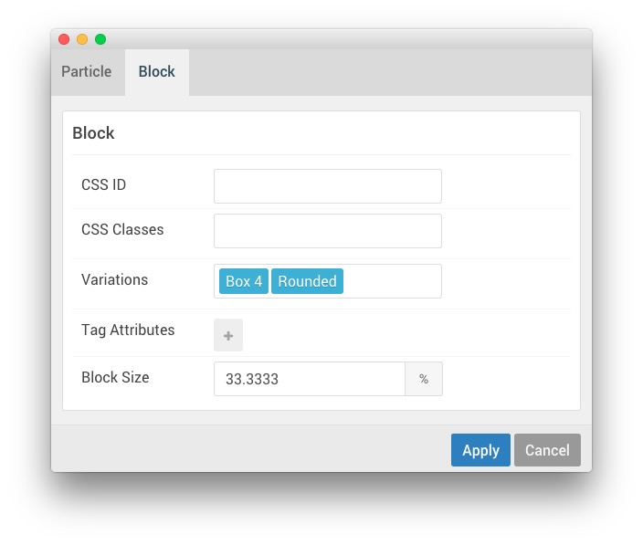

| Field          | Setting          |
| :-----         | :-----           |
| CSS ID         | Blank            |
| CSS Classes    | Blank            |
| Variations     | `Box 4, Rounded` |
| Tag Attributes | Blank            |
| Block Size     | `33.3333%`       |