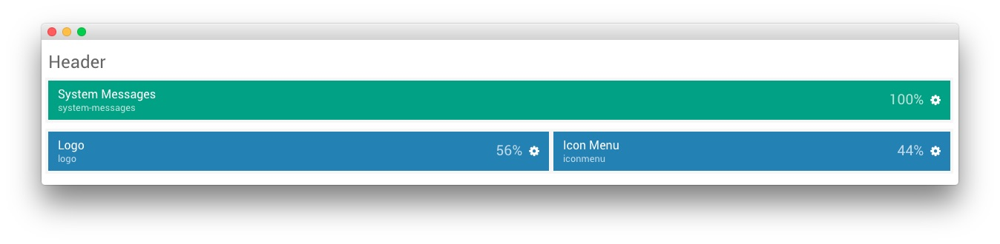
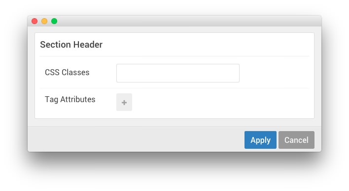

## Introduction

:   1. **Logo (Particle)** [40%, 5%, se]
    2. **Icon Menu (Particle)** [40%, 60%, se]

The **Header** section is made up of a position and two particles set in two rows. The first row hosts the **System Messages** position which remains invisible unless a system message is being displayed to the visitor.

In the second row, we have a **Logo** particle and an **Icon Menu** particle which make up the visual body of this area of the site. Settings used in our demo for each of these particles can be found below.

## Section Settings

| Field          | Setting |
| :-----         | :-----  |
| CSS Classes    | Blank   |
| Tag Attributes | Blank   |

## System Messages (Position)

The **System Messages** Position displays system messages in your layout. Always include this particle to all of your layouts. Otherwise users will not see important system messages like login failures.

### Particle Settings

### Block Settings

| Field          | Setting |
| :-----         | :-----  |
| CSS ID         | Blank   |
| CSS Classes    | Blank   |
| Variations     | Blank   |
| Tag Attributes | Blank   |
| Block Size     | `100%`  |

## Logo (Particle)

### Particle Settings

| Field         | Setting    |
| :-----        | :-----     |
| Particle Name | `Logo`     |
| URL           | Blank      |
| Image         | Custom     |
| Text          | `Callisto` |
| CSS Classes   | `g-logo`   |

### Block Settings

| Field          | Setting        |
| :-----         | :-----         |
| CSS ID         | Blank          |
| CSS Classes    | `g-logo-block` |
| Variations     | Blank          |
| Tag Attributes | Blank          |
| Block Size     | `56%`          |

## Icon Menu (Particle)

### Particle Settings

| Field                  | Setting          |
| :-----                 | :-----           |
| CSS Classes            | Blank            |
| Target                 | Self             |
| Icon Menu Item 1 Title | `Features`       |
| Icon Menu Item 1 Icon  | `fa fa-diamond`  |
| Icon Menu Item 1 Text  | `Features`       |
| Icon Menu Item 1 Link  | `#`              |
| Icon Menu Item 2 Title | `Gantry 5`       |
| Icon Menu Item 2 Icon  | `fa fa-rocket`   |
| Icon Menu Item 2 Text  | `Gantry 5`       |
| Icon Menu Item 2 Link  | `#`              |
| Icon Menu Item 3 Title | `Addons`         |
| Icon Menu Item 3 Icon  | `fa fa-gear`     |
| Icon Menu Item 3 Text  | `Addons`         |
| Icon Menu Item 3 Link  | `#`              |
| Icon Menu Item 4 Title | `Download`       |
| Icon Menu Item 4 Icon  | `fa fa-download` |
| Icon Menu Item 4 Text  | `Download`       |
| Icon Menu Item 4 Link  | `#`              |

### Block Settings

| Field          | Setting |
| :-----         | :-----  |
| CSS ID         | Blank   |
| CSS Classes    | `flush` |
| Variations     | Blank   |
| Tag Attributes | Blank   |
| Block Size     | `44%`   |
