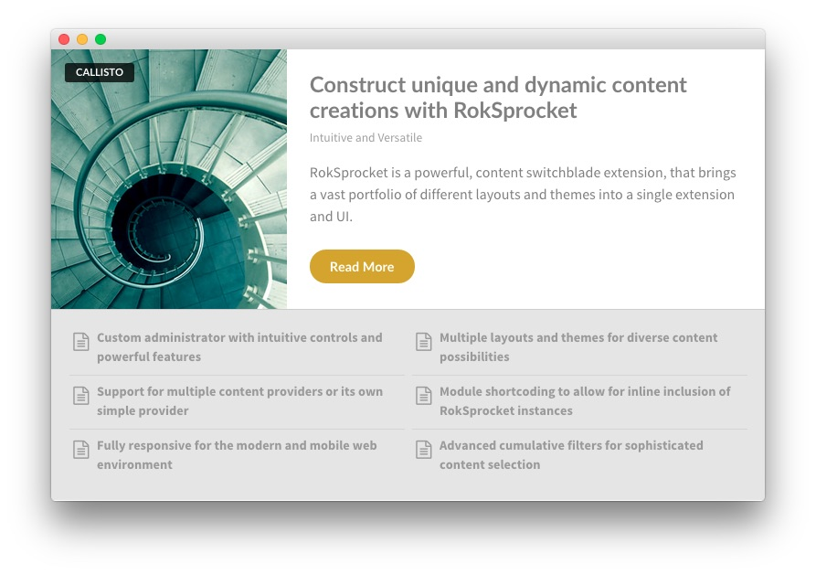
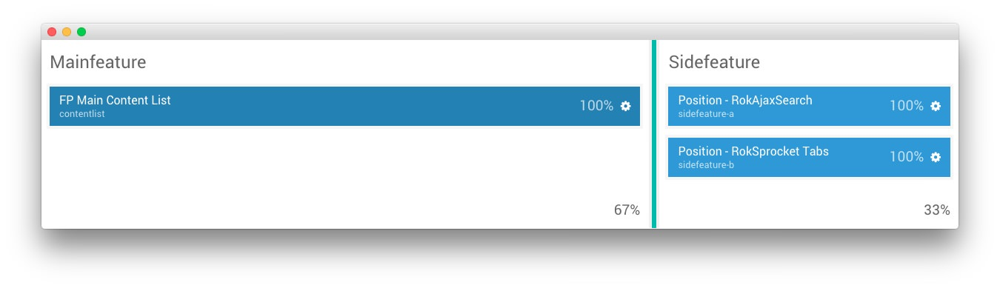
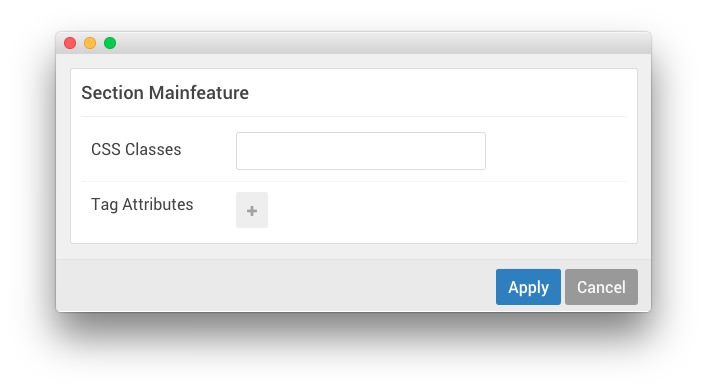
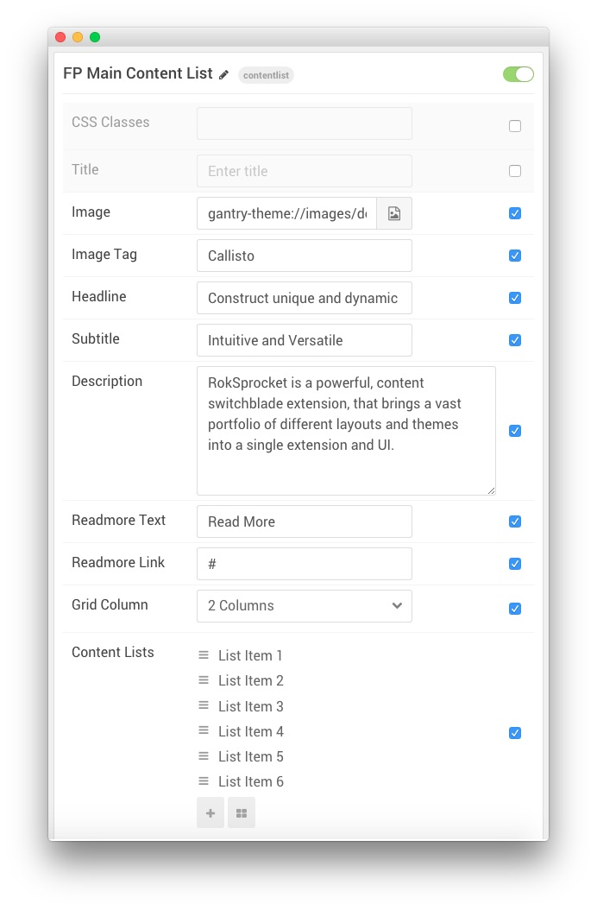
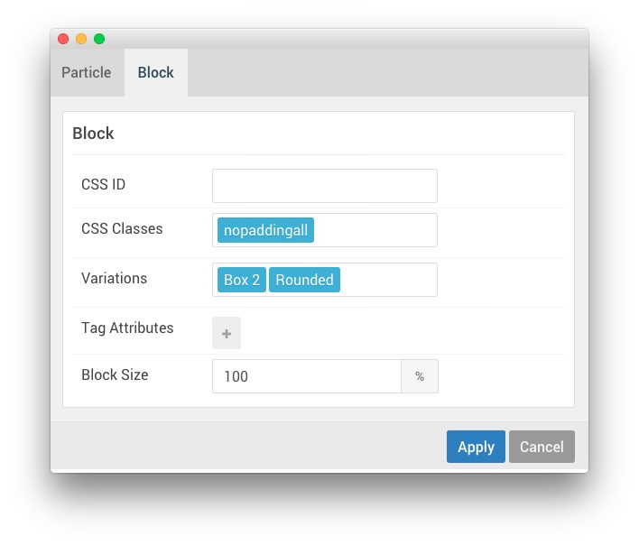

## Introduction

The **Mainfeature** section itself sits side-by-side with the **Sidebar** section. It is set to `67`% width and the **Sidebar** section to `33`%.

Settings used in the demo for the particle used in this section can be found below.

## Section Settings

| Field          | Setting |
| :-----         | :-----  |
| CSS Classes    | Blank   |
| Tag Attributes | Blank   |

## Content List (Particle)

### Particle Settings

| Field                     | Setting                                                                                              |
| :-----                    | :-----                                                                                               |
| Particle Name             | `FP Main Content List`                                                                               |
| CSS Classes               | Blank                                                                                                |
| Title                     | Blank                                                                                                |
| Image                     | Custom                                                                                               |
| Image Tag                 | `Callisto`                                                                                           |
| Headline                  | `Construct unique and dynamic content creations with RokSprocket` |
| Subtitle                  | `Intuitive and Versatile`                                                                            |
| Readmore Text             | `Read More`                                                                                          |
| Readmore Link             | `#`                                                                                                  |
| Grid Column               | 2 Columns                                                                                            |
| Content List Item 1 Title | `List Item 1`                                                                                        |
| Content List Item 1 Icon  | `fa fa-file-text-o fa-fw`                                                                            |
| Content List Item 1 Text  | `Custom administrator with intuitive controls and powerful features`                                 |
| Content List Item 1 Link  | `#`                                                                                                  |
| Content List Item 2 Title | `List Item 2`                                                                                        |
| Content List Item 2 Icon  | `fa fa-file-text-o fa-fw`                                                                            |
| Content List Item 2 Text  | `Multiple layouts and themes for diverse content possibilities`                                      |
| Content List Item 2 Link  | `#`                                                                                                  |
| Content List Item 3 Title | `List Item 3`                                                                                        |
| Content List Item 3 Icon  | `fa fa-file-text-o fa-fw`                                                                            |
| Content List Item 3 Text  | `Support for multiple content providers or its own simple provider`                                  |
| Content List Item 3 Link  | `#`                                                                                                  |
| Content List Item 4 Title | `List Item 4`                                                                                        |
| Content List Item 4 Icon  | `fa fa-file-text-o fa-fw`                                                                            |
| Content List Item 4 Text  | `Module shortcoding to allow for inline inclusion of RokSprocket instances`                          |
| Content List Item 4 Link  | `#`                                                                                                  |
| Content List Item 5 Title | `List Item 5`                                                                                        |
| Content List Item 5 Icon  | `fa fa-file-text-o fa-fw`                                                                            |
| Content List Item 5 Text  | `Fully responsive for the modern and mobile web environment`                                         |
| Content List Item 5 Link  | `#`                                                                                                  |
| Content List Item 6 Title | `List Item 6`                                                                                        |
| Content List Item 6 Icon  | `fa fa-file-text-o fa-fw`                                                                            |
| Content List Item 6 Text  | `Advanced cumulative filters for sophisticated content selection`                                    |
| Content List Item 6 Link  | `#`                                                                                                  |

**Description**
~~~ .html
RokSprocket is a powerful, content switchblade extension, that brings a vast portfolio of different layouts and themes into a single extension and UI.
~~~

### Block Settings

| Field          | Setting          |
| :-----         | :-----           |
| CSS ID         | Blank            |
| CSS Classes    | `nopaddingall`   |
| Variations     | `Box 2, Rounded` |
| Tag Attributes | Blank            |
| Block Size     | `100%`           |
