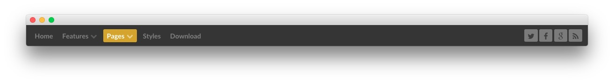
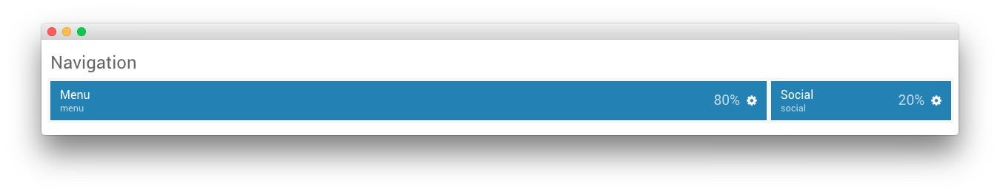
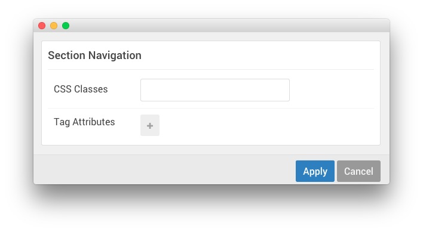

## Introduction

:   1. **Menu (Particle)** [40%, 5%, se]
    2. **Social** [40%, 85%, se]

The **Navigation** section is made up of two particles. The first is a **Menu** particle which displays a CMS-sourced menu which can be enhanced through Gantry's **Menu Editor**. The second particle in the section is the **Social** particle, displaying social links.

Settings used in our demo for each of these particles can be found below.

## Section Settings

| Field          | Setting |
| :-----         | :-----  |
| CSS Classes    | Blank   |
| Tag Attributes | Blank   |

### Menu (Particle)

By default, the **Menu** particle grabs the default menu and displays it. If you are visiting from a mobile device, this particle does not appear. Instead, the **Mobile Menu** particle that is assigned to the **Offcanvas** section will appear on the frontend. You can test this by adjusting the width of your browser window.

#### Particle Settings

| Field         | Setting |
| :-----        | :-----  |
| Particle Name | `Menu`  |
| Base Path     | `/`     |
| Menu          | Custom  |
| Start Level   | `1`     |
| Max Levels    | `0`     |

#### Block Settings

| Field          | Setting        |
| :-----         | :-----         |
| CSS ID         | Blank          |
| CSS Classes    | `g-menu-block` |
| Variations     | Blank          |
| Tag Attributes | Blank          |
| Block Size     | `80%`          |

### Social (Particle)

#### Particle Settings

| Field               | Setting                                          |
| :-----              | :-----                                           |
| Particle Name       | `Social`                                           |
| CSS Classes         | `social-items`                                   |
| Social Items        | `Features`                                       |
| Social Item 1 Title | `Twitter`                                        |
| Social Item 1 Icon  | `fa fa-twitter fa-fw`                            |
| Social Item 1 Text  | Blank                                            |
| Social Item 1 Link  | `http://twitter.com/rockettheme`                 |
| Social Item 2 Title | `Facebook`                                       |
| Social Item 2 Icon  | `fa fa-facebook fa-fw`                           |
| Social Item 2 Text  | Blank                                            |
| Social Item 2 Link  | `http://facebook.com/rockettheme`                |
| Social Item 3 Title | `Google`                                         |
| Social Item 3 Icon  | `fa fa-google fa-fw`                             |
| Social Item 3 Text  | Blank                                            |
| Social Item 3 Link  | `http://plus.google.com/+rockettheme`            |
| Social Item 4 Title | `RSS`                                            |
| Social Item 4 Icon  | `fa fa-rss fa-fw`                                |
| Social Item 4 Text  | Blank                                            |
| Social Item 4 Link  | `http://www.rockettheme.com/product-updates?rss` |

#### Block Settings

| Field          | Setting |
| :-----         | :-----  |
| CSS ID         | Blank   |
| CSS Classes    | Blank   |
| Variations     | Blank   |
| Tag Attributes | Blank   |
| Block Size     | `20%`   |
