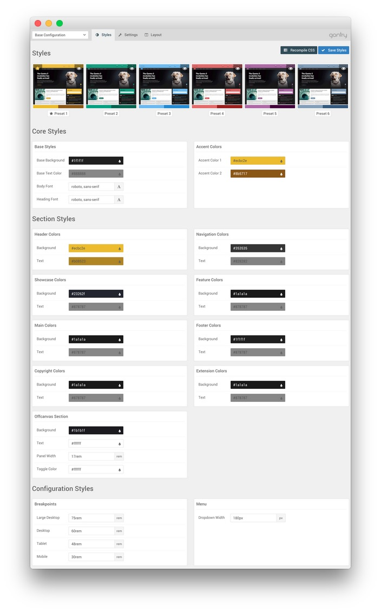

Theme Style Settings
-----

One of the most important aspects of any Gantry template is its ability to be easily customized using the settings present in the Template Settings page. These settings can be adjusted by navigating to **Administration -> Components -> Gantry 5 Themes -> Callisto**. To replicate the demo, the styling changes being made **Styles** tab.

This table will break down the various settings you may need to adjust in order to recreate the demo. Most of the settings under **Styles** are adjusted automatically with the selection of a template preset. You can set presets using the **Presets** options located at the top of the **Styles** admin panel.

Once you have selected a Preset, these options can be further adjusted to match the demo. Keep in mind that the Style indicated here relates to the template Style in this menu. More information about how Styles work can be found in our [Gantry documentation](http://docs.gantry.org/gantry5/configure/styles).

### Core Styles

| Configuration      | Category      | Option          | Setting              |
| :-----             | :-----        | :-----          |                      |
| Base Configuration | Base Styles   | Base Background | `#1f1f1f`            |
| Base Configuration | Base Styles   | Base Text Color | `#888888`            |
| Base Configuration | Base Styles   | Body Font       | `roboto, sans-serif` |
| Base Configuration | Base Styles   | Heading Font    | `roboto, sans-serif` |
| Base Configuration | Accent Colors | Accent Color 1  | `#ecbc2e`            |
| Base Configuration | Accent Colors | Accent Color 2  | `#8b5717`            |

### Section Styles

| Configuration      | Category          | Option       | Setting   |
| :-----             | :-----            | :-----       |           |
| Base Configuration | Header Colors     | Background   | `#ecbc2e` |
| Base Configuration | Header Colors     | Text         | `#b08523` |
| Base Configuration | Navigation Colors | Background   | `#353535` |
| Base Configuration | Navigation Colors | Text         | `#828282` |
| Base Configuration | Showcase Colors   | Background   | `#23262f` |
| Base Configuration | Showcase Colors   | Text         | `#878787` |
| Base Configuration | Feature Colors    | Background   | `#1a1a1a` |
| Base Configuration | Feature Colors    | Text         | `#878787` |
| Base Configuration | Main Colors       | Background   | `#1a1a1a` |
| Base Configuration | Main Colors       | Text         | `#878787` |
| Base Configuration | Footer Colors     | Background   | `#1f1f1f` |
| Base Configuration | Footer Colors     | Text         | `#878787` |
| Base Configuration | Copyright Colors  | Background   | `#1a1a1a` |
| Base Configuration | Copyright Colors  | Text         | `#878787` |
| Base Configuration | Extension Colors  | Background   | `#1a1a1a` |
| Base Configuration | Extension Colors  | Text         | `#878787` |
| Base Configuration | Offcanvas Section | Background   | `#1a1a1a` |
| Base Configuration | Offcanvas Section | Text         | `#878787` |
| Base Configuration | Offcanvas Section | Panel Width  | `17rem`   |
| Base Configuration | Offcanvas Section | Toggle Color | `#ffffff` |

### Configuration Styles

| Configuration      | Category    | Option          | Setting |
| :-----             | :-----      | :-----          |         |
| Base Configuration | Breakpoints | Large Desktop   | `75rem` |
| Base Configuration | Breakpoints | Desktop         | `60rem` |
| Base Configuration | Breakpoints | Tablet          | `48rem` |
| Base Configuration | Breakpoints | Mobile          | `30rem` |
| Base Configuration | Menu        | Dropdown Widths | `180px` |
