## Introduction

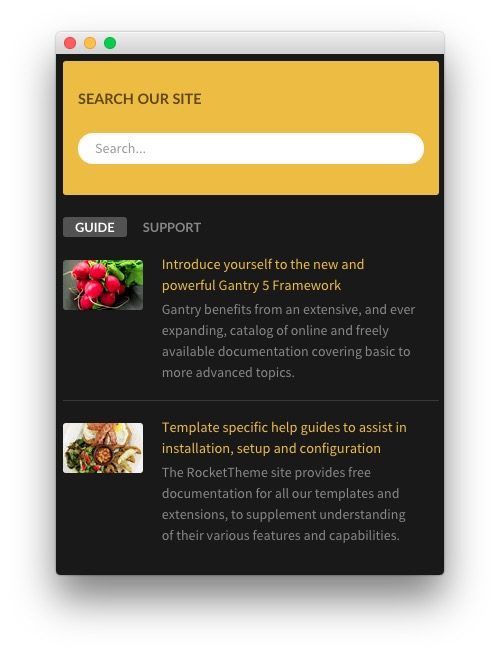

:   1. **Sidefeature A - RokAjaxSearch** [10%, 13%, se]
    2. **Sidefeature B - RokSProcket (Tabs)** [33%, 13%, se]

The **Sidefeature** section sits side-by-side with the **Mainfeature** section in the **Layout Manager**. It is set to take up `33%` of the total width of the page, and each **Particle** or **Module Position** will take up the full 33% if set to `100%` width, individually.

The **Sidefeature** section is made up of two **Module Positions**. These positions, once placed and set up in the **Layout Manager** make it possible to assign Modules to them that appear on your site.

Settings used in our demo for each of these particles can be found below.

## Section Settings

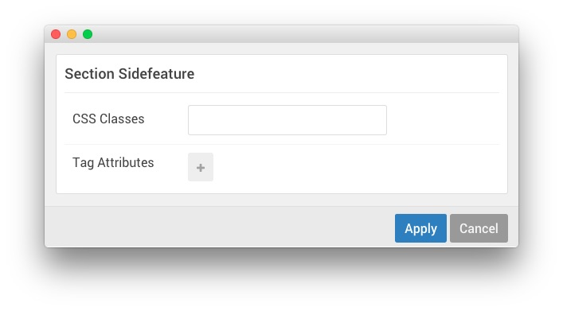

| Field          | Setting |
| :-----         | :-----  |
| CSS Classes    | Blank   |
| Tag Attributes | Blank   |

## Module Position (sidefeature-a)

### Particle Settings

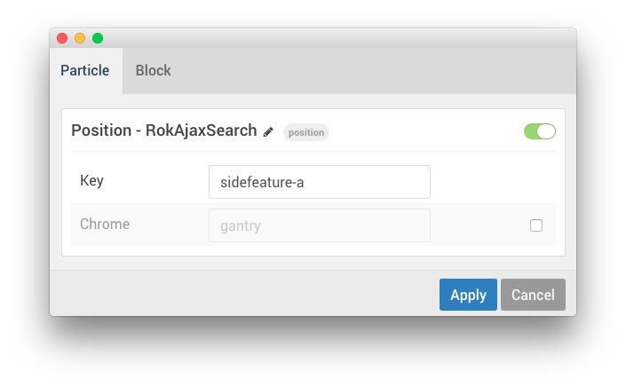

| Field         | Setting                    |
| :-----        | :-----                     |
| Particle Name | `Position - RokAjaxSearch` |
| Key           | `sidefeature-a`            |
| Chrome        | `gantry`                   |

### Block Settings

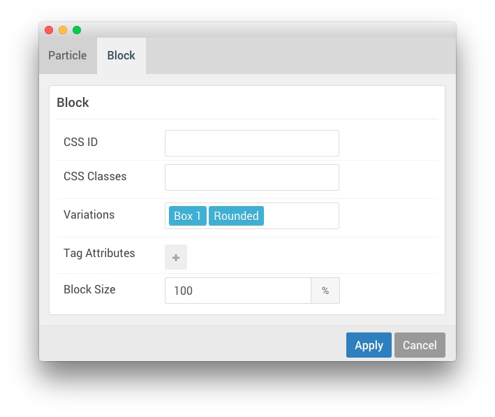

| Field          | Setting          |
| :-----         | :-----           |
| CSS ID         | Blank            |
| CSS Classes    | Blank            |
| Variations     | `Box 1, Rounded` |
| Tag Attributes | Blank            |
| Block Size     | `100%`           |

## Assigned Module(s)

The `sidefeature-a` module position is host to a single **RokAjaxSearch** module that allows visitors to search your site using the powerful RokAjaxSearch tool.

### Details

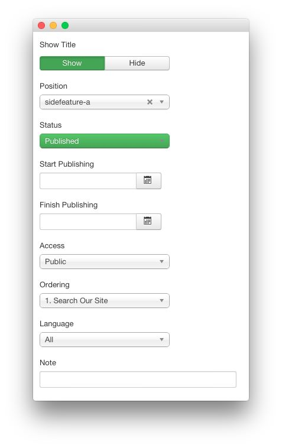

| Option      | Setting           |
| :---------- | :----------       |
| Title       | `Search Our Site` |
| Show Title  | Show              |
| Position    | sidefeature-a     |
| Status      | Published         |
| Access      | Public            |

### Module

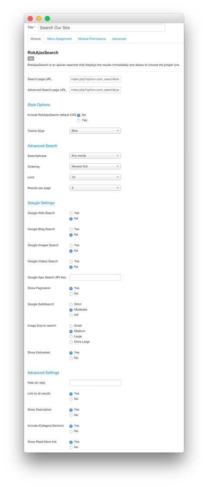

| Option                            | Setting                                                  |
| :----------                       | :----------                                              |
| Search Page URL                   | `index.php?option=com_search&view=search&tmpl=component` |
| Advanced Search Page URL          | `index.php?option=com_search&view=search`                |
| Include RokAjaxSearch default CSS | No                                                       |
| Theme Style                       | Blue                                                     |
| Searchphrase                      | Any words                                                |
| Ordering                          | Newest First                                             |
| Limit                             | 10                                                       |
| Results Per Page                  | 3                                                        |
| Google Web Search                 | No                                                       |
| Google Blog Search                | No                                                       |
| Google Images Search              | No                                                       |
| Google Videos Search              | No                                                       |
| Show Pagination                   | Yes                                                      |
| Google SafeSearch                 | Moderate                                                 |
| Image Size to Search              | Medium                                                   |
| Show Estimated                    | Yes                                                      |
| Hide div id(s)                    | Blank                                                    |
| Link to All Results               | Yes                                                      |
| Show Description                  | Yes                                                      |
| Include (Category/Section)        | Yes                                                      |
| Show Read More Link               | Yes                                                      |

### Advanced

| Option              | Setting     |
| :----------         | :---------- |
| Module Class Suffix |             |

## Module Position (sidefeature-b)

### Particle Settings

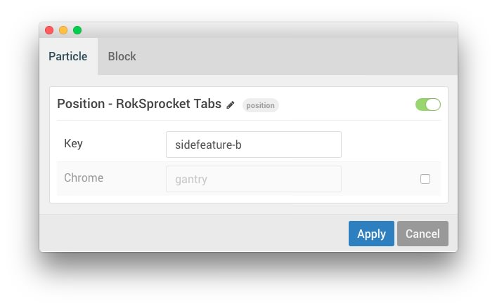

| Field         | Setting                       |
| :-----        | :-----                        |
| Particle Name | `Position - RokSprocket Tabs` |
| Key           | `sidefeature-b`               |
| Chrome        | `gantry`                      |

### Block Settings

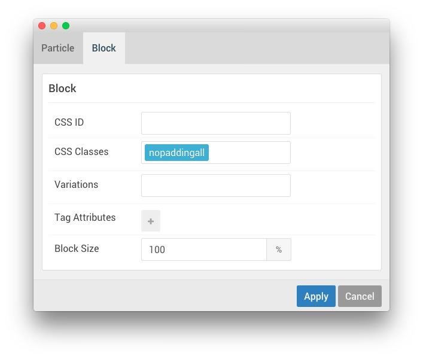

| Field          | Setting        |
| :-----         | :-----         |
| CSS ID         | Blank          |
| CSS Classes    | `nopaddingall` |
| Variations     | Blank          |
| Tag Attributes | Blank          |
| Block Size     | `100%`         |

## Assigned Module(s)

This area of the page is a **RokSprocket** module utilizing the **Simple** content provider and the **Tabs** layout.

The settings used in our demo are listed below.

### Details

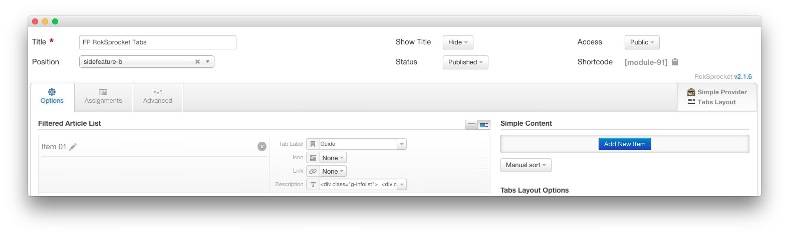

| Option           | Setting               |
| :--------------- | :-------------------- |
| Title            | `FP RokSprocket Tabs` |
| Show Title       | Hide                  |
| Access           | Public                |
| Position         | `sidefeature-a`       |
| Status           | Published             |
| Content Provider | Simple                |
| Layout Mode      | Tabs                  |

### Simple Content Provider

The **Tab Label** and **Description** fields in each item have been altered. A couple examples of these article changes can be found below.

#### Article 1

| Option    | Setting |
| :-----    | :-----  |
| Tab Label | `Guide` |
| Icon      | None    |
| Link      | None    |

**Description**

~~~ .html

    

        

        

            

                <a href="http://docs.gantry.org">Introduce yourself to
                the new and powerful Gantry 5 Framework</a>
            

            

                Gantry benefits from an extensive, and ever expanding,
                catalog of online and freely available documentation covering
                basic to more advanced
                topics.
            

        

    

    

        

        

            

                <a href="http://www.rockettheme.com/docs">Template
                specific help guides to
                assist in installation,
                setup and useconfiguration</a>
            

            

                The RocketTheme site provides free documentation for all
                our templates and extensions, to supplement understanding
                of their various features and
                capabilities.
            

        

    

~~~

#### Article 2

| Option    | Setting   |
| :-----    | :-----    |
| Tab Label | `Support` |
| Icon      | None      |
| Link      | None      |

**Description**

~~~ .html

    

        

        

            

                <a href="http://www.rockettheme.com/forum">A community forum to ask the moderators and developers
                questions</a>
            

            

                Our forums are monitored by a team of moderators, as well as
                the developers, to assist in general questions and problems
                relating to the templates and extensions.
            

        

    

    

        

        

            

                <a href="https://github.com/gantry/">Gantry is community driven
                and offers direct chat via
                Gitter</a>
            

            

                Github allows for an system where you can contribute code, post
                issues and feedback on the Gantry open source project.
                Discuss Gantry live with us via
                Gitter.
            

        

    

~~~

### Layout Options

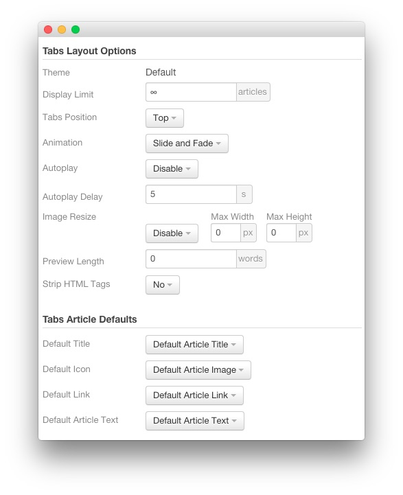

| Option                | Setting               |
| :-------------------- | :-------------------- |
| Theme                 | Default               |
| Display Limit         | `∞`                   |
| Tabs Position         | Top                   |
| Animation             | Slide and Fade        |
| Autoplay              | Disable               |
| Autoplay Delay        | `5`                   |
| Image Resize          | Disable               |
| Preview Length        | `0`                   |
| Strip HTML Tags       | No                    |
| Default Title         | Default Article Title |
| Default Article Text  | Default Article Text  |
| Default Article Image | Default Article Image |
| Default Link          | Default Article Link  |

### Advanced

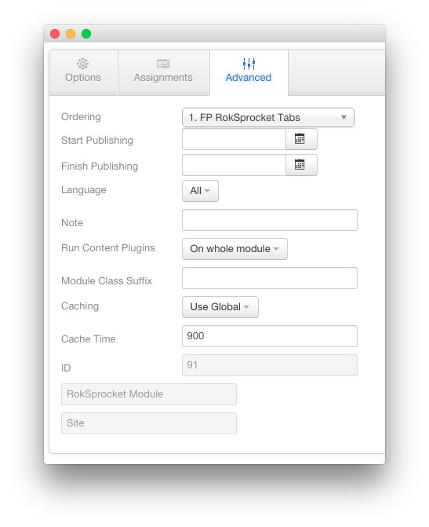

| Option              | Setting               |
| :------------------ | :-------------------- |
| Module Class Suffix |                       |
