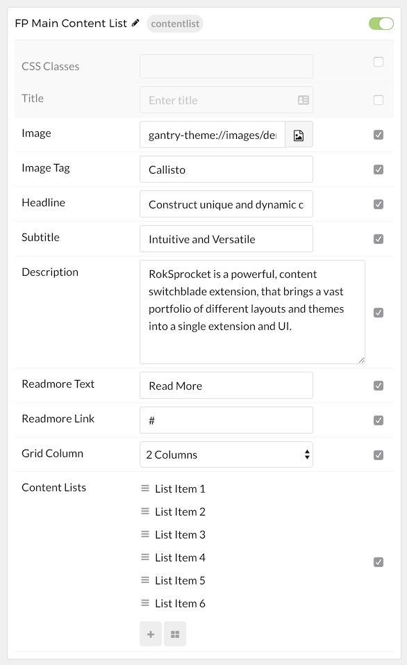

## Introduction

The **Content List** particle is an excellent choice for any situation where you want to create a content block that lists features and other tidbits of information.

Here are the topics covered in this guide:

* [Configuration](#configuration)
    - [Main Options](#main-options)
    - [Item Options](#item-options)

## Configuration

### Main Options 

These options affect the main area of the particle, and not the individual items within. You can set the title of the particle, as well as give it an introductory paragraph here.

| Option        | Description                                                                     |
| :-----        | :-----                                                                          |
| CSS Classes   | Set the CSS class(es) you would like to have apply at the particle level.       |
| Title         | Enter the title of the particle you would like to have appear on the front end. |
| Image         | Assign an image to the particle.                                                |
| Image Tag     | Customize the image tag.                                                        |
| Headline      | Enter a text headline here for the particle.                                    |
| Subtitle      | Enter a subtitle for the particle.                                              |
| Description   | Enter a description for the particle, appears under the subtitle.               |
| Readmore Text | Specify the readmore text.                                                      |
| Readmore Link | Specify the readmore link.                                                      |
| Grid Column   | Select the number of columns to display the content in.                         |

### Item Options

These items make up the individual featured items in the particle. They sit apart from the particle's title and introduction. Each item can have its own properties, including icons and written content.

| Option | Description                                                                                                                                                              |
| :----- | :-----                                                                                                                                                                   |
| Name   | The name of the item is what appears below the icon on the front end. This is in contrast to most particles where the individual item name only appears on the back end. |
| Icon   | Sets the primary icon for the item.                                                                                                                                      |
| Text   | Enter any text that you wish to have displayed in the item.                                                                                                              |
| Link   | Enter the URL you would like to have the item link to.                                                                                                                   |
