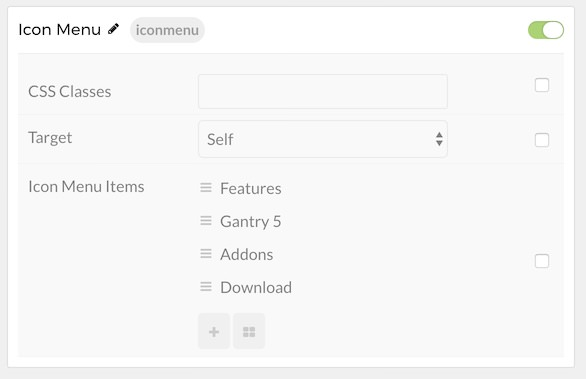

## Introduction

The **Icon Menu** particle enables you to create a quick custom menu using icons.

Here are the topics covered in this guide:

* [Configuration](#configuration)
    - [Main Options](#main-options)
    - [Item Options](#item-options)

## Configuration

### Main Options 

These options affect the main area of the particle, and not the individual items within.

| Option        | Description                                                                      |
| :-----        | :-----                                                                           |
| Particle Name | This name only appears in the back end.                                          |
| CSS Classes   | Enter the CSS class(es) you want to use in the content of the particle.          |
| Target        | Select between **Self** and **New Window** as the link targets for the particle. |

### Item Options

These items make up the individual featured items in the particle.

| Option | Description                                                                    |
| :----- | :-----                                                                         |
| Icon   | Select the icon you would like to have appear with the title area in the item. |
| Text   | Enter the title for the block item.                                            |
| Link   | Enter the url you want that link to go to.                                     |

