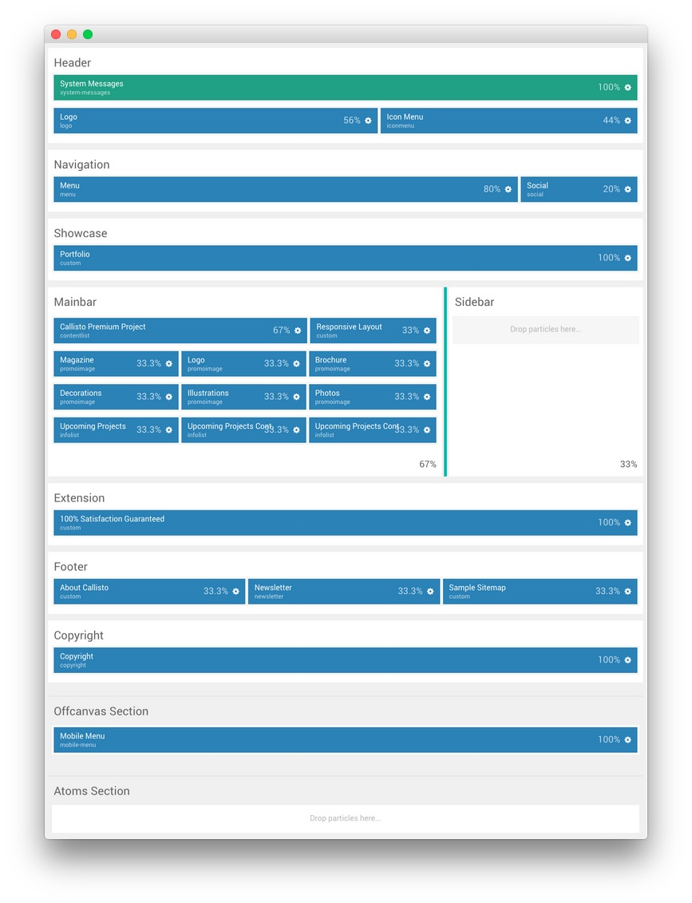
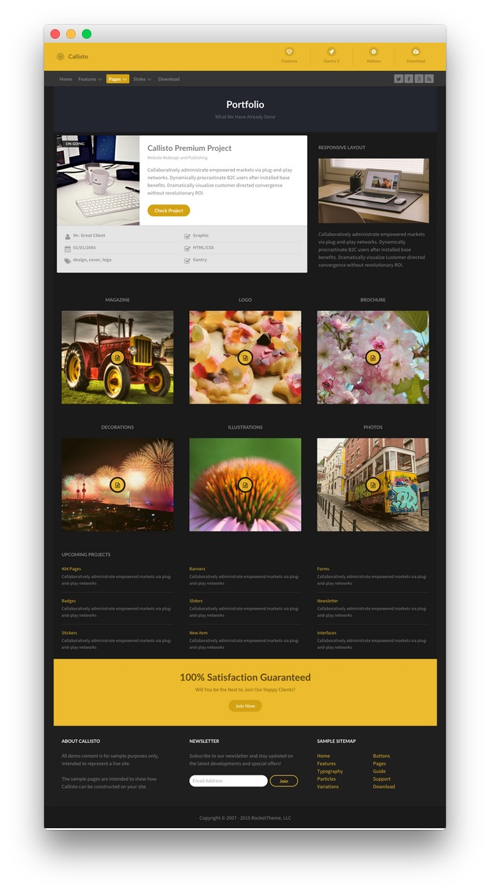
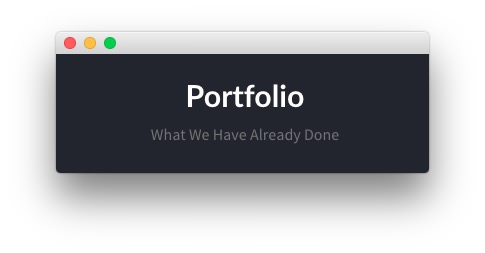
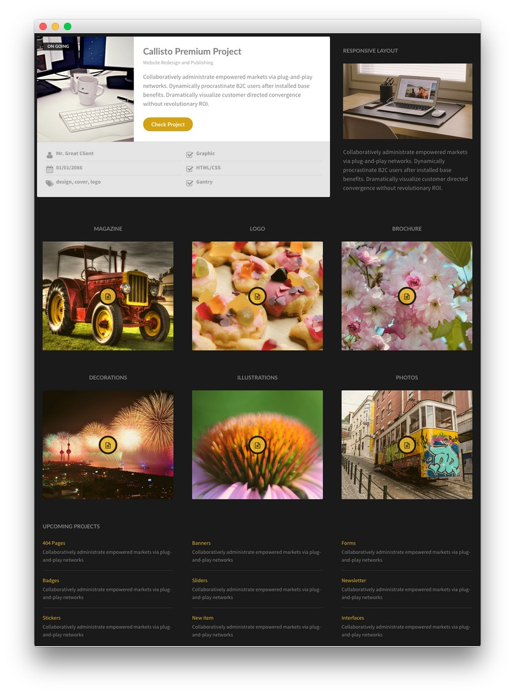
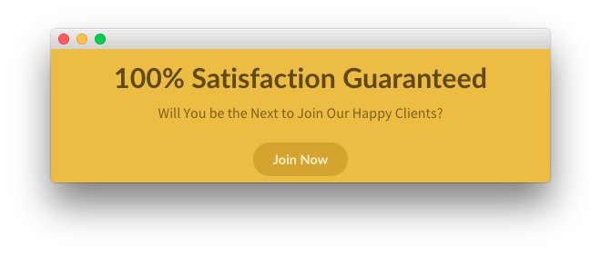

## Introduction

The **Portfolio** example page demonstrates how you can create a beautiful page with the Callisto template. Here is some information to help you replicate this page as it appears in the demo.

>> Any **Custom HTML** particles are available and set in the **Layout Manager**, not as **Custom HTML** modules.

## Layout Manager

This is a look at the **Layout Manager** for the **Callisto - Pages - Portfolio** outline. We have detailed the various particles represented here in the sections below.

## Modules and Particles

Below is a brief rundown of the modules and particles used to make up the demo page.

:   1. **Header - Logo** [6%, 11%, se]
    2. **Header - Icon Menu** [6%, 55%, se]
    3. **Navigation - Menu** [9%, 11%, se]
    4. **Navigation - Social** [9%, 78%, se]
    5. **Showcase - Custom HTML** [13%, 40%, se]
    6. **Mainbar - Content List** [16%, 11%, se]
    7. **Mainbar - Custom HTML** [16%, 65%, se]
    8. **Mainbar - Promo Image** [33%, 10%, se]
    9. **Mainbar - Promo Image** [33%, 38%, se]
    10. **Mainbar - Promo Image** [33%, 65%, se]
    11. **Mainbar - Promo Image** [48%, 10%, se]
    12. **Mainbar - Promo Image** [48%, 38%, se]
    13. **Mainbar - Promo Image** [48%, 65%, se]
    14. **Mainbar - Info List** [63%, 10%, se]
    15. **Mainbar - Info List** [63%, 38%, se]
    16. **Mainbar - Info List** [63%, 65%, se]
    17. **Extension - Custom HTML** [75%, 30%, se]
    18. **Footer - Custom HTML** [83%, 11%, se]
    19. **Footer - Newsletter** [83%, 38%, se]
    20. **Footer - Custom HTML - Copyright** [83%, 65%, se]
    21. **Copyright - Copyright** [92%, 40%, se]

1. [Header](#header-section)
2. [Navigation](#navigation-section)
3. [Showcase](#showcase-section)
4. [Mainbar](#mainbar-section)
5. [Extension](#extension-section)
6. [Footer](#footer-section)
7. [Copyright](#copyright-section)

## Header Section

:   1. **Logo (Particle)** [40%, 5%, se]
    2. **Icon Menu (Particle)** [40%, 60%, se]

The **Header** section is made up of a position and two particles set in two rows. The first row hosts the **System Messages** position which remains invisible unless a system message is being displayed to the visitor.

In the second row, we have a **Logo** particle and an **Icon Menu** particle which make up the visual body of this area of the site. Settings used in our demo for each of these particles can be found below.

### Logo (Particle)

#### Particle Settings

| Field         | Setting    |
| :-----        | :-----     |
| Particle Name | `Logo`     |
| URL           | Blank      |
| Image         | Custom     |
| Text          | `Callisto` |
| CSS Classes   | `g-logo`   |

#### Block Settings

| Field          | Setting        |
| :-----         | :-----         |
| CSS ID         | Blank          |
| CSS Classes    | `g-logo-block` |
| Variations     | Blank          |
| Tag Attributes | Blank          |
| Block Size     | `56%`          |

### Icon Menu (Particle)

#### Particle Settings

| Field                  | Setting          |
| :-----                 | :-----           |
| CSS Classes            | Blank            |
| Target                 | Self             |
| Icon Menu Item 1 Title | `Features`       |
| Icon Menu Item 1 Icon  | `fa fa-diamond`  |
| Icon Menu Item 1 Text  | `Features`       |
| Icon Menu Item 1 Link  | `#`              |
| Icon Menu Item 2 Title | `Gantry 5`       |
| Icon Menu Item 2 Icon  | `fa fa-rocket`   |
| Icon Menu Item 2 Text  | `Gantry 5`       |
| Icon Menu Item 2 Link  | `#`              |
| Icon Menu Item 3 Title | `Addons`         |
| Icon Menu Item 3 Icon  | `fa fa-gear`     |
| Icon Menu Item 3 Text  | `Addons`         |
| Icon Menu Item 3 Link  | `#`              |
| Icon Menu Item 4 Title | `Download`       |
| Icon Menu Item 4 Icon  | `fa fa-download` |
| Icon Menu Item 4 Text  | `Download`       |
| Icon Menu Item 4 Link  | `#`              |

#### Block Settings

| Field          | Setting |
| :-----         | :-----  |
| CSS ID         | Blank   |
| CSS Classes    | `flush` |
| Variations     | Blank   |
| Tag Attributes | Blank   |
| Block Size     | `44%`   |

## Navigation Section

:   1. **Menu (Particle)** [40%, 5%, se]
    2. **Social** [40%, 85%, se]

The **Navigation** section is made up of two particles. The first is a **Menu** particle which displays a CMS-sourced menu which can be enhanced through Gantry's **Menu Editor**. The second particle in the section is the **Social** particle, displaying social links.

Settings used in our demo for each of these particles can be found below.

### Menu (Particle)

#### Particle Settings

| Field         | Setting |
| :-----        | :-----  |
| Particle Name | `Menu`  |
| Base Path     | `/`     |
| Menu          | Custom  |
| Start Level   | `1`     |
| Max Levels    | `0`     |

#### Block Settings

| Field          | Setting        |
| :-----         | :-----         |
| CSS ID         | Blank          |
| CSS Classes    | `g-menu-block` |
| Variations     | Blank          |
| Tag Attributes | Blank          |
| Block Size     | `80%`          |

### Social (Particle)

#### Particle Settings

| Field               | Setting                                          |
| :-----              | :-----                                           |
| Particle Name       | `Social`                                         |
| CSS Classes         | `social-items`                                   |
| Social Items        | `Features`                                       |
| Social Item 1 Title | `Twitter`                                        |
| Social Item 1 Icon  | `fa fa-twitter fa-fw`                            |
| Social Item 1 Text  | Blank                                            |
| Social Item 1 Link  | `http://twitter.com/rockettheme`                 |
| Social Item 2 Title | `Facebook`                                       |
| Social Item 2 Icon  | `fa fa-facebook fa-fw`                           |
| Social Item 2 Text  | Blank                                            |
| Social Item 2 Link  | `http://facebook.com/rockettheme`                |
| Social Item 3 Title | `Google`                                         |
| Social Item 3 Icon  | `fa fa-google fa-fw`                             |
| Social Item 3 Text  | Blank                                            |
| Social Item 3 Link  | `http://plus.google.com/+rockettheme`            |
| Social Item 4 Title | `RSS`                                            |
| Social Item 4 Icon  | `fa fa-rss fa-fw`                                |
| Social Item 4 Text  | Blank                                            |
| Social Item 4 Link  | `http://www.rockettheme.com/product-updates?rss` |

#### Block Settings

| Field          | Setting |
| :-----         | :-----  |
| CSS ID         | Blank   |
| CSS Classes    | Blank   |
| Variations     | Blank   |
| Tag Attributes | Blank   |
| Block Size     | `20%`   |

## Showcase Section

The **Showcase** section contains a single **Custom HTML** particle. Settings used in our demo for this particle can be found below.

### Custom HTML (Particle)

#### Particle Settings

| Field         | Setting     |
| :-----        | :-----      |
| Particle Name | `Portfolio` |

**Custom HTML**
~~~ .html

    <h2 class="g-layercontent-title">Portfolio</h2>
    
What We Have Already Done

~~~

#### Block Settings

| Field          | Setting         |
| :-----         | :-----          |
| CSS ID         | Blank           |
| CSS Classes    | `flush, center` |
| Variations     | Blank           |
| Tag Attributes | Blank           |
| Block Size     | `100%`          |

## Mainbar Section

:   1. **Content List** [5%, 8%, se]
    2. **Custom HTML** [5%, 66%, se]
    3. **Promo Image 1** [33%, 8%, se]
    4. **Promo Image 2** [33%, 40%, se]
    5. **Promo Image 3** [33%, 68%, se]
    6. **Promo Image 4** [54%, 8%, se]
    7. **Promo Image 5** [54%, 40%, se]
    8. **Promo Image 6** [54%, 68%, se]
    5. **Info List 1** [77%, 8%, se]
    6. **Info List 2** [77%, 35%, se]
    7. **Info List 3** [77%, 66%, se]

The **Mainbar** section itself renders as 100% of the page width as there are no particles or positions assigned to the Sidebar section. With this in mind, the **Mainbar** section is set to `67`% width and the **Sidebar** section to `33`%.

Settings used in our demo for each of these particles can be found below.

### Content List (Particle)

#### Particle Settings

| Field                      | Setting                           |
| :-----                     | :-----                            |
| Particle Name              | `Callisto Premium Project`        |
| CSS Classes                | Blank                             |
| Title                      | Blank                             |
| Image                      | Custom                            |
| Image Tag                  | `On Going`                        |
| Headline                   | `Callisto Premium Project`        |
| Subtitle                   | `Website Redesign and Publishing` |
| Readmore Text              | `Check Project`                   |
| Readmore Link              | `#`                               |
| Grid Column                | 2 Columns                         |
| Content Lists Item 1 Title | `Mr. Great Client`                |
| Content Lists Item 1 Icon  | `fa fa-user fa-fw`                |
| Content Lists Item 1 Text  | `Mr. Great Client`                |
| Content Lists Item 1 Link  | `#`                               |
| Content Lists Item 2 Title | `Graphic`                         |
| Content Lists Item 2 Icon  | `fa fa-check-square-o fa-fw`      |
| Content Lists Item 2 Text  | `Graphic`                         |
| Content Lists Item 2 Link  | `#`                               |
| Content Lists Item 3 Title | `01/01/2086`                      |
| Content Lists Item 3 Icon  | `fa fa-calendar fa-fw`            |
| Content Lists Item 3 Text  | `01/01/2086`                      |
| Content Lists Item 3 Link  | `#`                               |
| Content Lists Item 4 Title | `HTML/CSS`                        |
| Content Lists Item 4 Icon  | `fa fa-check-square-o fa-fw`      |
| Content Lists Item 4 Text  | `HTML/CSS`                        |
| Content Lists Item 4 Link  | `#`                               |
| Content Lists Item 5 Title | `design, cover, logo`             |
| Content Lists Item 5 Icon  | `fa fa-tags fa-fw`                |
| Content Lists Item 5 Text  | `design, cover, logo`             |
| Content Lists Item 5 Link  | `#`                               |
| Content Lists Item 6 Title | `Gantry`                          |
| Content Lists Item 6 Icon  | `fa fa-check-square-o fa-fw`      |
| Content Lists Item 6 Text  | `Gantry`                          |
| Content Lists Item 6 Link  | `#`                               |

**Description**
~~~ .html
Collaboratively administrate empowered markets via plug-and-play networks. Dynamically procrastinate B2C users after installed base benefits. Dramatically visualize customer directed convergence without revolutionary ROI.
~~~

#### Block Settings

| Field          | Setting          |
| :-----         | :-----           |
| CSS ID         | Blank            |
| CSS Classes    | `nopaddingall`   |
| Variations     | `Box 2, Rounded` |
| Tag Attributes | Blank            |
| Block Size     | `67%`            |

### Custom HTML (Particle)

#### Particle Settings

| Field         | Setting             |
| :-----        | :-----              |
| Particle Name | `Responsive Layout` |

**Custom HTML**
~~~ .html
<h2 class="g-title">Responsive Layout</h2>

Collaboratively administrate empowered markets via plug-and-play networks. Dynamically procrastinate B2C users after installed base benefits. Dramatically visualize customer directed convergence without revolutionary ROI.

~~~

#### Block Settings

| Field          | Setting |
| :-----         | :-----  |
| CSS ID         | Blank   |
| CSS Classes    | Blank   |
| Variations     | Blank   |
| Tag Attributes | Blank   |
| Block Size     | `33%`   |

### Promo Image 1 (Particle)

#### Particle Settings

| Field             | Setting                          |
| :-----            | :-----                           |
| Particle Name     | `Magazine`                       |
| CSS Classes       | Blank                            |
| Title             | `Magazine`                       |
| Promo Image       | Custom                           |
| Promo Image Title | `Magazine`                       |
| Description       | `Short project description here` |
| Icon Button       | `fa fa-file-text-o`              |
| Icons             | Blank                            |

#### Block Settings

| Field          | Setting    |
| :-----         | :-----     |
| CSS ID         | Blank      |
| CSS Classes    | `center`   |
| Variations     | Blank      |
| Tag Attributes | Blank      |
| Block Size     | `33.3333%` |

### Promo Image 2 (Particle)

#### Particle Settings

| Field             | Setting                          |
| :-----            | :-----                           |
| Particle Name     | `Logo`                           |
| CSS Classes       | Blank                            |
| Title             | `Logo`                           |
| Promo Image       | Custom                           |
| Promo Image Title | `Logo`                           |
| Description       | `Short project description here` |
| Icon Button       | `fa fa-file-text-o`              |
| Icons             | Blank                            |

#### Block Settings

| Field          | Setting    |
| :-----         | :-----     |
| CSS ID         | Blank      |
| CSS Classes    | `center`   |
| Variations     | Blank      |
| Tag Attributes | Blank      |
| Block Size     | `33.3333%` |

### Promo Image 3 (Particle)

#### Particle Settings

| Field             | Setting                          |
| :-----            | :-----                           |
| Particle Name     | `Brochure`                       |
| CSS Classes       | Blank                            |
| Title             | `Brochure`                       |
| Promo Image       | Custom                           |
| Promo Image Title | `Brochure`                       |
| Description       | `Short project description here` |
| Icon Button       | `fa fa-file-text-o`              |
| Icons             | Blank                            |

#### Block Settings

| Field          | Setting    |
| :-----         | :-----     |
| CSS ID         | Blank      |
| CSS Classes    | `center`   |
| Variations     | Blank      |
| Tag Attributes | Blank      |
| Block Size     | `33.3333%` |

### Promo Image 4 (Particle)

#### Particle Settings

| Field             | Setting                          |
| :-----            | :-----                           |
| Particle Name     | `Decorations`                    |
| CSS Classes       | Blank                            |
| Title             | `Decorations`                    |
| Promo Image       | Custom                           |
| Promo Image Title | `Decorations`                    |
| Description       | `Short project description here` |
| Icon Button       | `fa fa-file-text-o`              |
| Icons             | Blank                            |

#### Block Settings

| Field          | Setting    |
| :-----         | :-----     |
| CSS ID         | Blank      |
| CSS Classes    | `center`   |
| Variations     | Blank      |
| Tag Attributes | Blank      |
| Block Size     | `33.3333%` |

### Promo Image 5 (Particle)

#### Particle Settings

| Field             | Setting                          |
| :-----            | :-----                           |
| Particle Name     | `Illustrations`                  |
| CSS Classes       | Blank                            |
| Title             | `Illustrations`                  |
| Promo Image       | Custom                           |
| Promo Image Title | `Illustrations`                  |
| Description       | `Short project description here` |
| Icon Button       | `fa fa-file-text-o`              |
| Icons             | Blank                            |

#### Block Settings

| Field          | Setting    |
| :-----         | :-----     |
| CSS ID         | Blank      |
| CSS Classes    | `center`   |
| Variations     | Blank      |
| Tag Attributes | Blank      |
| Block Size     | `33.3333%` |

### Promo Image 6 (Particle)

#### Particle Settings

| Field             | Setting                          |
| :-----            | :-----                           |
| Particle Name     | `Photos`                         |
| CSS Classes       | Blank                            |
| Title             | `Photos`                         |
| Promo Image       | Custom                           |
| Promo Image Title | `Photos`                         |
| Description       | `Short project description here` |
| Icon Button       | `fa fa-file-text-o`              |
| Icons             | Blank                            |

#### Block Settings

| Field          | Setting    |
| :-----         | :-----     |
| CSS ID         | Blank      |
| CSS Classes    | `center`   |
| Variations     | Blank      |
| Tag Attributes | Blank      |
| Block Size     | `33.3333%` |

### Info List 1 (Particle)

#### Particle Settings

| Field                         | Setting                                                                     |
| :-----                        | :-----                                                                      |
| Particle Name                 | `Upcoming Projects`                                                         |
| CSS Classes                   | Blank                                                                       |
| Title                         | `Upcoming Projects`                                                         |
| Info Lists Item 1 Title       | `404 Pages`                                                                 |
| Info Lists Item 1 Link        | `#`                                                                         |
| Info Lists Item 1 Description | `Collaboratively administrate empowered markets via plug-and-play networks` |
| Info Lists Item 2 Title       | `Badges`                                                                    |
| Info Lists Item 2 Link        | `#`                                                                         |
| Info Lists Item 2 Description | `Collaboratively administrate empowered markets via plug-and-play networks` |
| Info Lists Item 3 Title       | `Stickers`                                                                  |
| Info Lists Item 3 Link        | `#`                                                                         |
| Info Lists Item 3 Description | `Collaboratively administrate empowered markets via plug-and-play networks` |

#### Block Settings

| Field          | Setting    |
| :-----         | :-----     |
| CSS ID         | Blank      |
| CSS Classes    | Blank      |
| Variations     | Blank      |
| Tag Attributes | Blank      |
| Block Size     | `33.3333%` |

### Info List 2 (Particle)

#### Particle Settings

| Field                         | Setting                                                                     |
| :-----                        | :-----                                                                      |
| Particle Name                 | `Upcoming Projects Cont.`                                                   |
| CSS Classes                   | Blank                                                                       |
| Title                         | `&nbsp;`                                                                    |
| Info Lists Item 1 Title       | `Banners`                                                                   |
| Info Lists Item 1 Link        | `#`                                                                         |
| Info Lists Item 1 Description | `Collaboratively administrate empowered markets via plug-and-play networks` |
| Info Lists Item 2 Title       | `Sliders`                                                                   |
| Info Lists Item 2 Link        | `#`                                                                         |
| Info Lists Item 2 Description | `Collaboratively administrate empowered markets via plug-and-play networks` |
| Info Lists Item 3 Title       | `New Item`                                                                  |
| Info Lists Item 3 Link        | `Tables`                                                                    |
| Info Lists Item 3 Description | `Collaboratively administrate empowered markets via plug-and-play networks` |

#### Block Settings

| Field          | Setting    |
| :-----         | :-----     |
| CSS ID         | Blank      |
| CSS Classes    | Blank      |
| Variations     | Blank      |
| Tag Attributes | Blank      |
| Block Size     | `33.3333%` |

### Info List 3 (Particle)

#### Particle Settings

| Field                         | Setting                                                                     |
| :-----                        | :-----                                                                      |
| Particle Name                 | `Upcoming Projects Cont.`                                                   |
| CSS Classes                   | Blank                                                                       |
| Title                         | `&nbsp;`                                                                    |
| Info Lists Item 1 Title       | `Forms`                                                                     |
| Info Lists Item 1 Link        | `#`                                                                         |
| Info Lists Item 1 Description | `Collaboratively administrate empowered markets via plug-and-play networks` |
| Info Lists Item 2 Title       | `Newsletter`                                                                |
| Info Lists Item 2 Link        | `#`                                                                         |
| Info Lists Item 2 Description | `Collaboratively administrate empowered markets via plug-and-play networks` |
| Info Lists Item 3 Title       | `Interfaces`                                                                |
| Info Lists Item 3 Link        | `#`                                                                         |
| Info Lists Item 3 Description | `Collaboratively administrate empowered markets via plug-and-play networks` |

#### Block Settings

| Field          | Setting    |
| :-----         | :-----     |
| CSS ID         | Blank      |
| CSS Classes    | Blank      |
| Variations     | Blank      |
| Tag Attributes | Blank      |
| Block Size     | `33.3333%` |

## Extension Section

The **Extension** section contains a single **Custom HTML** particle. Settings used in our demo for this particle can be found below.

### Custom HTML (Particle)

#### Particle Settings

| Field         | Setting                        |
| :-----        | :-----                         |
| Particle Name | `100% Satisfaction Guaranteed` |

**Custom HTML**
~~~ .html

    <h2 class="g-layercontent-title">100% Satisfaction Guaranteed</h2>
    
Will You be the Next to Join Our Happy Clients?

    <a href="#" class="button button-2">Join Now</a>

~~~

#### Block Settings

| Field          | Setting         |
| :-----         | :-----          |
| CSS ID         | Blank           |
| CSS Classes    | `flush, center` |
| Variations     | `Box 1`         |
| Tag Attributes | Blank           |
| Block Size     | `100%`          |

## Footer Section

:   1. **Custom HTML 1** [30%, 5%, se]
    2. **Newsletter** [30%, 38%, se]
    3. **Custom HTML 2** [30%, 70%, se]

The **Footer** section is made up of three particles in a single row. This includes a **Newsletter** particle surrounded by two **Custom HTML** particles.

Settings used in our demo for each of these particles can be found below.

### Custom HTML 1 (Particle)

#### Particle Settings

| Field         | Setting          |
| :-----        | :-----           |
| Particle Name | `About Callisto` |

**Custom HTML**
~~~ .html
<h2 class="g-title">About Callisto</h2>

All demo content is for sample purposes only, intended to represent a live site.

The sample pages are intended to show how Callisto can be constructed on your site.

~~~

#### Block Settings

| Field          | Setting          |
| :-----         | :-----           |
| CSS ID         | Blank            |
| CSS Classes    | Blank            |
| Variations     | Blank            |
| Tag Attributes | Blank            |
| Block Size     | `33.3333333333%` |

### Newsletter (Particle)

#### Particle Settings

| Field          | Setting           |
| :-----         | :-----            |
| Particle Name  | `Newsletter`      |
| CSS Classes    | Blank             |
| Title          | `Newsletter`      |
| Feedburner URI | `rocketthemeblog` |

**Heading Text**
~~~ .html
Subscribe to our newsletter and stay updated on the latest developments and special offers!
~~~

#### Block Settings

| Field          | Setting          |
| :-----         | :-----           |
| CSS ID         | Blank            |
| CSS Classes    | `flush, center`  |
| Variations     | `Box 1`          |
| Tag Attributes | Blank            |
| Block Size     | `33.3333666666%` |

### Custom HTML 2 (Particle)

#### Particle Settings

| Field         | Setting          |
| :-----        | :-----           |
| Particle Name | `Simple Sitemap` |

**Custom HTML**
~~~ .html
<h2 class="g-title">Sample Sitemap</h2>

    

        <ul class="nomarginall noliststyle">
            <li><a href="#">Home</a></li>
            <li><a href="#">Features</a></li>
            <li><a href="#">Typography</a></li>
            <li><a href="#">Particles</a></li>
            <li><a href="#">Variations</a></li>
        </ul>       
    

    

        <ul class="nomarginall noliststyle">
            <li><a href="#">Buttons</a></li>
            <li><a href="#">Pages</a></li>
            <li><a href="#">Guide</a></li>
            <li><a href="#">Support</a></li>
            <li><a href="#">Download</a></li>
        </ul>       
    
  

~~~

#### Block Settings

| Field          | Setting         |
| :-----         | :-----          |
| CSS ID         | Blank           |
| CSS Classes    | `flush, center` |
| Variations     | `Box 1`         |
| Tag Attributes | Blank           |
| Block Size     | `33.3333%`      |

## Copyright Section

The **Copyright** section contains a single **Copyright** particle. Settings used in our demo for this particle can be found below.

### Custom HTML (Particle)

#### Particle Settings

| Field           | Setting            |
| :-----          | :-----             |
| Particle Name   | `Copyright`        |
| Start Year      | `2007`             |
| End Year        | Now                |
| Copyright Owner | `RocketTheme, LLC` |

#### Block Settings

| Field          | Setting  |
| :-----         | :-----   |
| CSS ID         | Blank    |
| CSS Classes    | `center` |
| Variations     | Blank    |
| Tag Attributes | Blank    |
| Block Size     | `100%`   |
