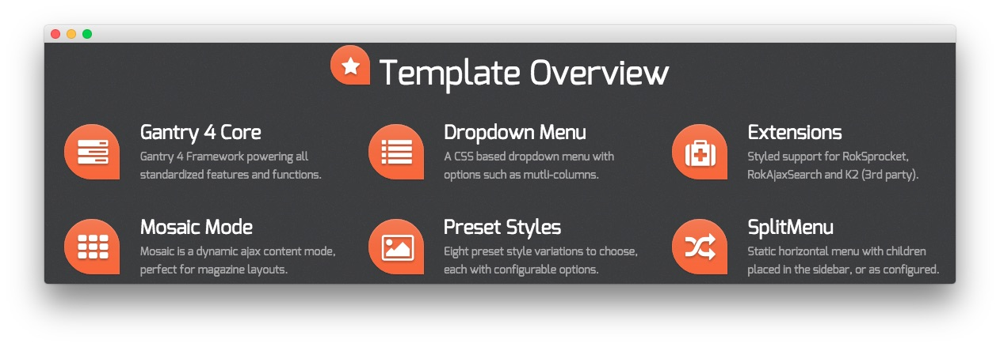
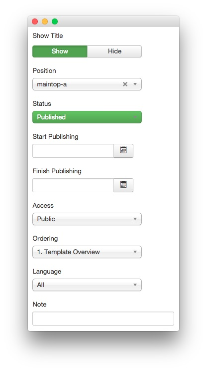
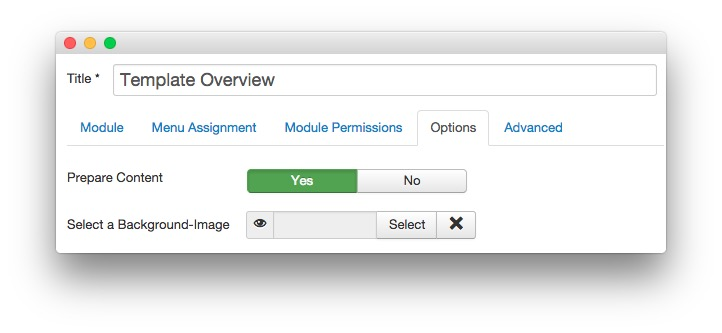
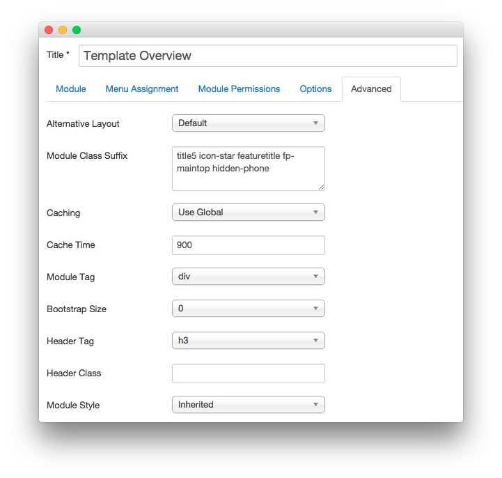

Template Overview
-----

This area of the front page is a **Custom HTML** module. You will find the settings used in our demo below.

>> Any **mod_custom** (Custom HTML) modules are best handled using either RokPad or no editor as a WYSIWYG editor can cause issues with any code that exists in the **Custom Output** field.

### Details

|   Option   |       Setting       |
| :--------- | :------------------ |
| Title      | `Template Overview` |
| Show Title | Show                |
| Position   | maintop-a           |
| Status     | Published           |
| Access     | Public              |

### Custom Output
Enter the following in the **Custom Output** text editor.

~~~

  

    

      

        <h5 class="title largemarginright"></h5>
      
  
      

        <h3 class="nomarginbottom"><a href="index.php?option=com_content&amp;view=article&amp;id=6&amp;Itemid=113">Gantry 4 Core</a></h3>
        
Gantry 4 Framework powering all standardized features and functions.

      
  
    

  
  
  

    

      

        <h5 class="title largemarginright"></h5>
      
  
      

        <h3 class="nomarginbottom"><a href="index.php?option=com_content&amp;view=article&amp;id=5&amp;Itemid=112">Dropdown Menu</a></h3>
        A CSS based dropdown menu with advanced options such as mutli-columns.
      
  
    

  
  
  

    

      

        <h5 class="title largemarginright"></h5>
      
  
      

        <h3 class="nomarginbottom"><a href="index.php?option=com_content&amp;view=article&amp;id=6&amp;Itemid=113">Extensions</a></h3>
        
Styled support for RokSprocket, RokAjaxSearch and K2 (3rd party).

      
  
    

  
   

  

    

      

        <h5 class="title largemarginright"></h5>
      
  
      

        <h3 class="nomarginbottom"><a href="index.php?option=com_content&amp;view=article&amp;id=6&amp;Itemid=113">Mosaic Mode</a></h3>
        Mosaic is a dynamic ajax content display mode, perfect for magazine layouts.
      
  
    

  
  
  

    

      

        <h5 class="title largemarginright"></h5>
      
  
      

        <h3 class="nomarginbottom"><a href="index.php?option=com_content&amp;view=article&amp;id=10&amp;Itemid=117">Preset Styles</a></h3>
        
Eight preset style variations to choose, each with configurable options.

      
  
    

  
  
  

    

      

        <h5 class="title largemarginright"></h5>
      
  
      

        <h3 class="nomarginbottom"><a href="index.php?option=com_content&amp;view=article&amp;id=5&amp;Itemid=112">SplitMenu</a></h3>
        
Static horizontal menu with children placed in the sidebar, or as configured.

      
  
    

  
   

~~~

### Basic

| Option                    | Setting |  
| :------------------------ | :------ |  
| Prepare Content           | Yes     |  
| Select a Background Image | Blank   |

### Advanced

|        Option       |                         Setting                         |
| :------------------ | :------------------------------------------------------ |
| Module Class Suffix | `title5 icon-star featuretitle fp-maintop hidden-phone` |
