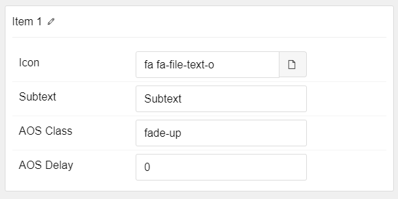

## Introduction

The **Content Tabs** particle lets you display an abundance of different categories of content in a small space using tabs.

Here are the topics covered in this guide:

* [Configuration](#configuration)
    - [Main Options](#main-options)
    - [Item Options](#item-options)

## Configuration

### Main Options 

These options affect the main area of the particle, and not the individual items within. You can set the title of the particle, as well as give it an introductory paragraph here.

| Option         | Description                                                                     |
| :-----         | :-----                                                                          |
| CSS Classes    | Set the CSS class(es) you would like to have apply at the particle level.       |
| Title          | Enter the title of the particle you would like to have appear on the front end. |
| Animation Type | Select the type of transition animation to use when switching between tabs.     |

### Item Options

These items make up the individual featured items in the particle. They sit apart from the particle's title and introduction. Each item can have its own properties, including icons and written content.

| Option        | Description                                                                                      |
| :-----        | :-----                                                                                           |
| Name          | The name if the item is used for backend organization only and does not appear on the front end. |
| Title         | Enter a title for the item that appears on the front end.                                        |
| Readmore Text | Enter any text that you wish to have displayed in the item.                                      |
| Readmore Link | Enter the URL you would like to have the item link to.                                           |
| Tab Content   | Here is where you enter text/HTML content for the tab.                                           |

### Icons

Icon content (as demonstrated in our demo) is available as a sub-item for this particle.

| Option    | Description                                                        |
| :-----    | :-----                                                             |
| Icon      | Select the icon you would like to have appear.                     |
| Subtext   | Enter any text you want to have displayed under the icon.          |
| AOS Class | Select the type of animation to appear on scroll.                  |
| AOS Delay | Enter a delay time (in milliseconds) for the animation to trigger. |