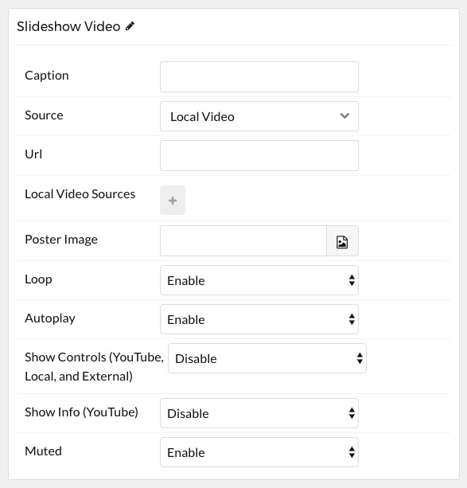

## Introduction

The **Video** particle enables you quickly and easily add video content to your page.

Here are the topics covered in this guide:

* [Configuration](#configuration)
    - [Main Options](#main-options)
    - [Item Options](#item-options)

## Configuration

### Main Options 

These options affect the main area of the particle, and not the individual items within.

| Option        | Description                                                                                 |
| :-----        | :-----                                                                                      |
| Particle Name | Enter the name you would like to assign to the particle. This only appears in the back end. |
| CSS Classes   | Sets any CSS class(es) you want to have apply to the particle's content.                    |
| Title         | Enter a title for the particle.                                                             |

### Item Options

These items make up the individual featured items in the particle.

| Option                | Description                                                                                                                     |
| :-----                | :-----                                                                                                                          |
| Caption               | Enter a caption for the video.                                                                                                  |
| Source                | Enter a source (type) for the video. You can choose between: **Slideshow Preset**, **Vimeo**, **YouTube**, and **Local Video**. |
| Local Video Source(s) | When **Local Video** is selected as the **Source**, this would be the video you wish to load in the particle.                   |
| Loop                  | Enable or disable video looping.                                                                                                |
| Autoplay              | Enable of disable video autoplay.                                                                                               |
| Show Controls         | Show or hide controls from the embedded video's player. This is available on **YouTube** and **Local** sources.                 |

The particle has local support for any video format that can be natively embedded using HTML5. This includes: MP4, WebM, Mov, and Ogg videos.

