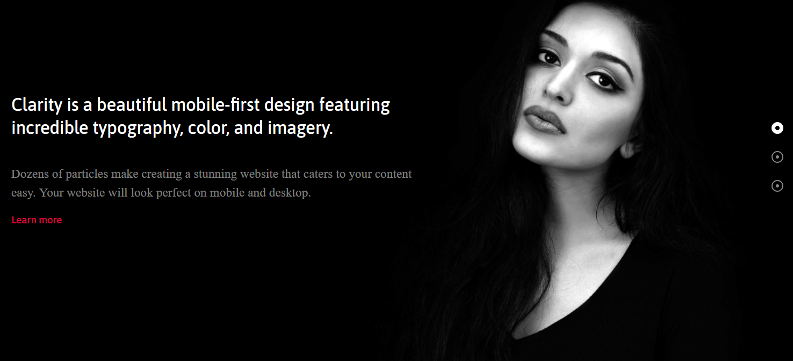
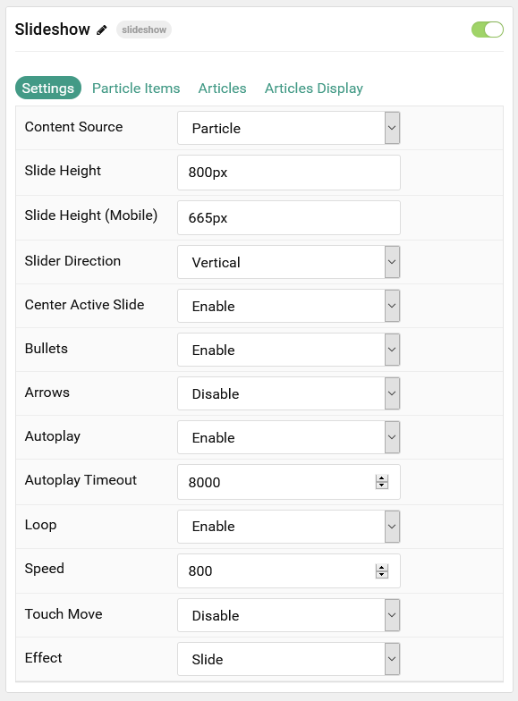
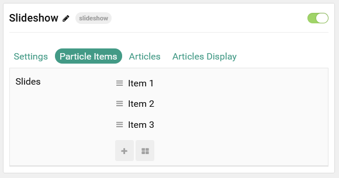
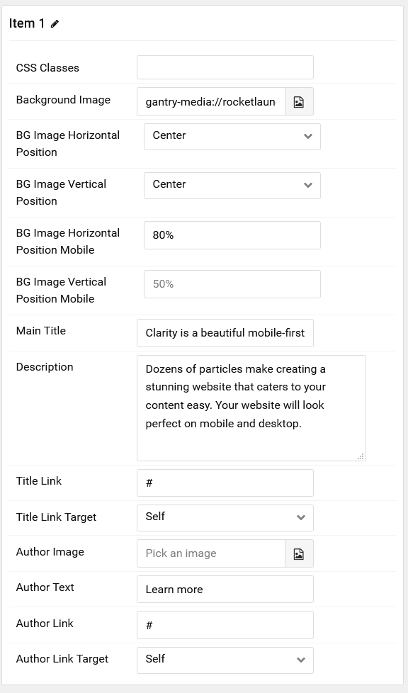
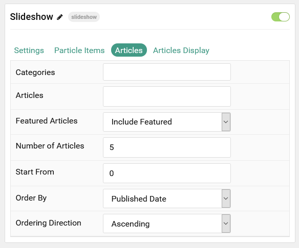
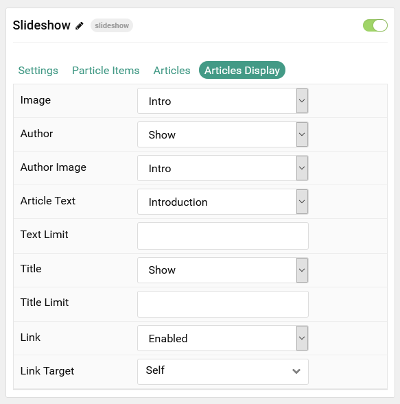

## Introduction

The **Slideshow** particle creates beautiful image slideshows that work perfectly at the top of your page.

Here are the topics covered in this guide:

* [Configuration](#configuration)
    - [Main Options](#settings)
    - [Item Options](#particle-item-options)
    - [Articles](#articles)
    - [Display](#display)

## Configuration

### Settings

These options affect the main area of the particle, and not the individual items within. You can set the title of the particle, as well as give it an introductory paragraph here.

| Option                | Description                                                                                               |
| :----------------     | :-------------------------------------------------------------------------------------------------------- |
| Particle Name         | This is the name of the particle used for back end management. It does not appear on the front end.       |
| Content Source        | Choose between **Particle** and **Joomla** as the content source for the particle.                        |
| Slide Height          | Set the minimal height of each slide.                                                                     |
| Slide Height (Mobile) | Set the minimal height of each slide on mobile devices.                                                   |
| Slider Direction      | Choose between a **Vertical** and **Horizontal** slider animation.                                        |
| Center Active Slide   | If **enabled**, the active slide will be centered.                                                        |
| Bullets               | **Enable** or **Disable** bullet navigation.                                                              |
| Arrows                | **Enable** or **Disable** arrows navigation.                                                              |
| Autoplay              | **Enable** or **Disable** autoplay for the particle.                                                      |
| Autoplay Timeout      | Set the time (in milliseconds) between slides in autoplay mode.                                           |
| Loop                  | **Enable** or **Disable** looping slides.                                                                 |
| Speed                 | Set the transition speed (in milliseconds).                                                               |
| Touch Move            | **Enable** or **Disable** touch movements.                                                                |
| Effect                | Choose a slideshow effect. Options include: **Slide** or **Fade**.                                        |

### Particle Item Options

These items make up the individual featured items in the particle. Items in this section will only appear if **Particle** is selected as the **Content Source**.

| Option                              | Description                                                                                      |
| :----------------------             | :--------------------------------------------------------------------------------------          |
| Item Name                           | This is the name of the item. It is used only for backend organization and does not appear.      |
| CSS Classes                         | Enter any CSS class(es) you wish to have apply to the item.                                      |
| Background Image                    | Select a background image to appear in the particle.                                             |
| BG Image Horizontal Position        | Choose between **Left**, **Center**, and **Right** horizontal position for the background image. |
| BG Image Vertical Position          | Choose between **Top**, **Center**, and **Bottom** horizontal position for the background image. |
| BG Image Horizontal Position Mobile | Set the horizontal position percentage of the background image on mobile devices.                |
| BG Image Vertical Position Mobile   | Set the vertical position percentage of the background image on mobile devices.                  |
| Main Title                          | Enter a larger main title to appear on the front end.                                            |
| Description                         | Enter a text description to appear in the particle.                                              |
| Title Link                          | Enter a URL the button will send users to.                                                       |
| Title Link Target                   | Enter a target window for the link.                                                              |
| Author Image                        | Select an image to display in the author section of the item.                                    |
| Author Text                         | Enter the name of the author.                                                                    |
| Author Link                         | Enter the URL the author's name will link to.                                                    |
| Author Link Target                  | Enter the target window for the author link to open in.                                          |

### Articles

| Option             | Description                                                                                                     |
| :-----             | :-----                                                                                                          |
| Categories         | Select the categories of articles this particle will display.                                                   |
| Articles           | Select the number of articles you would like the particle to fetch.                                             |
| Featured Articles  | Choose how Featured Articles should be filtered. Choose between **Include**, **Exclude**, or **Only Featured**. |
| Number of Articles | Enter the maximum number of articles to display.                                                                |
| Start From         | Enter offset specifying the first article to return. The default is '0' (the first article).                    |
| Order By           | Choose the type of factor to order by.                                                                          |
| Ordering Direction | Choose between **Ascending** and **Descending** as the article ordering method.                                 |

### Display

This section configures how articles are displayed.

| Option        | Description                                                                                         |
| :------------ | :-------------------------------------------------------------------------------------------------- |
| Image         | Choose between the **Intro**, **Full**, or no image to display with each item.                      |
| Author        | **Show** or **Hide** the article's author.                                                          |
| Author Image  | Choose between the **Intro**, **Full**, or no image to display as the author image with each item.  |
| Article Text  | Choose between **Introduction**, **Full Article**, or **none** content text to display.             |
| Text Limit    | Enter a limit (in characters) of article text to display with each item.                            |
| Title         | **Show** or **Hide** the article's title.                                                           |
| Title Limit   | Enter the maximum number of characters in the title to display.                                     |
| Link          | **Show** or **Hide** the Title link.                                                                |
| Target        | Choose whether to have the link open in a new tab or the same tab.                                  |
