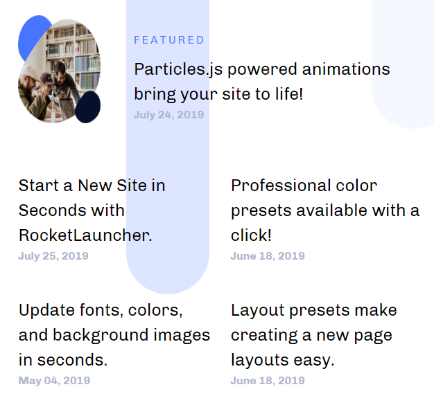

## Introduction

The **Topic List** particle takes the **Category List** particle's simplicity and applies it directly to content at an article level. It lists articles with minimal information in a clean, modern way.

Here are the topics covered in this guide:

* [Configuration](#configuration)
  * [Main Options](#settings)
  * [Item Options](#particle-item-options)
  * [Articles](#articles)
  * [Display](#display)

## Configuration

### Settings 

These options affect the main area of the particle, and not the individual items within.

| Option         | Description                                                                                         |
| :-----         | :-----                                                                                              |
| Particle Name  | This is the name of the particle used for back end management. It does not appear on the front end. |
| Content Source | Choose between **Particle** and **Joomla** as the Content Source.                                   |
| Featured Title | Enter a title for the particle that appears on the front end.                                       |
| Date Format    | Select the date format used to display items in the particle.                                       |

### Particle Item Options

These items make up the individual featured items in the particle. 

| Option      | Description                                                                                                                                            |
| :-----      | :-----                                                                                                                                                 |
| Item Name   | The item name becomes the title of the content block item.                                                                                             |
| Featured ?  | Decide if you want the article to be featured or not.                                                                                                  |
| Promo Image | Select an image to appear with the item.                                                                                                               |
| Date        | Enter the date to be displayed with the item.                                                                                                          |
| URL         | Enter the url you want that link to go to.                                                                                                             |
| Target      | Set the target for the link. You can choose between **Self** which opens the link in the current tab or **New Window** which opens links in a new tab. |

### Articles

| Option             | Description                                                                                                     |
| :-----             | :-----                                                                                                          |
| Categories         | Select the categories of articles this particle will display.                                                   |
| Articles           | Select the number of articles you would like the particle to fetch.                                             |
| Featured Articles  | Choose how Featured Articles should be filtered. Choose between **Include**, **Exclude**, or **Only Featured**. |
| Number of Articles | Enter the maximum number of articles to display.                                                                |
| Start From         | Enter offset specifying the first article to return. The default is '0' (the first article).                    |
| Order By           | Choose the type of factor to order by.                                                                          |
| Ordering Direction | Choose between **Ascending** and **Descending** as the article ordering method.                                 |

### Display

This section configures how articles are displayed.

| Option      | Description                                                                                   |
| :-----      | :-----                                                                                        |
| Title       | Choose whether or not the title of an article should be shown.                                |
| Title Limit | Set a character limit for titles.                                                             |
| Date        | Decide whether to show the created, published, or modified date as the date for each article. |