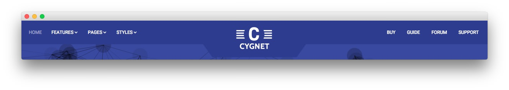
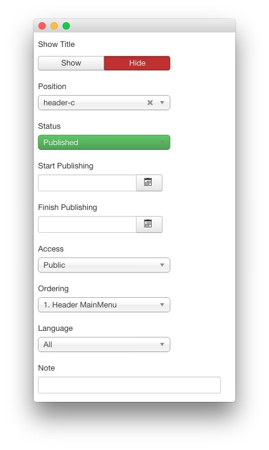
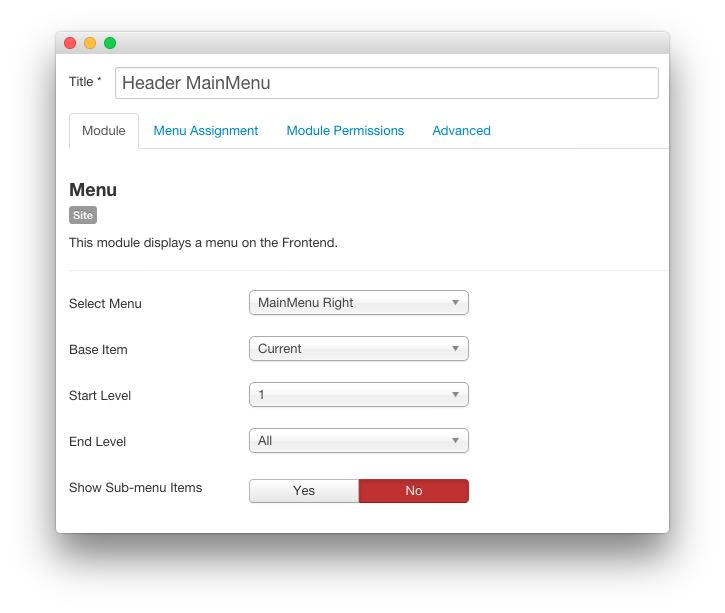
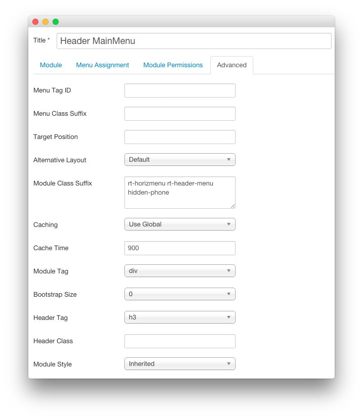

Header MainMenu
-----

:   1. **Menu** [27%, 75%, se]

A **Menu** module makes up the right-hand side of the main menu at the top of the page. Here is a breakdown of the options selected to make it appear as it does on the front page of our demo.

### Details

| Option      | Setting           |
| :---------- | :----------       |
| Title       | `Header MainMenu` |
| Show Title  | Hide              |
| Position    | header-c          |
| Status      | Published         |
| Access      | Public            |

### Basic Options

| Option              | Setting        |
| :----------         | :----------    |
| Select Menu         | MainMenu Right |
| Base Item           | Current        |
| Start Level         | 1              |
| End Level           | All            |
| Show Sub-menu Items | No             |

### Advanced Options

| Option              | Setting                                    |
| :----------         | :----------                                |
| Module Class Suffix | `rt-horizmenu rt-header-menu hidden-phone` |
