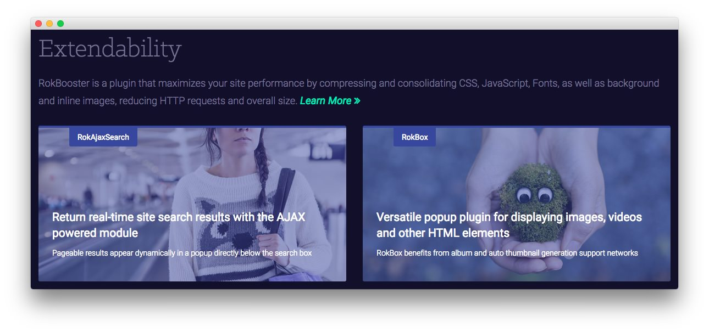
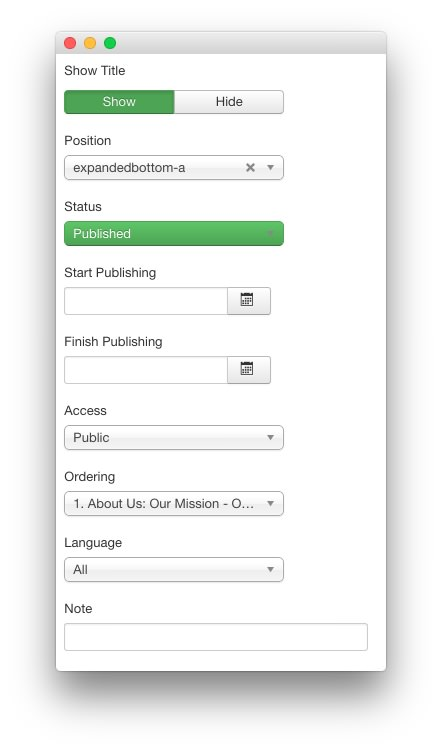
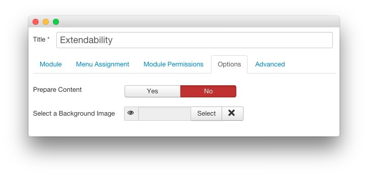
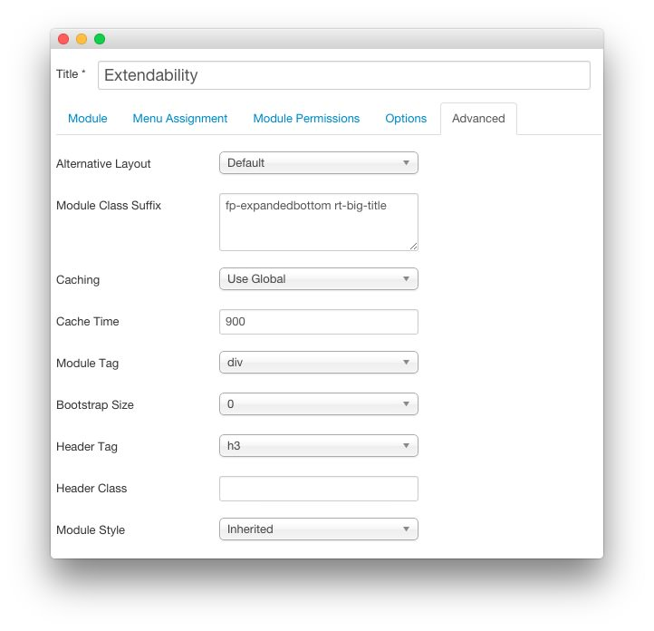

Extendability
-----

This area of the page is a **Custom HTML** module. You will find the settings used in our demo below.

>> Any **mod_custom** (Custom HTML) modules are best handled using either RokPad or no editor as a WYSIWYG editor can cause issues with any code that exists in the **Custom Output** field.

### Details

| Option      | Setting          |
| :---------- | :----------      |
| Title       | `Extendability`  |
| Show Title  | Show             |
| Position    | expandedbottom-a |
| Status      | Published        |
| Access      | Public           |

### Custom Output

Enter the following in the **Custom Output** text editor.

~~~ .html

RokBooster is a plugin that maximizes your site performance by compressing and consolidating CSS, JavaScript, Fonts, as well as background and inline images, reducing HTTP requests and overall size. <a class="readon3" href="#">Learn More</a>

    

        

            

                

                    

                        
                    

                    

                        
RokAjaxSearch

                        

                            <h2 class="title">Return real-time site search results with the AJAX powered module</h2>
                            
Pageable results appear dynamically in a popup directly below the search box
                     
                        

                    
          
                
              
            

        
  
        

            

                

                    

                        
                    

                    

                        
RokBox

                        

                            <h2 class="title">Versatile popup plugin for displaying images, videos and other HTML elements</h2>
                            
RokBox benefits from album and auto thumbnail generation support networks
                        
                        

                    
          
                

            

        
          
    

~~~

### Basic

| Option                    | Setting     |
| :----------               | :---------- |
| Prepare Content           | No          |
| Select a Background Image | Blank       |

### Advanced

| Option              | Setting                          |
| :----------         | :----------                      |
| Module Class Suffix | `fp-expandedbottom rt-big-title` |
