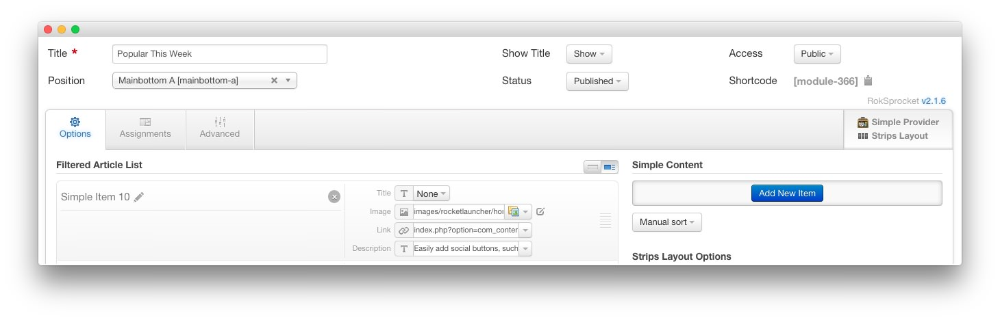
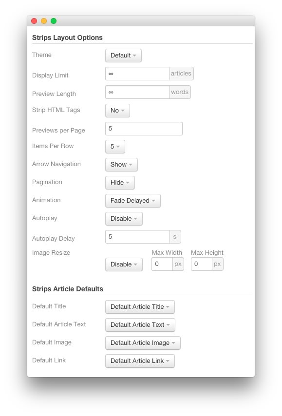
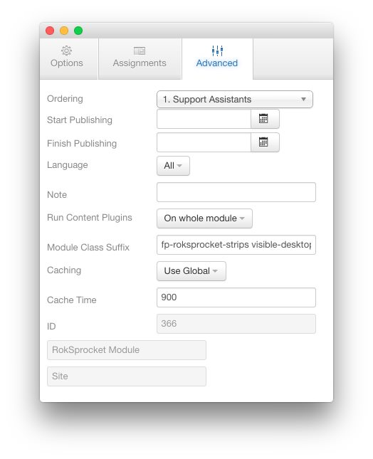
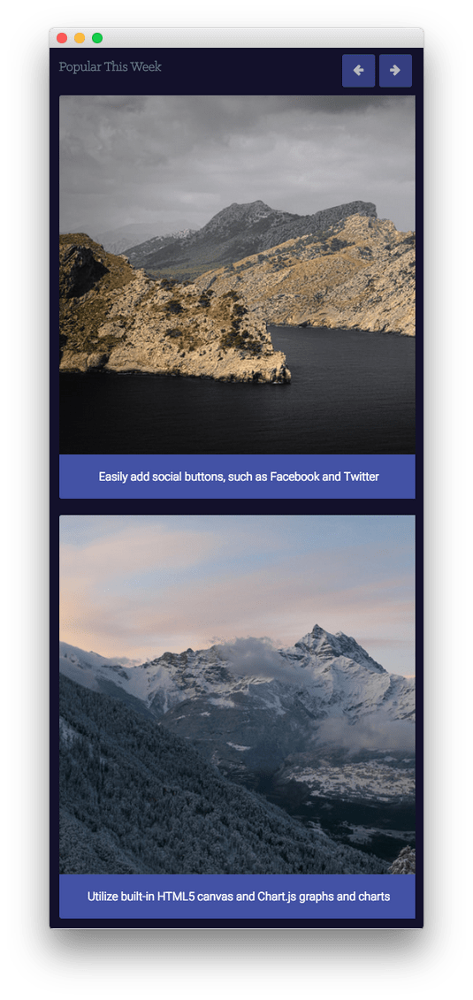
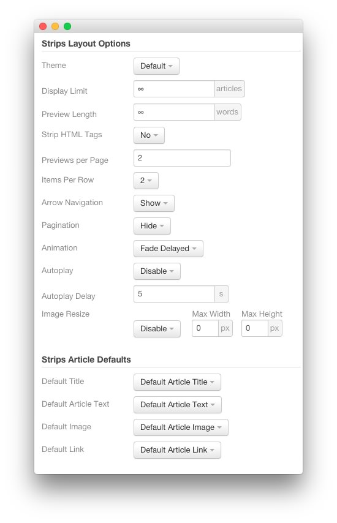
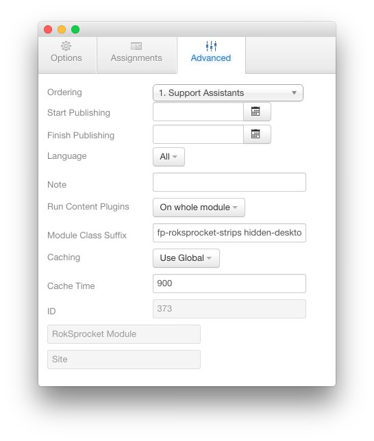

Popular This Week
-----

We used a **RokSprocket** module with the **Strips** layout to make up this area of the front page. You will find the settings used in our demo below.

We utilized the **Simple** Content Provider, linking each item in the RokSprocket module to an article. You can find examples of the **Simple** items used in this module in the **Filtered Article List** section below.

There are actually two RokSprocket modules that make up this area of the page. The first (listed in this section) displays for desktops while the other appears on mobile devices such as smartphones and tablets (detailed at the bottom half of the page).

### Details

| Option           | Setting             |
| :----------      | :----------         |
| Title            | `Popular This Week` |
| Show Title       | Show                |
| Access           | Public              |
| Position         | mainbottom-a        |
| Status           | Published           |
| Content Provider | Simple              |
| Type             | Strips              |

### Filtered Article List

#### Article 1

| Option      | Setting                                                   |
| :-----      | :------                                                   |
| Title       | None                                                      |
| Image       | Custom                                                    |
| Link        | Custom                                                    |
| Description | `Easily add social buttons, such as Facebook and Twitter` |

#### Article 2

| Option      | Setting                                                        |
| :-----      | :------                                                        |
| Title       | None                                                           |
| Image       | Custom                                                         |
| Link        | Custom                                                         |
| Description | `Utilize built-in HTML5 canvas and Chart.js graphs and charts` |

#### Article 3

| Option      | Setting                                                        |
| :-----      | :------                                                        |
| Title       | None                                                           |
| Image       | Custom                                                         |
| Link        | Custom                                                         |
| Description | `Configurable animated countdown feature for the offline page` |

### Layout Options

| Option            | Setting      |
| :----------       | :----------  |
| Theme             | Default      |
| Display Limit     | ∞            |
| Preview Length    | ∞            |
| Strip HTML Tags   | No           |
| Previews Per Page | `5`          |
| Items Per Row     | 5            |
| Arrow Navigation  | Show         |
| Pagination        | Hide         |
| Animation         | Fade Delayed |
| Autoplay          | Disable      |
| Autoplay Delay    | 5            |
| Image Resize      | Disable      |

### Advanced

| Option              | Setting                                 |
| :----------         | :----------                             |
| Module Class Suffix | `fp-roksprocket-strips visible-desktop` |

Non-Desktop Version
-----

We used a **RokSprocket** module with the **Strips** layout to make up this area of the front page. You will find the settings used in our demo below.

We utilized the **Simple** Content Provider, linking each item in the RokSprocket module to an article. You can find examples of the **Simple** items used in this module in the **Filtered Article List** section below.

### Details

| Option           | Setting             |
| :----------      | :----------         |
| Title            | `Popular This Week` |
| Show Title       | Hide                |
| Access           | Public              |
| Position         | mainbottom-a        |
| Status           | Published           |
| Content Provider | Simple              |
| Type             | Strips              |

### Filtered Article List

#### Article 1

| Option      | Setting                                                   |
| :-----      | :------                                                   |
| Title       | None                                                      |
| Image       | Custom                                                    |
| Link        | Custom                                                    |
| Description | `Easily add social buttons, such as Facebook and Twitter` |

#### Article 2

| Option      | Setting                                                        |
| :-----      | :------                                                        |
| Title       | None                                                           |
| Image       | Custom                                                         |
| Link        | Custom                                                         |
| Description | `Utilize built-in HTML5 canvas and Chart.js graphs and charts` |

#### Article 3

| Option      | Setting                                                        |
| :-----      | :------                                                        |
| Title       | None                                                           |
| Image       | Custom                                                         |
| Link        | Custom                                                         |
| Description | `Configurable animated countdown feature for the offline page` |

### Layout Options

| Option            | Setting      |
| :----------       | :----------  |
| Theme             | Default      |
| Display Limit     | ∞            |
| Preview Length    | ∞            |
| Strip HTML Tags   | No           |
| Previews Per Page | `2`          |
| Items Per Row     | 2            |
| Arrow Navigation  | Show         |
| Pagination        | Hide         |
| Animation         | Fade Delayed |
| Autoplay          | Disable      |
| Autoplay Delay    | 5            |
| Image Resize      | Disable      |

### Advanced

| Option              | Setting                                |
| :----------         | :----------                            |
| Module Class Suffix | `fp-roksprocket-strips hidden-desktop` |

