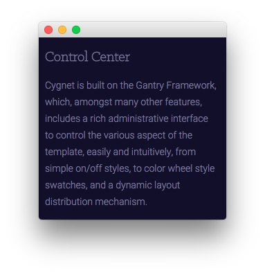
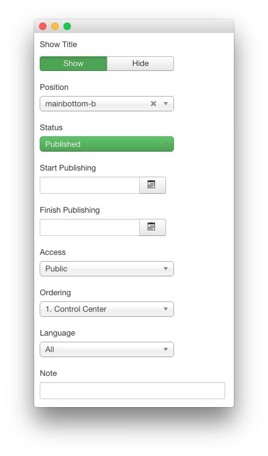
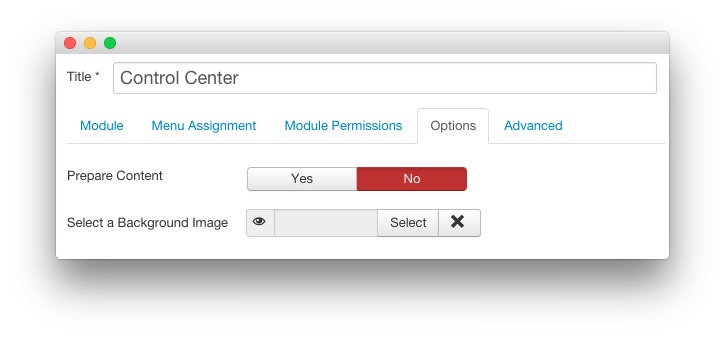
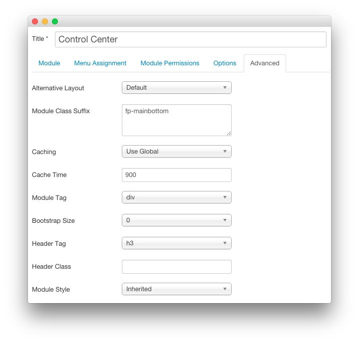

Control Center
-----

This area of the front page is a **Custom HTML** module. You will find the settings used in our demo below.

>> Any **mod_custom** (Custom HTML) modules are best handled using either RokPad or no editor as a WYSIWYG editor can cause issues with any code that exists in the **Custom Output** field.

### Details

| Option     | Setting          |
| :--------- | :-----------     |
| Title      | `Control Center` |
| Show Title | Show             |
| Position   | mainbottom-b     |
| Status     | Published        |
| Access     | Public           |

### Custom Output

Enter the following in the **Custom Output** text editor.

~~~ .html
Cygnet is built on the Gantry Framework, which, amongst many other features, includes a rich administrative interface to control the various aspect of the template, easily and intuitively, from simple on/off styles, to color wheel style swatches, and a dynamic layout distribution mechanism.
~~~

### Basic

| Option                    | Setting |
| :------------------------ | :------ |
| Prepare Content           | No      |
| Select a Background Image | Blank   |

### Advanced

| Option              | Setting                           |
| :------------------ | :-------------------------------- |
| Module Class Suffix | `fp-mainbottom`                   |
