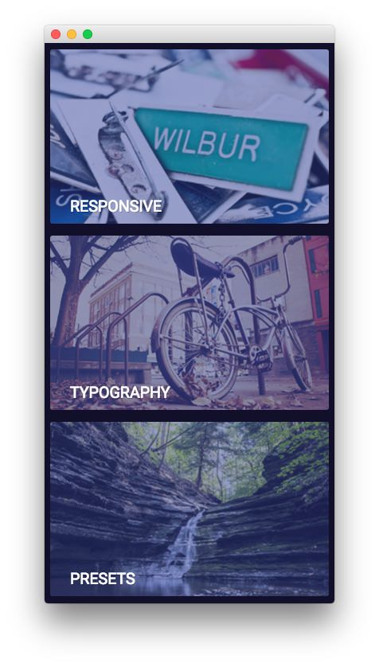
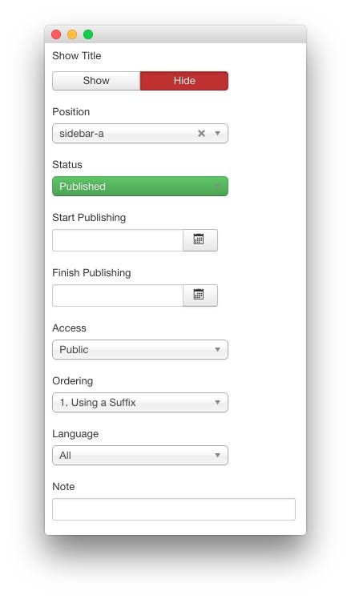
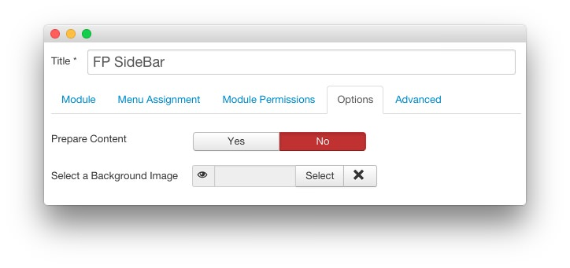
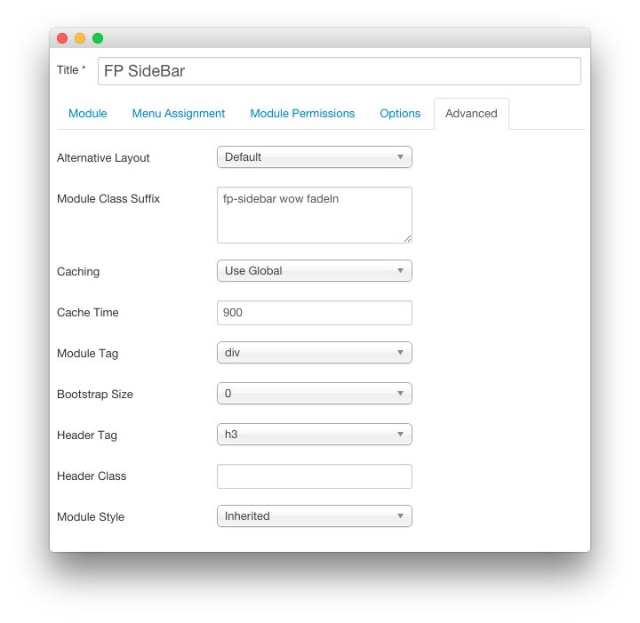

FP SideBar
-----

This area of the front page is a **Custom HTML** module. You will find the settings used in our demo below.

>> Any **mod_custom** (Custom HTML) modules are best handled using either RokPad or no editor as a WYSIWYG editor can cause issues with any code that exists in the **Custom Output** field.

### Details

| Option     | Setting      |
| :--------- | :----------- |
| Title      | `FP SideBar` |
| Show Title | Hide         |
| Position   | sidebar-a    |
| Status     | Published    |
| Access     | Public       |

### Custom Output

Enter the following in the **Custom Output** text editor.

~~~ .html

    
    

        <h2 class="rt-uppercase"><a class="fp-demo-url" href="index.php?option=com_content&amp;view=article&amp;id=1&amp;Itemid=111">Responsive</a></h2>
        
<a class="fp-demo-url" href="index.php?option=com_content&amp;view=article&amp;id=1&amp;Itemid=111">Adapts to any devices</a>

    
          

    
    

        <h2 class="rt-uppercase"><a class="fp-demo-url" href="index.php?option=com_content&amp;view=article&amp;id=4&amp;Itemid=114">Typography</a></h2>
        
<a class="fp-demo-url" href="index.php?option=com_content&amp;view=article&amp;id=4&amp;Itemid=114">Individualize your content</a>

    
          

    
    

        <h2 class="rt-uppercase"><a class="fp-demo-url" href="index.php?option=com_content&amp;view=article&amp;id=1&amp;Itemid=111">Presets</a></h2>
        
<a class="fp-demo-url" href="index.php?option=com_content&amp;view=article&amp;id=1&amp;Itemid=111">Six elegant styles</a>

    
          

~~~

### Basic

| Option                    | Setting |
| :------------------------ | :------ |
| Prepare Content           | No      |
| Select a Background Image | Blank   |

### Advanced

| Option              | Setting                           |
| :------------------ | :-------------------------------- |
| Module Class Suffix | `fp-sidebar wow fadeIn`           |
