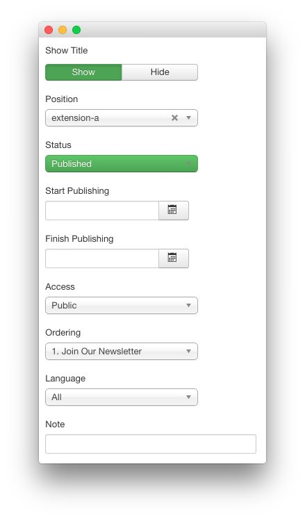
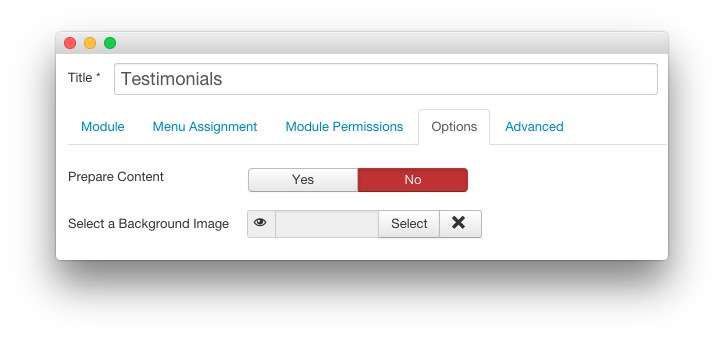

Testimonials
-----

:   1. **Custom HTML** [25%, 5%, ne]

This area of the front page is a **Custom HTML** module. You will find the settings used in our demo below.

>> Any **mod_custom** (Custom HTML) modules are best handled using either RokPad or no editor as a WYSIWYG editor can cause issues with any code that exists in the **Custom Output** field.

### Details

| Option     | Setting        |
| :--------- | :-----------   |
| Title      | `Testimonials` |
| Show Title | Show           |
| Position   | extension-a    |
| Status     | Published      |
| Access     | Public         |

### Custom Output

Enter the following in the **Custom Output** text editor.

~~~ .html

Our RokSprocket extension provides a content grid layout, designed for quotes and testimonials. Configure the number of rows, columns, and location of the bubble tail. <a href="#" class="readon3">Learn More</a>

~~~

### Basic

| Option                    | Setting |
| :------------------------ | :------ |
| Prepare Content           | No      |
| Select a Background Image | Blank   |

### Advanced

| Option              | Setting                           |
| :------------------ | :-------------------------------- |
| Module Class Suffix | `fp-extension rt-big-title`       |
