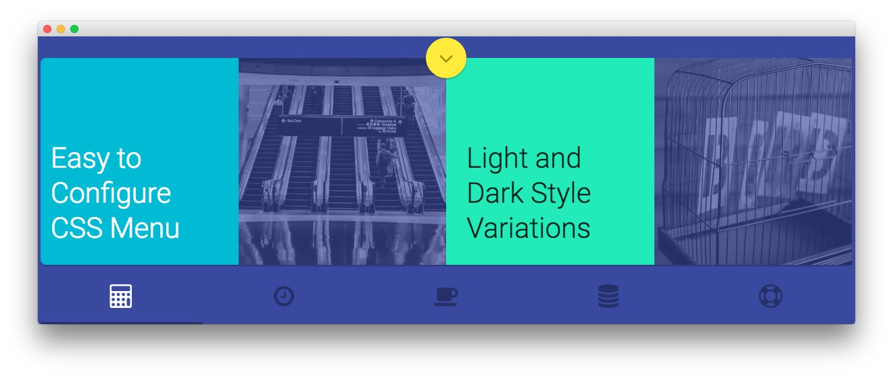
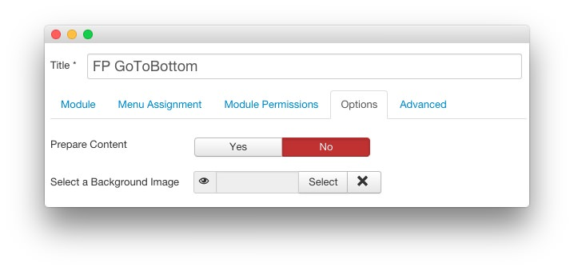
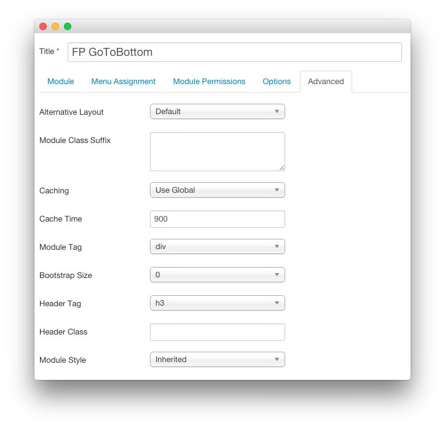

---
title: Cygnet: Recreating the Demo - FP GoToBottom
description: Your Guide to Recreating Elements of the Cygnet Demo for Joomla
breadcrumb: /joomla:Joomla/!templates:Templates/cygnet:Cygnet

---

FP GoToBottom
-----

:   1. **Custom HTML** [15%, 48%, se]

This area of the page is a **Custom HTML** module. You will find the settings used in our demo below.

>> Any **mod_custom** (Custom HTML) modules are best handled using either RokPad or no editor as a WYSIWYG editor can cause issues with any code that exists in the **Custom Output** field.

### Details

| Option      | Setting         |
| :---------- | :----------     |
| Title       | `FP GoToBottom` |
| Show Title  | Hide            |
| Position    | showcase-a      |
| Status      | Published       |
| Access      | Public          |

### Custom Output

Enter the following in the **Custom Output** text editor.

~~~ .html
<a class="rt-gotobottom wow fadeInDown"
   href="#rt-expandedbottom"
   data-scroll
   data-options='{
                    "speed": 500,
                    "easing": "easeInOutCubic",
                    "offset": 0,
                    "updateURL": false
                }'
>
    <i class="fa fa-angle-down"></i>
</a>

~~~

### Basic

| Option                    | Setting     |
| :----------               | :---------- |
| Prepare Content           | No          |
| Select a Background Image | Blank       |

### Advanced

| Option              | Setting     |
| :----------         | :---------- |
| Module Class Suffix |             |