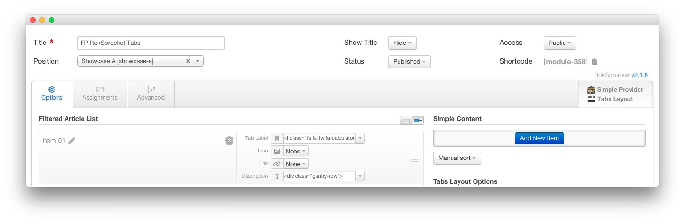
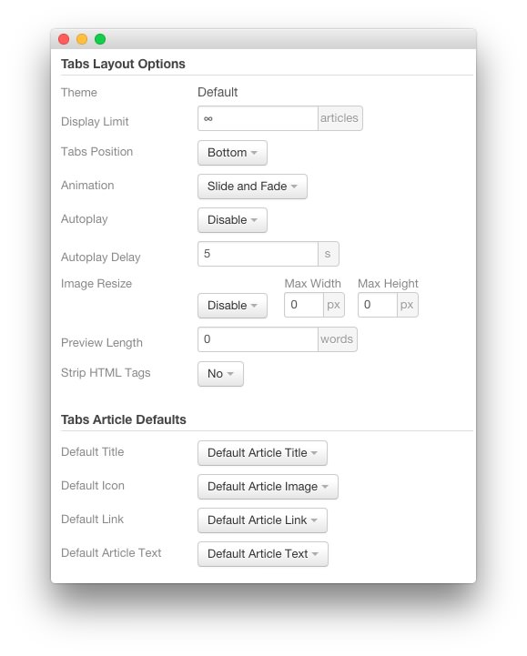
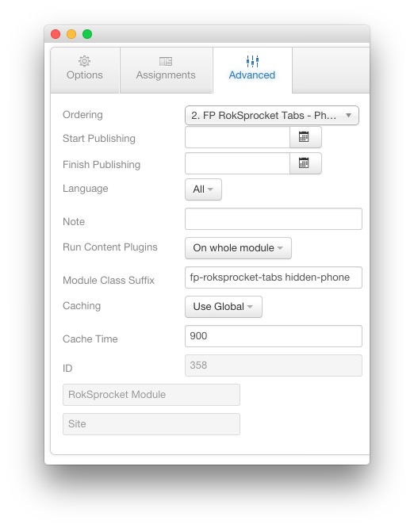
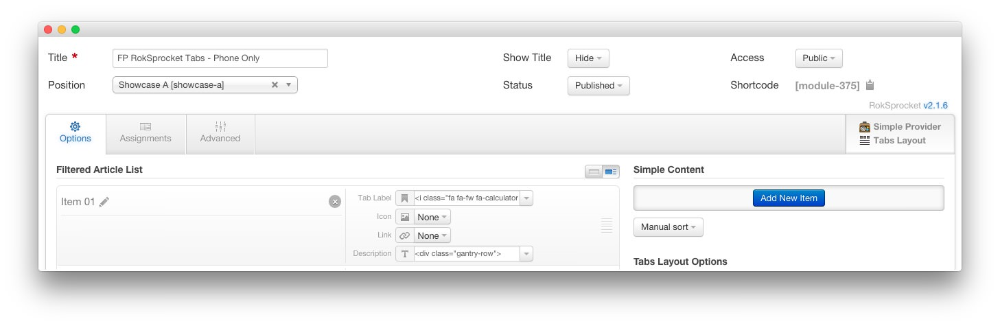
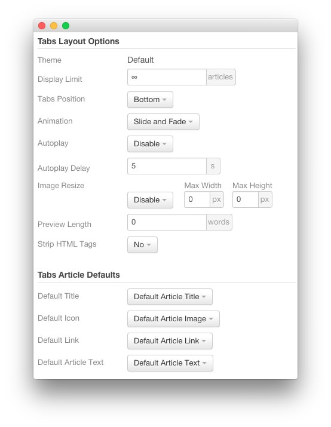
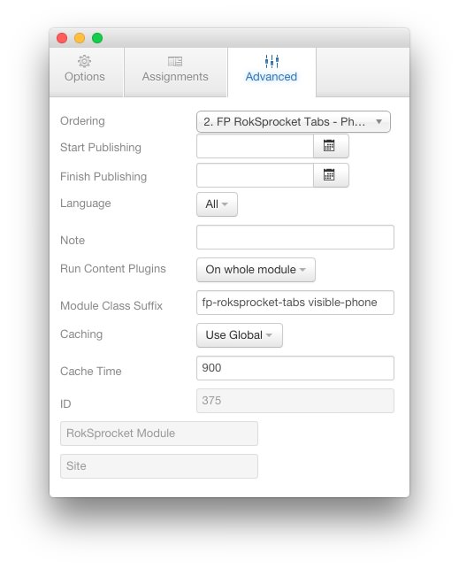

FP RokSprocket Tabs
----

This area of the page is a **RokSprocket** module utilizing the **Simple** content provider and the **Tabs** layout.

There are two RokSprocket modules represented in this area of the page. The one pictured above appears for devices other than phones. The other is set to display only on phones (pictured below).

The settings used in our demo are listed below.

### Details

| Option           | Setting               |
| :--------------- | :-------------------- |
| Title            | `FP RokSprocket Tabs` |
| Show Title       | Hide                  |
| Access           | Public                |
| Position         | showcase-a            |
| Status           | Published             |
| Content Provider | Simple                |
| Layout Mode      | Tabs                  |

### Simple Content Provider

The **Tab Label** and **Description** fields in each item have been altered. A couple examples of these article changes can be found below.

#### Article 1

| Option    | Setting                                  |
| :-----    | :-----                                   |
| Tab Label | `<i class="fa fa-fw fa-calculator"></i>` |
| Icon      | None                                     |
| Link      | None                                     |

**Description**

~~~ .html

    

        

            <h2>Easy to Configure CSS Menu</h2>
        

        

            <a href="#"></a>
        

        

            <h2>Light and Dark Style Variations</h2>
        

        

            <a href="#"></a>
        

    

~~~

#### Article 2

| Option    | Setting                               |
| :-----    | :-----                                |
| Tab Label | `<i class="fa fa-fw fa-clock-o"></i>` |
| Icon      | None                                  |
| Link      | None                                  |

**Description**

~~~ .html

    

        

            <h2>Multiple Grid Layout Possibilities</h2>
        

        

            <a href="#"></a>
        

        

            <h2>Many Color Chooser Options</h2>
        

        

            <a href="#"></a>
        

    

~~~

### Layout Options

| Option                | Setting               |
| :-------------------- | :-------------------- |
| Theme                 | Default               |
| Display Limit         | `∞`                   |
| Tabs Position         | Bottom                |
| Animation             | Slide and Fade        |
| Autoplay              | Disable               |
| Autoplay Delay        | `5`                   |
| Image Resize          | Disable               |
| Preview Length        | `0`                   |
| Strip HTML Tags       | No                    |
| Default Title         | Default Article Title |
| Default Article Text  | Default Article Text  |
| Default Article Image | Default Article Image |
| Default Link          | Default Article Link  |

### Advanced

| Option              | Setting                            |
| :------------------ | :--------------------              |
| Module Class Suffix | `fp-roksprocket-tabs hidden-phone` |

FP RokSprocket Tabs - Phone Only
-----

The settings used in our demo for phones are listed below.

### Details

| Option           | Setting               |
| :--------------- | :-------------------- |
| Title            | `FP RokSprocket Tabs - Phone Only` |
| Show Title       | Hide                  |
| Access           | Public                |
| Position         | showcase-a            |
| Status           | Published             |
| Content Provider | Simple                |
| Layout Mode      | Tabs                  |

### Simple Content Provider

The **Tab Label** and **Description** fields in each item have been altered. A couple examples of these article changes can be found below.

#### Article 1

| Option    | Setting                                  |
| :-----    | :-----                                   |
| Tab Label | `<i class="fa fa-fw fa-calculator"></i>` |
| Icon      | None                                     |
| Link      | None                                     |

**Description**

~~~ .html

    

        

            <a href="#"></a>
        

    

~~~

#### Article 2

| Option    | Setting                               |
| :-----    | :-----                                |
| Tab Label | `<i class="fa fa-fw fa-clock-o"></i>` |
| Icon      | None                                  |
| Link      | None                                  |

**Description**

~~~ .html

    

        

            <a href="#"></a>
        

    

~~~

### Layout Options

| Option                | Setting               |
| :-------------------- | :-------------------- |
| Theme                 | Default               |
| Display Limit         | `∞`                   |
| Tabs Position         | Bottom                |
| Animation             | Slide and Fade        |
| Autoplay              | Disable               |
| Autoplay Delay        | `5`                   |
| Image Resize          | Disable               |
| Preview Length        | `0`                   |
| Strip HTML Tags       | No                    |
| Default Title         | Default Article Title |
| Default Article Text  | Default Article Text  |
| Default Article Image | Default Article Image |
| Default Link          | Default Article Link  |

### Advanced

| Option              | Setting                             |
| :------------------ | :--------------------               |
| Module Class Suffix | `fp-roksprocket-tabs visible-phone` |