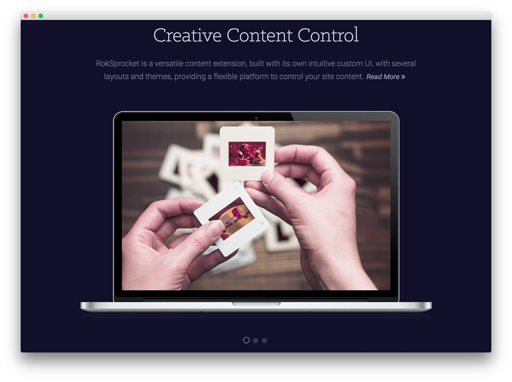
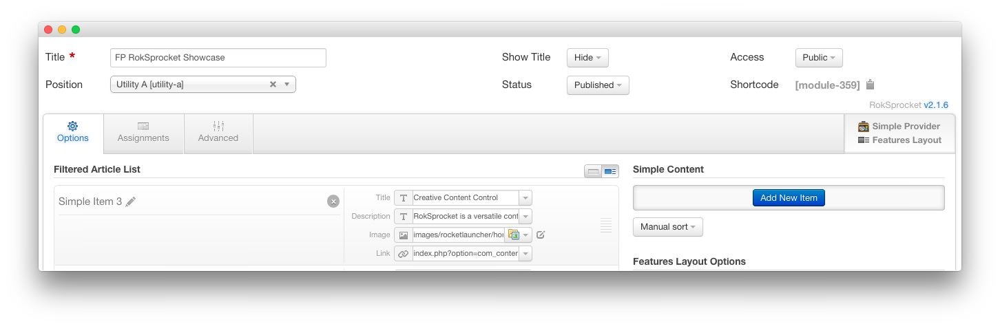
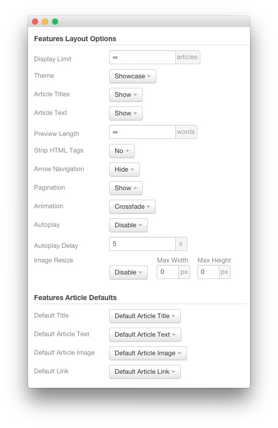
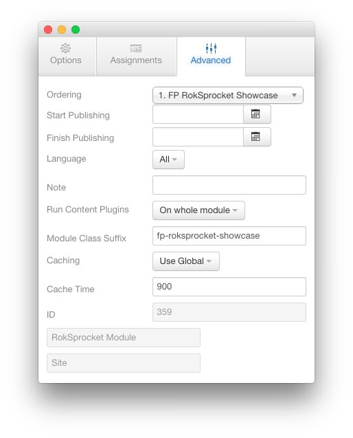

FP RokSprocket Showcase
-----

The **RokSprocket** module used in this area of the front page is a great way to feature some of your site's more notable articles or areas of interest.

We utilized the **Simple** Content Provider, linking each item in the RokSprocket module to an article. You can find examples of the **Simple** items used in this module in the **Filtered Article List** section below.

### Details

| Option           | Setting                               |
| :--------------- | :------------------------------------ |
| Title            | `FP RokSprocket Showcase`             |
| Show Title       | Hide                                  |
| Access           | Public                                |
| Position         | utility-a                             |
| Status           | Published                             |
| Content Provider | Simple                                |
| Type             | Features                              |

### Filtered Article List

#### Article 1

| Option | Setting                    |
| :----- | :------                    |
| Title  | `Creative Content Control` |
| Image  | Custom                     |
| Link   | Custom                     |

**Description**

~~~ .html
RokSprocket is a versatile content extension, built with its own intuitive custom UI, with several layouts and themes, providing a flexible platform to control your site content.~~~

#### Article 2

| Option | Setting                   |
| :----- | :------                   |
| Title  | `Rich Typography Options` |
| Image  | Custom                    |
| Link   | Custom                    |

**Description**

~~~ .html
The theme features an array of assets to enhance the site content and design, through custom typography, FontAwesome icons and bootstrap elements. 
~~~

#### Article 3

| Option | Setting                |
| :----- | :------                |
| Title  | `Custom Offline Pages` |
| Image  | Custom                 |
| Link   | Custom                 |

**Description**

~~~ .html
Cygnet benefits from a custom Offline Page with built-in login, as well as a Coming Soon Page, which has a configurable countdown, such as for new site launches.
~~~

### Layout Options

| Option                | Setting               |
| :-------------------- | :-------------------- |
| Display Limit         | ∞                     |
| Theme                 | Showcase              |
| Article Titles        | Show                  |
| Article Text          | Show                  |
| Preview Length        | ∞                     |
| Strip HTML Tags       | No                    |
| Arrow Navigation      | Hide                  |
| Pagination            | Show                  |
| Animation             | Crossfade             |
| Autoplay              | Disable               |
| Autoplay Delay        | 5                     |
| Image Resize          | Disable               |
| Default Title         | Default Article Title |
| Default Article Text  | Default Article Text  |
| Default Article Image | Default Article Image |
| Default Link          | Default Article Link  |

### Advanced

| Option              | Setting                             |
| :------------------ | :---------------------------------- |
| Module Class Suffix | `fp-roksprocket-showcase`           |
