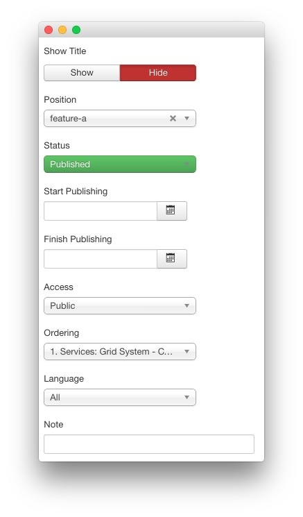
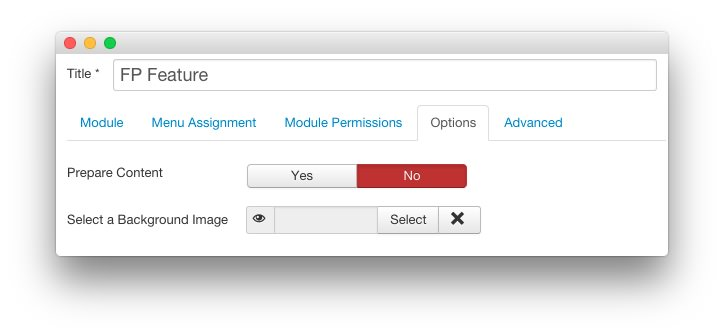
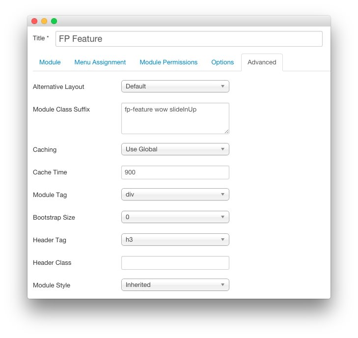

FP Feature
-----

This area of the page is a **Custom HTML** module. You will find the settings used in our demo below.

>> Any **mod_custom** (Custom HTML) modules are best handled using either RokPad or no editor as a WYSIWYG editor can cause issues with any code that exists in the **Custom Output** field.

### Details

| Option      | Setting      |
| :---------- | :----------  |
| Title       | `FP Feature` |
| Show Title  | Hide         |
| Position    | feature-a    |
| Status      | Published    |
| Access      | Public       |

### Custom Output

Enter the following in the **Custom Output** text editor.

~~~ .html

    

        

            

                

                    

                        <i class="fa fa-fw fa-history"></i>
                    

                    

                        <h3>Feature Focus</h3>  
                        
The Features layout, offers Slideshow and Showcase options, for easy to configure content presentation

                    

                    

                

                

                    

                        <i class="fa fa-fw fa-shopping-cart"></i>
                    

                    

                        <h3>Tabbed Content</h3> 
                        
RokSprocket features the Tabs layout, with configurable tab positions and titles with icons or text

                    

                    

                
              
            

        
  
        

            

                

                    

                        <i class="fa fa-fw fa-institution"></i>
                    

                    

                        <h3>Data Comparison</h3>    
                        
Utilize the tables layout to present columns of data, such as price comparisons, for your various products

                    

                    

                

                

                    

                        <i class="fa fa-fw fa-camera-retro"></i>
                    

                    

                        <h3>Photo Integration</h3>  
                        
In the administrator, there is support for the Media Manager, RokGallery, and custom URL/Path input

                    

                    

                
              
            

        
                                      
    

    
RokSprocket's custom administrator benefits from compounding filters, intuitive per item controls, and a rich UI to make configuration as user friendly as possible. <a href="index.php?option=com_content&amp;view=article&amp;id=1&amp;Itemid=111" class="readon3">Learn More</a>

    <a class="readon" href="index.php?option=com_content&amp;view=article&amp;id=1&amp;Itemid=111">Get Started</a>

~~~

### Basic

| Option                    | Setting     |
| :----------               | :---------- |
| Prepare Content           | No          |
| Select a Background Image | Blank       |

### Advanced

| Option              | Setting                    |
| :----------         | :----------                |
| Module Class Suffix | `fp-feature wow slideInUp` |