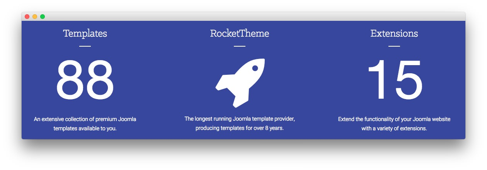
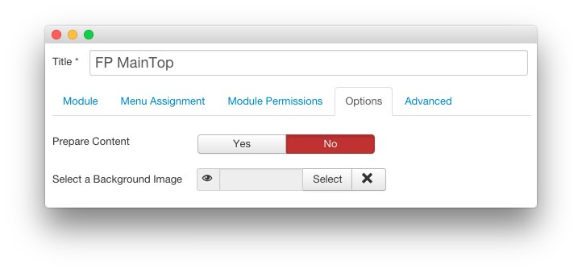
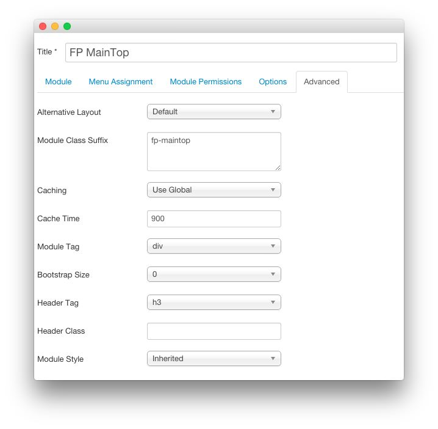

FP MainTop
-----

This area of the front page is a **Custom HTML** module. You will find the settings used in our demo below.

>> Any **mod_custom** (Custom HTML) modules are best handled using either RokPad or no editor as a WYSIWYG editor can cause issues with any code that exists in the **Custom Output** field.

### Details

| Option     | Setting      |
| :--------- | :----------- |
| Title      | `FP MainTop` |
| Show Title | Hide         |
| Position   | maintop-a    |
| Status     | Published    |
| Access     | Public       |

### Custom Output

~~~ .html

    

        

            

                

                    <h3>Templates</h3>
                    

                    
1

                    
An extensive collection of premium Joomla templates available to you.

                

            

        

        

            

                

                    <h3>RocketTheme</h3>
                    

                    
<i class="fa fa-rocket"></i>

                    
The longest running Joomla template provider, producing templates for over 8 years.

                

            

        

        

            

                

                    <h3>Extensions</h3>
                    

                    
1
                
                    
Extend the functionality of your Joomla website with a variety of extensions.

                

            

        

    

~~~

### Basic

| Option                    | Setting |
| :------------------------ | :------ |
| Prepare Content           | No      |
| Select a Background Image | Blank   |

### Advanced

| Option              | Setting      |
| :-----              | :-----       |
| Module Class Suffix | `fp-maintop` |
