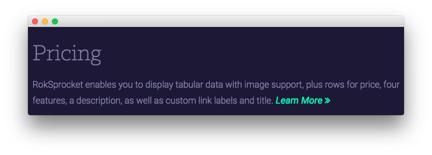
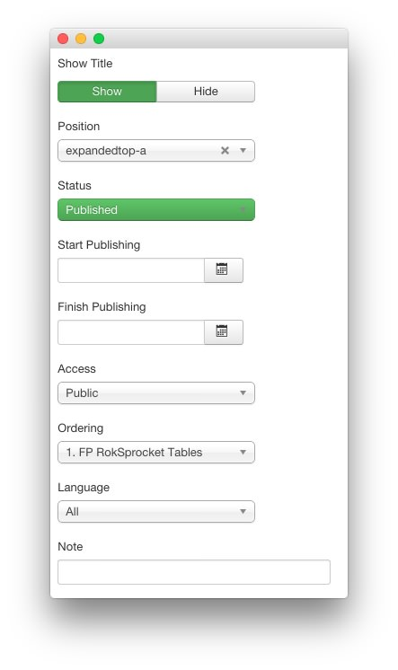
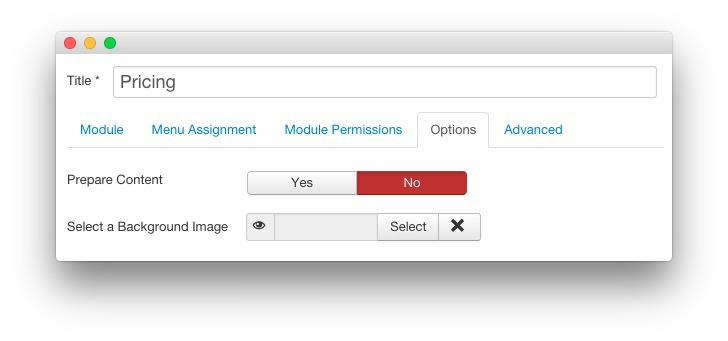
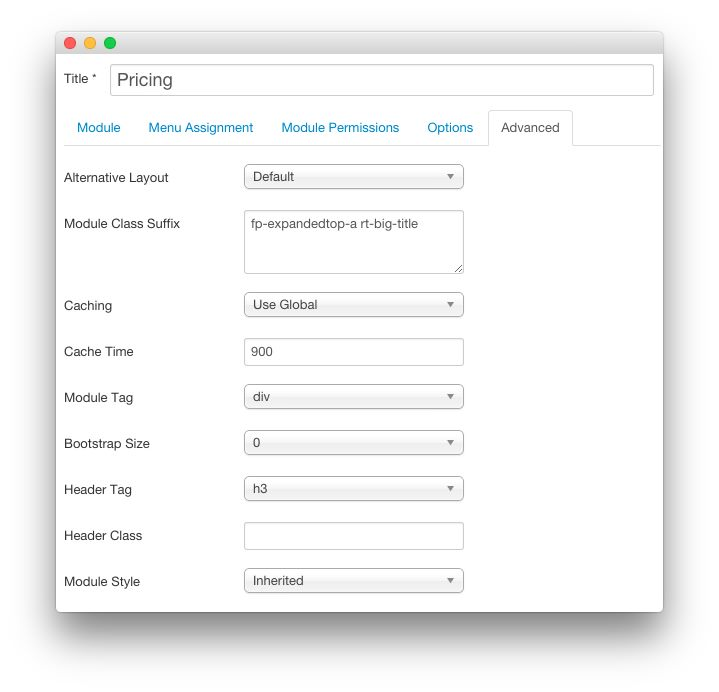

Pricing
-----

This area of the page is a **Custom HTML** module. You will find the settings used in our demo below.

>> Any **mod_custom** (Custom HTML) modules are best handled using either RokPad or no editor as a WYSIWYG editor can cause issues with any code that exists in the **Custom Output** field.

### Details

| Option      | Setting       |
| :---------- | :----------   |
| Title       | `Pricing`     |
| Show Title  | Show          |
| Position    | expandedtop-a |
| Status      | Published     |
| Access      | Public        |

### Custom Output

Enter the following in the **Custom Output** text editor.

~~~ .html

RokSprocket enables you to display tabular data with image support, plus rows for price, four features, a description, as well as custom link labels and title.<a class="readon3" href="#"> Learn More</a>

~~~

### Basic

| Option                    | Setting     |
| :----------               | :---------- |
| Prepare Content           | No          |
| Select a Background Image | Blank       |

### Advanced

| Option              | Setting                         |
| :----------         | :----------                     |
| Module Class Suffix | `fp-expandedtop-a rt-big-title` |