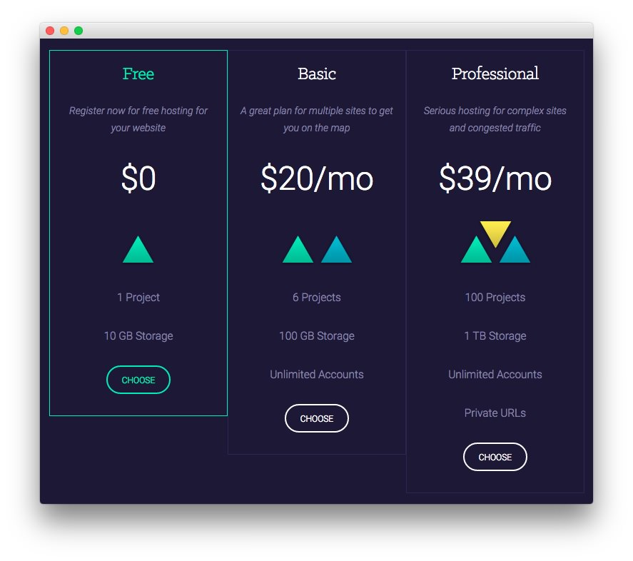
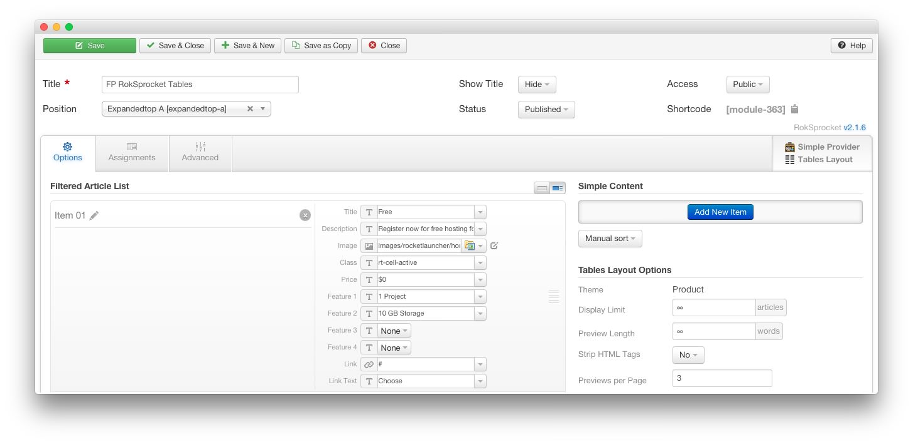
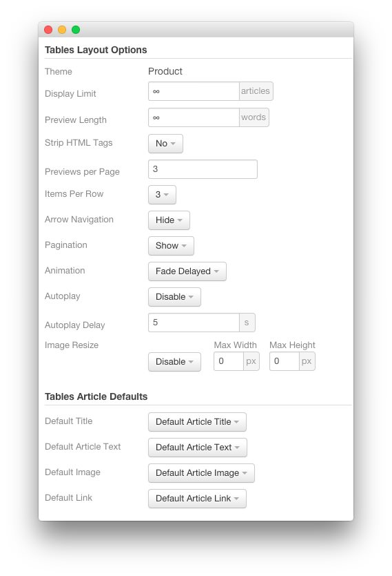
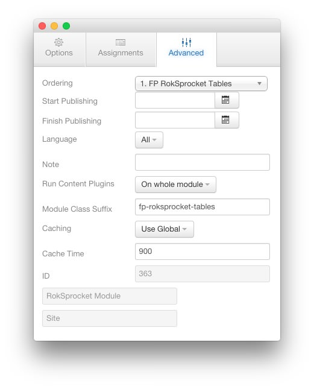

FP RokSprocket Tables
-----

We used a **RokSprocket** module with the **Tables** layout to make up this area of the front page. You will find the settings used in our demo below.

We utilized the **Simple** Content Provider. You can find examples of the **Simple** items used in this module in the **Filtered Article List** section below.

### Details

| Option           | Setting                 |
| :----------      | :----------             |
| Title            | `FP RokSprocket Tables` |
| Show Title       | Hide                    |
| Access           | Public                  |
| Position         | expandedtop-a           |
| Status           | Published               |
| Content Provider | Simple                  |
| Type             | Tables                  |

### Filtered Article List

#### Item 1

| Option      | Setting                                          |
| :-----      | :------                                          |
| Title       | `Free`                                           |
| Description | `Register now for free hosting for your website` |
| Image       | Custom                                           |
| Class       | `rt-cell-active`                                 |
| Price       | `$0`                                             |
| Feature 1   | `1 Project`                                      |
| Feature 2   | `10 GB Storage`                                  |
| Feature 3   | None                                             |
| Feature 4   | None                                             |
| Link        | `#`                                              |
| Link Text   | `Choose`                                         |

#### Item 2

| Option      | Setting                                                 |
| :-----      | :------                                                 |
| Title       | `Basic`                                                 |
| Description | `A great plan for multiple sites to get you on the map` |
| Image       | Custom                                                  |
| Class       | None                                                    |
| Price       | `$20/mo`                                                |
| Feature 1   | `6 Projects`                                            |
| Feature 2   | `100 GB Storage`                                        |
| Feature 3   | `Unlimited Accounts`                                    |
| Feature 4   | None                                                    |
| Link        | `#`                                                     |
| Link Text   | `Choose`                                                |

#### Item 3

| Option      | Setting                                                   |
| :-----      | :------                                                   |
| Title       | `Professional`                                            |
| Description | `Serious hosting for complex sites and congested traffic` |
| Image       | Custom                                                    |
| Class       | None                                                      |
| Price       | `$39/mo`                                                  |
| Feature 1   | `100 Projects`                                            |
| Feature 2   | `1 TB Storage`                                            |
| Feature 3   | `Unlimited Accounts`                                      |
| Feature 4   | `Private URLs`                                            |
| Link        | `#`                                                       |
| Link Text   | `Choose`                                                  |

### Layout Options

| Option            | Setting      |
| :----------       | :----------  |
| Theme             | Product      |
| Display Limit     | ∞            |
| Preview Length    | ∞            |
| Strip HTML Tags   | No           |
| Previews Per Page | `3`          |
| Items Per Row     | 3            |
| Arrow Navigation  | Hide         |
| Pagination        | Show         |
| Animation         | Fade Delayed |
| Autoplay          | Disable      |
| Autoplay Delay    | 5            |
| Image Resize      | Disable      |

### Advanced

| Option              | Setting                 |
| :----------         | :----------             |
| Module Class Suffix | `fp-roksprocket-tables` |
