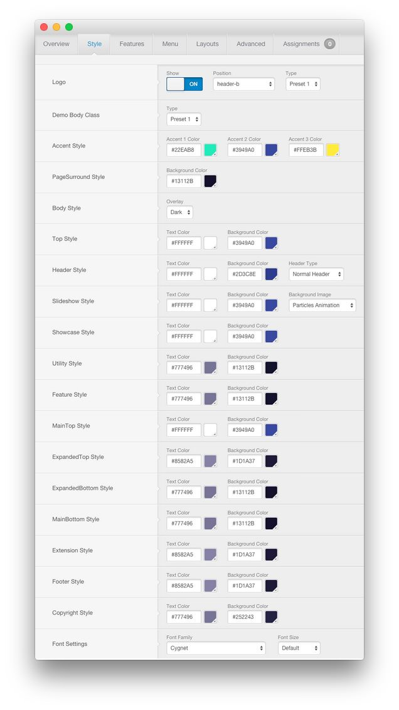
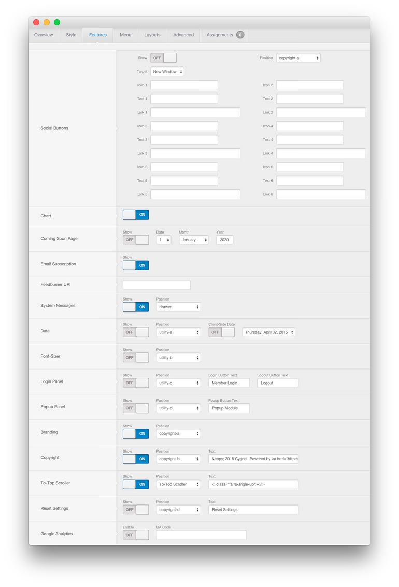
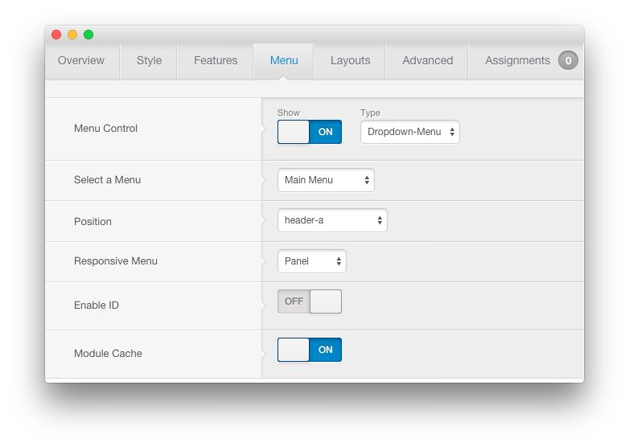
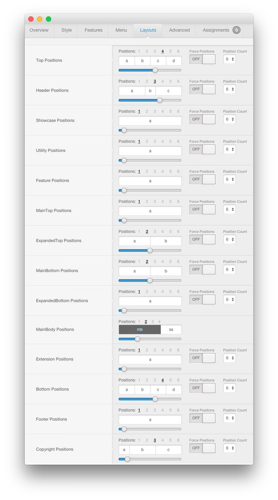
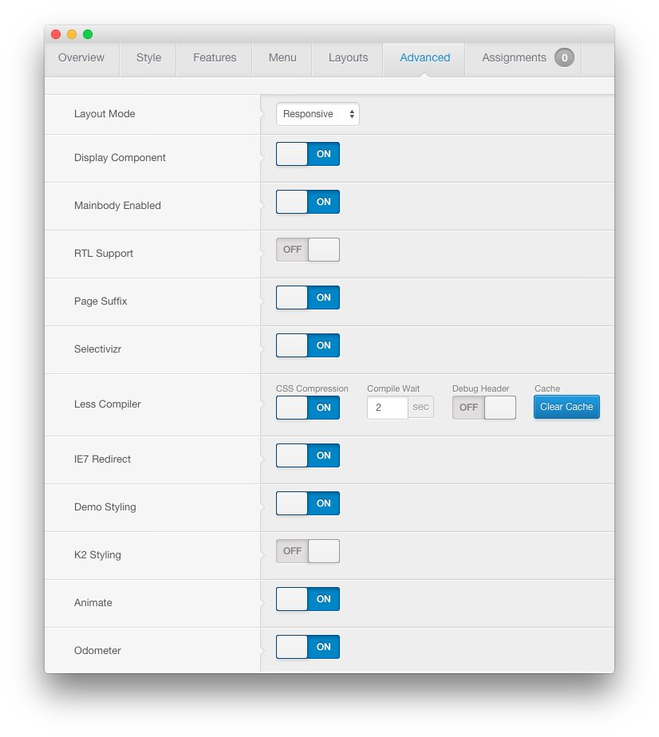
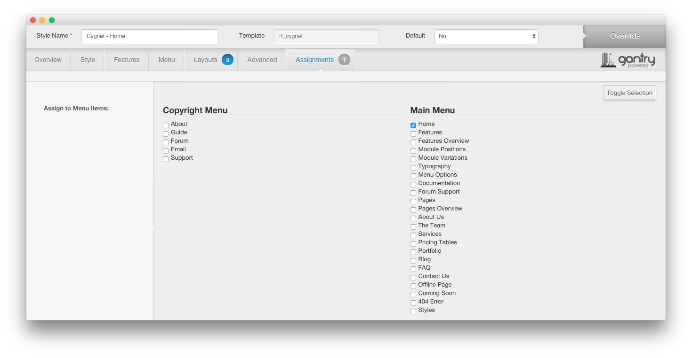

Template Settings
-----
One of the most important aspects of any Gantry template is its ability to be easily customized using the settings present in the Template Settings page. These settings can be adjusted by navigating to **Administration -> Template Manager -> Cygnet Template**. To replicate the demo, the main changes being made will happen within the Style, Features, Layouts, and Advanced tabs.

This table will break down the various settings you may need to adjust in order to recreate the demo. Most of the settings under **Style** are adjusted automatically with the selection of a template preset. You can set presets using the **Presets** button located next to the **Save** option at the top of the Template Settings page.

Once you have selected a Preset, these options can be further adjusted to match the demo. Keep in mind that the Style indicated here relates to the template Style in this menu. More information about how Styles work can be found in our [Gantry documentation](http://docs.gantry.org/gantry4/configure).

### Style

| Style   | Option               | Position | Setting                                                                                   |
| :------ | :------------------- | :------- | :----------------------------------------------------------------                         |
| Default | Logo                 | header-b | Show: On, Type: Cygnet Template                                                           |
| Default | Demo Body Class      |          | Preset 1                                                                                  |
| Default | Accent Style         |          | Accent 1 Color: `#22eab8`, Accent 2 Color: `#3949a0`, Accent 3 Color: `#ffeb3b`           |
| Default | PageSurround Style   |          | Background Color: `#13112b`                                                               |
| Default | Body Style           |          | Overlay: Dark                                                                             |
| Default | Top Style            |          | Text Color: `#ffffff`, Background Color: `#3949a0`                                        |
| Default | Header Style         |          | Text Color: `#ffffff`, Background Color: `#2d3c8e`, Header Type: Normal Header            |
| Default | Slideshow Style      |          | Text Color: `#ffffff`, Background Color: `#3949a0`, Background Image: Particles Animation |
| Default | Showcase Style       |          | Text Color: `#8f8f8f`, Background Color: `#3949a0`                                        |
| Default | Utility Style        |          | Text Color: `#777496`, Background Color: `#13112b`                                        |
| Default | Feature Style        |          | Text Color: `#777496`, Background Color: `#13112b`                                        |
| Default | MainTop Style        |          | Text Color: `#ffffff`, Background Color: `#3949a0`                                        |
| Default | ExpandedTop Style    |          | Text Color: `#8582a5`, Background Color: `#1d1a37`                                        |
| Default | ExpandedBottom Style |          | Text Color: `#777496`, Background Color: `#13112b`                                        |
| Default | MainBottom Style     |          | Text Color: `#777496`, Background Color: `#13112b`                                        |
| Default | Extension Style      |          | Text Color: `#8582a5`, Background Color: `#1d1a37`                                        |
| Default | Footer Style         |          | Text Color: `#8582a5`, Background Color: `#1d1a37`                                        |
| Default | Copyright Style      |          | Text Color: `#777496`, Background Color: `#252243`                                        |
| Default | Font Settings        |          | Font Family: Cygnet, Font Size: Default                                                   |

### Features

| Style   | Option             | Position        | Setting                                                                                                 |
| :------ | :----------------- | :----------     | :-------------------------------------------------------------------------                              |
| Default | Social Buttons     | copyright-a     | Show: On                                                                                                |
| Default | Chart              |                 | Show: On                                                                                                |
| Default | Coming Soon Page   |                 | Show: Off                                                                                               |
| Default | Email Subscription |                 | Show: On                                                                                                |
| Default | Feedburner URI     |                 | Blank                                                                                                   |
| Default | System Messages    | drawer          | On                                                                                                      |
| Default | Date               | utility-a       | Show: Off, Client-Side Date: Off                                                                        |
| Default | Font-Sizer         | utility-b       | Show: Off                                                                                               |
| Default | Login Panel        | utility-c       | Show: Off, Login Button Text: `Member Login`, Logout Button Text: `Logout`                              |
| Default | Popup Panel        | utility-d       | Show: Off, Popup Button Text: `Popup Module`                                                            |
| Default | Branding           | copyright-a     | Show: On                                                                                                |
| Default | Copyright          | copyright-b     | Show: On, Text: `&copy; 2015 Cygnet. Powered by <a href="http://www.rockettheme.com/">RocketTheme</a>.` |
| Default | To-Top Scroller    | To-Top Scroller | Show: On, Text: `<i class="fa fa-angle-up"></i>`                                                        |
| Default | Reset Settings     | copyright-d     | Show: Off, Text: `Reset Settings`                                                                       |
| Default | Google Analytics   |                 | Enable: Off                                                                                             |

### Menu

| Style       | Option          | Setting                       |
| :---------- | :----------     | :----------                   |
| Default     | Menu Control    | Show: On, Type: Dropdown-Menu |
| Default     | Select a Menu   | Main Menu                     |
| Default     | Position        | header-a                      |
| Default     | Responsive Menu | Panel                         |
| Default     | Enable ID       | Off                           |
| Default     | Module Cache    | On                            |

### Layouts

| Style   | Option                   | Setting               |
| :------ | :----------------------- | :-------------------- |
| Default | Top Positions            | Positions: 4, 3:3:3:3 |
| Default | Header Positions         | Positions: 3, 5:2:5   |
| Default | Showcase Positions       | Positions: 1, 12      |
| Default | Utility Positions        | Positions: 1, 12      |
| Default | Feature Positions        | Positions: 1, 12      |
| Default | MainTop Positions        | Positions: 1, 12      |
| Default | ExpandedTop Positions    | Positions: 2, 6:6     |
| Default | MainBottom Positions     | Positions: 2, 6:6     |
| Default | ExpandedBottom Positions | Positions: 1, 12      |
| Default | MainBody Positions       | Positions: 2, 8:4     |
| Default | Extension Positions      | Positions: 1, 12      |
| Default | Bottom Positions         | Positions: 4, 3:3:3:3 |
| Default | Footer Positions         | Positions: 1, 12      |
| Default | Copyright Positions      | Positions: 3, 2:5:5   |
| Home    | ExpandedTop Positions    | Positions: 2, 8:4     |
| Home    | MainBottom Positions     | Positions: 2, 9:3     |
| Home    | MainBody Positions       | Positions: 2, 4:8     |

### Advanced

| Style   | Option            | Setting                                                 |
| :------ | :---------------- | :------------------------------------------------------ |
| Default | Layout Mode       | Responsive                                              |
| Default | Display Component | On                                                      |
| Default | Mainbody Enabled  | On                                                      |
| Default | RTL Support       | Off                                                     |
| Default | Page Suffix       | On                                                      |
| Default | Selectivizr       | On                                                      |
| Default | Less Compiler     | CSS Compression: On, Compile Wait: 2, Debug Header: Off |
| Default | IE7 Redirect      | On                                                      |
| Default | Demo Styling      | On                                                      |
| Default | K2 Styling        | Off                                                     |
| Default | Animate           | On                                                      |
| Default | Odometer          | On                                                      |

### Assignments

| Style |   Option  | Setting |
| :---- | :-------- | :------ |
| Home  | Main Menu | Home    |
