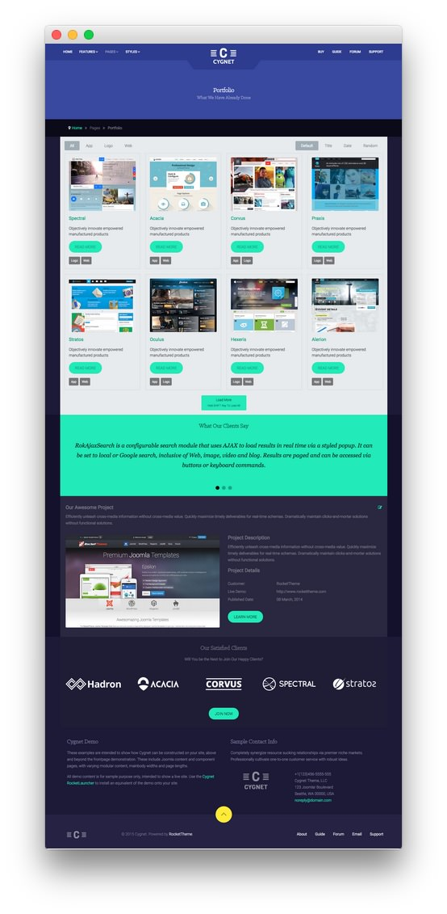
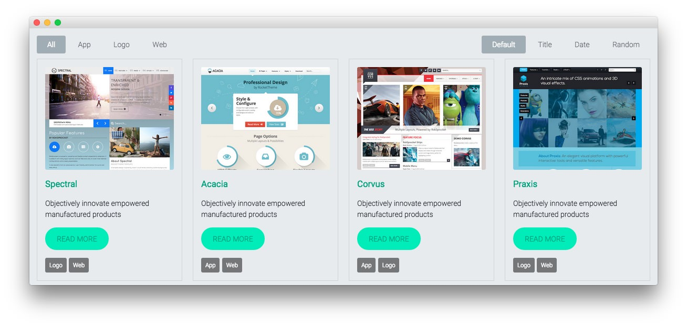
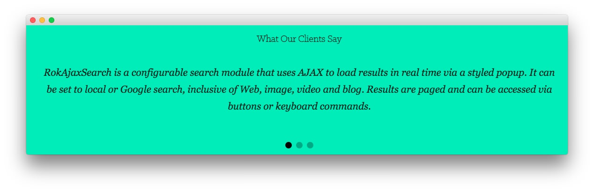
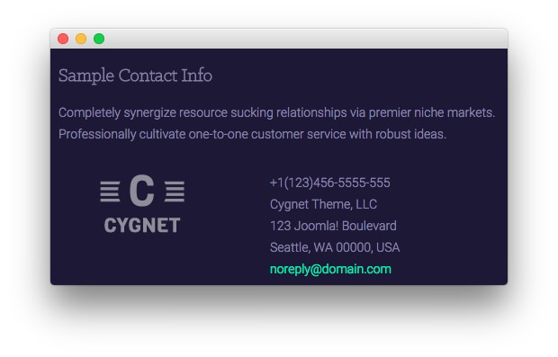

Introduction
-----

The **Portfolio** example page demonstrates how you can create a clean, functional portfolio with the Cygnet template. Here is some information to help you replicate this page as it appears in the demo.

>> Any **mod_custom** (Custom HTML) modules are best handled using either RokPad or no editor as a WYSIWYG editor can cause issues with any code that exists in the **Custom Output** field.

Modules
-----

Below is a brief rundown of the modules used to make up the demo page.

:   1. **Custom HTML - Portfolio** [10%, 45%, se]
    2. **Breadcrumbs** [14%, 15%, se]
    3. **RokSprocket Mosaic** [17%, 15%, se]
    4. **RokSprocket Strips - What Our Clients Say** [47%, 15%, se]
    5. **Custom HTML - Our Satisfied Clients** [72%, 15%, se]
    6. **Custom HTML - Cygnet Demo** [82%, 15%, se]
    7. **Custom HTML - Sample Contact Info** [82%, 52%, se]
    8. **Article Content** [55%, 15%, se]

1. [Custom HTML - Portfolio](portfolio.md#custom-html---portfolio)
2. [Breadcrumbs](portfolio.md#breadcrumbs)
3. [RokSprocket Mosaic](portfolio.md#roksprocket-mosaic)
4. [RokSprocket Strips - What Our Clients Say](portfolio.md#what-our-clients-say)
5. [Custom HTML - Our Satisfied Clients](portfolio.md#custom-html---our-satisfied-clients)
6. [Custom HTML - Cygnet Demo](portfolio.md#custom-html---cygnet-demo)
7. [Custom HTML - Sample Contact Info](portfolio.md#custom-html---sample-contact-info)
8. [Article Content](portfolio.md#mainbody)

### Custom HTML - Portfolio

#### Module

|   Option   |                                Setting                                 |
| :--------- | :--------------------------------------------------------------------- |
| Title      | `Portfolio[span class="rt-title-tag"]What We Have Already Done[/span]` |
| Show Title | Yes                                                                    |
| Position   | showcase-a                                                             |
| Status     | Published                                                              |
| Access     | Public                                                                 |

>> The title of this module requires RokCandy in order to appear properly on the screen due to the `[span]` tags present. See the main [RokCandy](../../extensions/rokcandy/rokcandy_use.md#rokcandy-use-in-rockettheme-template-demos) guide for additional instructions.

#### Content

~~~ .html
&nbsp;
~~~

#### Options

|           Option          | Setting |
| :------------------------ | :------ |
| Prepare Content           | No      |
| Select a Background-Image | Blank   |

#### Advanced

|        Option       |                                    Setting                                     |
| :------------------ | :----------------------------------------------------------------------------- |
| Module Class Suffix | `rt-top-large-padding nomarginall rt-center rt-title-large rt-nomodulecontent` |

### Breadcrumbs

#### Module

|        Option       |    Setting    |
| :------------------ | :------------ |
| Title               | `Breadcrumbs` |
| Show You Are Here   | No            |
| Show Home           | Yes           |
| Text for Home Entry |               |
| Show Last           | Yes           |
| Text Separator      |               |
| Show Title          | Hide          |
| Position            | breadcrumb    |
| Status              | Published     |
| Access              | Public        |

##### Advanced

|        Option       |     Setting     |
| :------------------ | :-------------- |
| Module Class Suffix | ` hidden-phone` |

### RokSprocket Mosaic

#### Module

|    Option   |             Setting             |
| :---------- | :------------------------------ |
| Title       | `Portfolio: RokSprocket Mosaic` |
| Show Title  | Hide                            |
| Position    | expandedtop-a                   |
| Layout Type | Mosaic Layout                   |
| Provider    | Simple Provider                 |
| Status      | Published                       |
| Access      | Public                          |

#### Article List Item Example

| Option      | Setting                                                |
| :---------- | :-----------                                           |
| Title       | `Spectral`                                             |
| Description | `Objectively innovate empowered manufactured products` |
| Image       | Custom                                                 |
| Link        | Custom                                                 |
| Tags        | Logo, Web                                              |

#### Options

| Option          | Setting                      |
| :----------     | :----------                  |
| Theme           | Default                      |
| Display Limit   | ∞                            |
| Columns         | 4                            |
| Preview Length  | ∞                            |
| Only Show Tags  |                              |
| Strip HTML Tags | No                           |
| Blocks Per View | 8                            |
| Article Details | Hide author and date         |
| Block Animation | Fade, Scale, Rotate          |
| Ordering        | Default, Title, Date, Random |
| Image Size      | Disable, 0, 0                |

#### Advanced

|        Option       |      Setting       |
| :------------------ | :----------------- |
| Module Class Suffix | `box3 nomarginall` |

### What Our Clients Say

#### Module

|    Option   |        Setting         |
| :---------- | :--------------------- |
| Title       | `What Our Clients Say` |
| Show Title  | Show                   |
| Position    | mainbottom-a           |
| Layout Type | Strips Layout          |
| Provider    | Simple Provider        |
| Status      | Published              |
| Access      | Public                 |

#### Article List Item Example

| Option      | Setting      |
| :---------- | :----------- |
| Title       | None         |
| Image       | None         |
| Link        | None         |

**Description**

~~~ .html

RokAjaxSearch is a configurable search module that uses AJAX to load results in real time via a styled popup. It can be set to local or Google search, inclusive of Web, image, video and blog. Results are paged and can be accessed via buttons or keyboard commands.

~~~

#### Options

|       Option      |    Setting    |
| :---------------- | :------------ |
| Theme             | Default       |
| Display Limit     | ∞             |
| Preview Length    | ∞             |
| Strip HTML Tags   | No            |
| Previews Per Page | 1             |
| Items Per Row     | 1             |
| Arrow Navigation  | Hide          |
| Pagination        | Show          |
| Animation         | Fade Delayed  |
| Autoplay          | Disable       |
| Autoplay Delay    | 5             |
| Image Resize      | Disable, 0, 0 |

#### Advanced

|        Option       |           Setting            |
| :------------------ | :--------------------------- |
| Module Class Suffix | `box1 rt-center nomarginall` |

### Custom HTML - Our Satisfied Clients

#### Module

|   Option   |         Setting         |
| :--------- | :---------------------- |
| Title      | `Our Satisfied Clients` |
| Show Title | Yes                     |
| Position   | extension-a             |
| Status     | Published               |
| Access     | Public                  |

#### Content

~~~ .html

Will You be the Next to Join Our Happy Clients?

 

    

        

            

                
            

        

        

            

                
            

        

        

            

                
            

        

        

            

                
            

        

        

            

                
            

        

    

  

<a href="http://www.rockettheme.com/joomla/templates/cygnet" class="readon">Join Now</a>

~~~

#### Options

| Option                    | Setting     |
| :----------               | :---------- |
| Prepare Content           | No          |
| Select a Background-Image | Blank       |

#### Advanced

| Option              | Setting     |
| :----------         | :---------- |
| Module Class Suffix | `rt-center` |

### Custom HTML - Cygnet Demo

#### Module

| Option     | Setting         |
| :--------- | :-------------  |
| Title      | `Cygnet Demo` |
| Show Title | Yes             |
| Position   | footer-a        |
| Status     | Published       |
| Access     | Public          |

#### Content

~~~ .html

These examples are intended to show how Cygnet can be constructed on your site, above and beyond the frontpage demonstration. These include Joomla content and component pages, with varying modular content, mainbody widths and page lengths.

All demo content is for sample purpose only, intended to show a live site. Use the <a href="http://www.rockettheme.com/joomla/templates/cygnet">Cygnet RocketLauncher</a> to install an equivalent of the demo onto your site.

~~~

#### Options

| Option                    | Setting     |
| :----------               | :---------- |
| Prepare Content           | No          |
| Select a Background-Image | Blank       |

#### Advanced

| Option              | Setting           |
| :----------         | :----------       |
| Module Class Suffix | `rt-phone-center` |

### Custom HTML - Sample Contact Info

#### Module

| Option     | Setting               |
| :--------- | :-------------------- |
| Title      | `Sample Contact Info` |
| Show Title | Yes                   |
| Position   | footer-b              |
| Status     | Published             |
| Access     | Public                |

#### Content

~~~ .html

Completely synergize resource sucking relationships via premier niche markets. Professionally cultivate one-to-one customer service with robust ideas.

    

        

            
        
  
    

    

        

            +1(123)456-5555-555 
            Cygnet Theme, LLC 
            123 Joomla! Boulevard 
            Seattle, WA 00000, USA 
            <a href="#">noreply@domain.com</a>
        

    

~~~

#### Options

| Option                    | Setting     |
| :----------               | :---------- |
| Prepare Content           | No          |
| Select a Background-Image | Blank       |

#### Advanced

| Option              | Setting           |
| :----------         | :----------       |
| Module Class Suffix | `rt-phone-center` |

Mainbody
-----

The page's content body is set in the **Portfolio** article. You will find the content used in the article below.

~~~ .html
<h3>Our Awesome Project</h3>

Efficiently unleash cross-media information without cross-media value. Quickly maximize timely deliverables for real-time schemas. Dramatically maintain clicks-and-mortar solutions without functional solutions.

    

        

            

                
                    
                
            

        

        

            

                <h3>Project Description</h3>
                
Efficiently unleash cross-media information without cross-media value. Quickly maximize timely deliverables for real-time schemas. Dramatically maintain clicks-and-mortar solutions without functional solutions.

                <h3>Project Details</h3>
                

                    

                        

                            
Customer:

                            
Live Demo:

                            
Published Date:

                        

                    

                    

                        

                            
RocketTheme

                            
http://www.rockettheme.com

                            
08 March, 2014

                        

                    

                

                

                
<a href="http://www.rockettheme.com/joomla/templates/cygnet" class="readon">Learn More</a>

            

        

    

~~~
