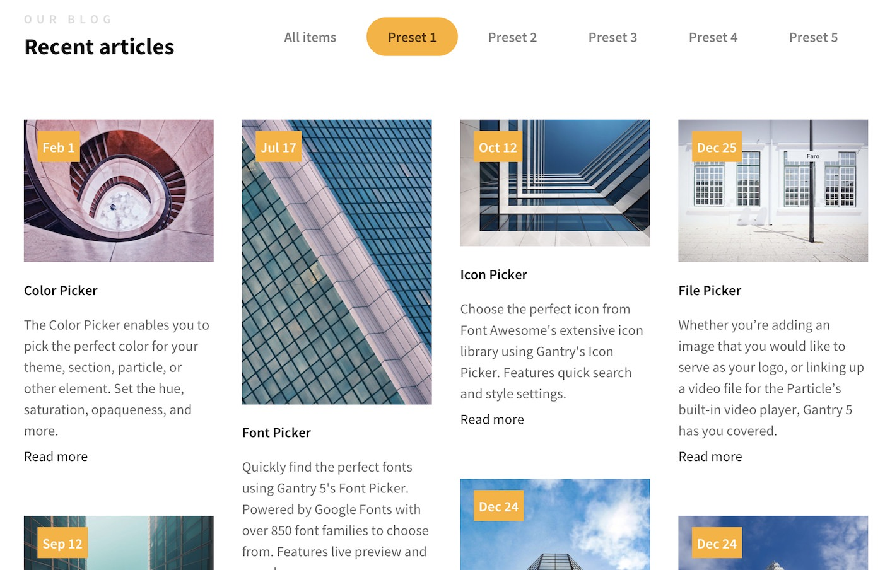
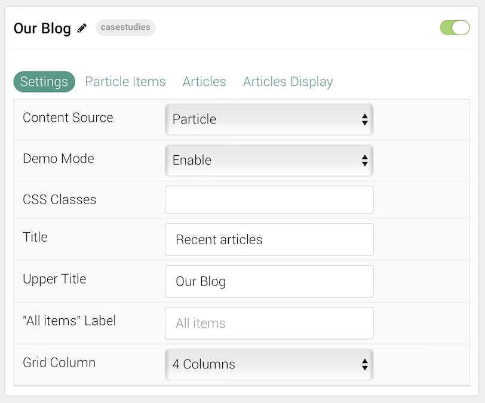
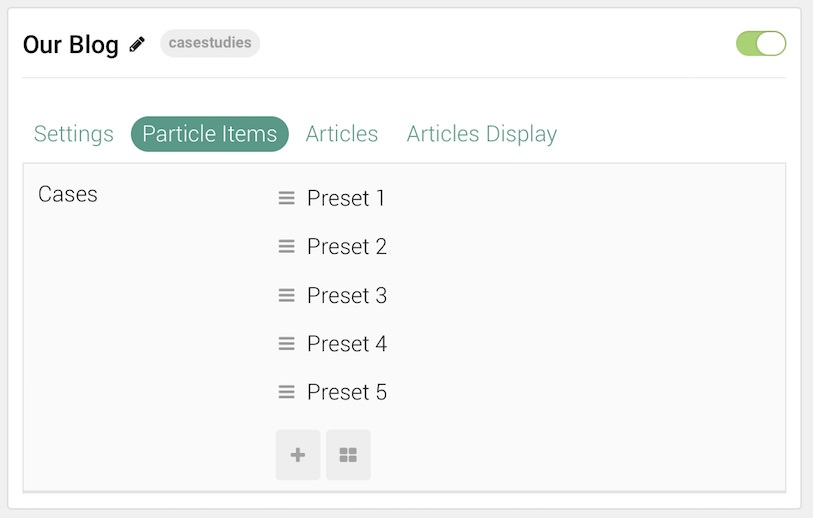
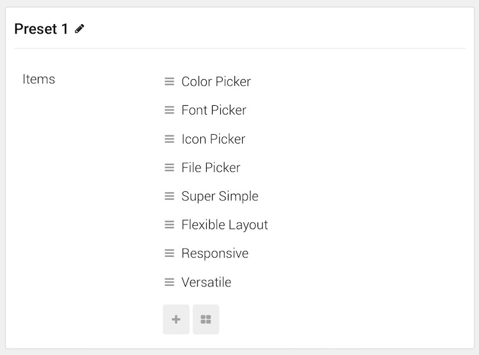
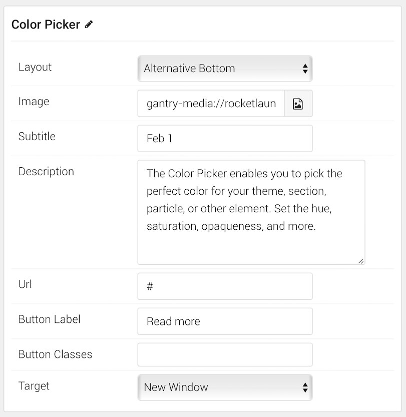
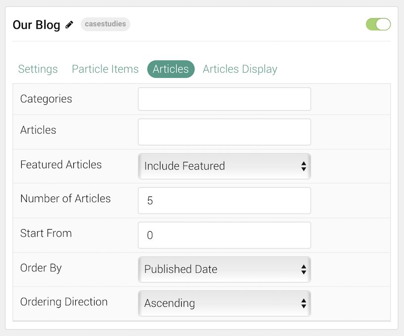
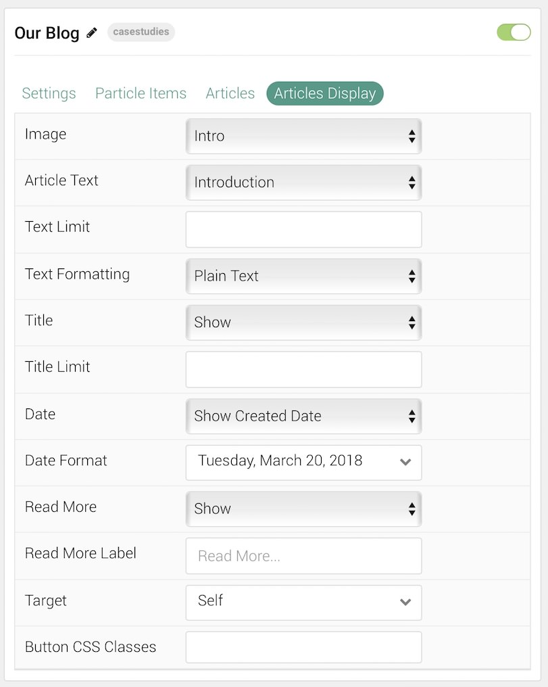

## Introduction

The **Case Studies** particle is an excellent particle for displaying image content in a clean, modern way.

Here are the topics covered in this guide:

* [Configuration](#configuration)
    - [Main Options](#settings)
    - [Item Options](#particle-item-options)
    - [Articles](#articles)
    - [Display](#display)

## Configuration

### Settings 

These options affect the main area of the particle, and not the individual items within. You can set the title of the particle, as well as give it an introductory paragraph here.

| Option            | Description                                                                                             |
| :-----            | :-----                                                                                                  |
| Particle Name     | This is the name of the particle used for back end management. It does not appear on the front end.     |
| Content Source    | Choose between **Particle** and **Joomla** as the Content Source.                                       |
| Demo Mode         | **Enables** or **Disables** Demo Mode. If enabled the preset number will be synced with the set number. |
| CSS Classes       | Enter any CSS class(es) you wish to have apply to the particle.                                         |
| Title             | Enter a title for the particle. This will appear on the front end.                                      |
| Upper Title       | Enter a title to appear in the upper area of the particle.                                              |
| "All Items" Label | Enter a label for the tab that loads all of the items at once.                                          |
| Grid Column       | Enter the number of column(s) you wish to have items displayed in at once.                              |

### Particle Item Options

These items make up the individual featured items in the particle. Items in this section will only appear if **Particle** is selected as the **Content Source**.

| Option         | Description                                                                    |
| :-----         | :-----                                                                         |
| Item Name      | This is the name of the item. This only appears in the back end.               |
| Layout         | Choose the layout for the item.                                                |
| Image          | Select an image to display in the item.                                        |
| Subtitle       | Enter a subtitle to appear with the item.                                      |
| Description    | Enter a text description to appear with the item.                              |
| URL            | Enter a URL for the item to link to.                                           |
| Button Label   | Enter text to appear on the button that takes the visitor to your entered URL. |
| Button Classes | Enter any CSS class(es) you wish to have apply to the button.                  |
| Target         | Choose whether to have the link open in a new tab or the same tab.             |

### Articles

| Option             | Description                                                                                                     |
| :-----             | :-----                                                                                                          |
| Categories         | Select the categories of articles this particle will display.                                                   |
| Articles           | Select the number of articles you would like the particle to fetch.                                             |
| Featured Articles  | Choose how Featured Articles should be filtered. Choose between **Include**, **Exclude**, or **Only Featured**. |
| Number of Articles | Enter the maximum number of articles to display.                                                                |
| Start From         | Enter offset specifying the first article to return. The default is '0' (the first article).                    |
| Order By           | Choose the type of factor to order by.                                                                          |
| Ordering Direction | Choose between **Ascending** and **Descending** as the article ordering method.                                 |

### Display

This section configures how articles are displayed.

| Option          | Description                                                                         |
| :-----          | :-----                                                                              |
| Image           | Display the image assigned to the article's **Intro**, **Full** or **None**.        |
| Article Text    | Choose whether to display the **Introduction**, **Full Title**, or **Hide** (none). |
| Text Limit      | Enter the number of characters you wish to limit the text displayed to.             |
| Text Formatting | Choose between plain text and HTML.                                                 |
| Title           | **Show** or **Hide** the article's title.                                           |
| Title Limit     | Enter the maximum number of characters in the title to display.                     |
| Date            | Enter a date for the item.                                                          |
| Date Format     | Select the format you want the date to be displayed in.                             |
| Read More       | **Show** or **Hide** the Read More link.                                            |
| Read More Label | Enter any text you wish to have appear as the read more link.                       |
| Target          | Choose whether to have the link open in a new tab or the same tab.                  |
| Button Classes  | Enter any CSS class(es) you wish to have apply to the button.                       |