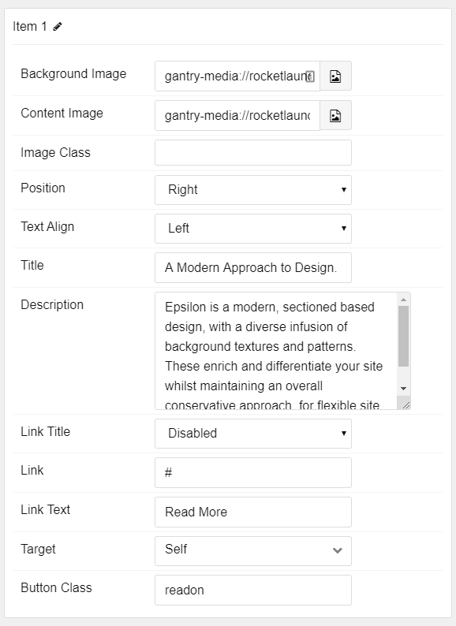

## Introduction

The **Slideshow** particle creates a clean, modern slideshow perfect for the top of your website's homepage.

Here are the topics covered in this guide:

* [Configuration](#configuration)
    - [Main Options](#main-options)
    - [Item Options](#item-options)

## Configuration

### Main Options

These options affect the main area of the particle, and not the individual items within.

| Option            | Setting                                                               |
|:----------------- |:--------------------------------------------------------------------- |
| Particle Name     | The name of the particle for organizational use in the backend.       |
| CSS Classes       | CSS Class(es) you would like to have apply to the particle's content. |
| In Animation      | Set the animation type for incoming items.                            |
| Out Animation     | Set the animation type for outgoing items.                            |
| Content Animation | Set the animation type for the content as it comes into view.         |
| Prev Next         | **Enable** or **Disable** the Prev/Next Buttons.                      |
| Dots              | **Enable** or **Disable** dots navigation.                            |
| Loop              | **Enable** or **Disable** looping of slides.                          |
| Autoplay          | **Enable** or **Disable** autoplay for the particle.                  |
| Autoplay Speed    | Set the speed (in milliseconds) of the particle's animation.          |
| Pause on Hover    | **Enable** or **Disable** the pause-on-hover effect for the particle. |

### Item Options

These items make up the individual featured items in the particle.

| Option        | Description                                                                                                  |
|:------------- |:------------------------------------------------------------------------------------------------------------ |
| Name          | Enter a name for your item. This only appears on the back end.                                               |
| Content Image | Set an image for the content area of the item.                                                               |
| Image Class   | Enter any CSS class(es) you want to have apply to the image.                                                 |
| Position      | Select the position the image will appear in. Options include: **Right**, **Left**, **Top**, and **Bottom**. |
| Text Align    | Select the alignment of text. Options include: **Left**, **Right**, and **Center**.                          |
| Title         | Enter a title for the item.                                                                                  |
| Description   | Enter a description for the item.                                                                            |
| Link Title    | Enter a title to appear as the title of the link.                                                            |
| Link          | Enter a link for the item.                                                                                   |
| Link Text     | Enter text that appears as the link for the item.                                                            |
| Target        | Select between **Self** and **New Window** for the link's target.                                            |
| Button Class  | Enter any CSS class(es) you want to have apply to the button.                                                |
