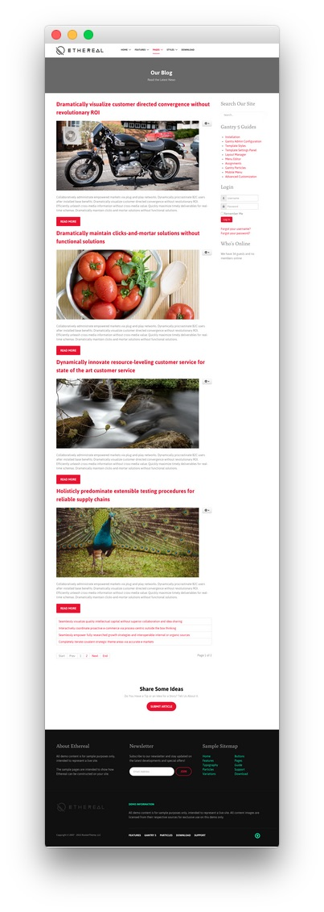
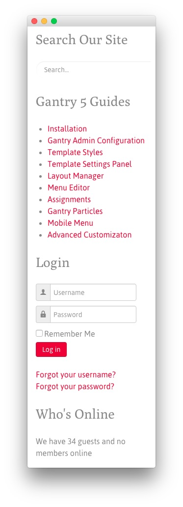

## Introduction

The **Blog** example page demonstrates how you can create a beautiful page with the Ethereal template. Here is some information to help you replicate this page as it appears in the demo.

## Modules and Particles

Below is a brief rundown of the modules and particles used to make up the demo page.

:   1. **Showcase - Custom HTML (Module)** [8%, 45%, se]
    2. **Mainbar - Page Content** [11%, 15%, se]
    3. **Aside - RokAjaxSearch (Module)** [28%, 10%, se]
    4. **Aside - Custom HTML (Module)** [47%, 10%, se]
    5. **Aside - Login (Module)** [50%, 50%, se]
    6. **Aside - Who's Online (Module)** [50%, 60%, se]
    5. **Footer - Custom HTML (Module)** [72%, 10%, se]
    6. **Footer - Custom HTML (Module)** [72%, 38%, se]
    7. **Footer - Custom HTML (Module)** [72%, 65%, se]

1. [Showcase](#showcase-section)
2. [Mainbar](#mainbar-section)
3. [Extension](#extension-section)
4. [Bottom](#bottom-section)
4. [Footer](#footer-section)

## Showcase Section

This area of the page is a **Custom HTML** module. You will find the settings used in our demo below.

>> Any **mod_custom** (Custom HTML) modules are best handled using either RokPad or no editor as a WYSIWYG editor can cause issues with any code that exists in the **Custom Output** field.

### Custom HTML (Module)

### Details

| Field      | Setting             |
| :-----     | :-----              |
| Title      | `Our Blog - Header` |
| Show Title | Hide                |
| Position   | `showcase-a`        |
| Status     | Published           |

### Custom Output

Enter the following in the **Custom Output** text editor.

~~~ .html

    <h2 class="g-layercontent-title">Our Blog</h2>
    
Read the Latest News

~~~

### Basic

| Option                    | Setting     |
| :----------               | :---------- |
| Prepare Content           | No          |
| Select a Background Image | Blank       |

### Advanced

| Option              | Setting        |
| :----------         | :----------    |
| Module Class Suffix | `flush center` |

## Mainbar Section

The **Mainbar** section includes several articles assigned to the **Joomla Blog** category, displayed through the **Page Content** particle. Here are the settings found in the **Dramatically visualize customer directed convergence without revolutionary ROI** article.

| Option   | Setting                                                                          |
| :-----   | :-----                                                                           |
| Title    | `Dramatically visualize customer directed convergence without revolutionary ROI` |
| Alias    | `dramatically-visualize-customer-directed-convergence-without-revolutionary-roi` |
| Status   | Published                                                                        |
| Featured | No                                                                               |
| Category | `Joomla Blog`                                                                    |

**Content Body**

~~~ .html

Collaboratively administrate empowered markets via plug-and-play networks. Dynamically procrastinate B2C users after installed base benefits. Dramatically visualize customer directed convergence without revolutionary ROI. Efficiently unleash cross-media information without cross-media value. Quickly maximize timely deliverables for real-time schemas. Dramatically maintain clicks-and-mortar solutions without functional solutions.

<a class="button" href="#">Read More</a>
~~~

## Aside Section

This area of the page consists of the **Aside** section, which sits to the right of the **Mainbar** section in the **Layout Manager**.

Here is a breakdown of the modules used in the `aside` module position assigned to the **Aside** section in the **Layout Manager** for the **Blog** sample page:

* RokAjaxSearch (Module)
* Custom HTML (Module)
* Login (Module)
* Who's Online (Module)

>> Any **mod_custom** (Custom HTML) modules are best handled using either RokPad or no editor as a WYSIWYG editor can cause issues with any code that exists in the **Custom Output** field.

### Custom HTML (Module)

### Details

| Field      | Setting                                 |
| :-----     | :-----                                  |
| Title      | `Sophisticated - Responsive - Powerful` |
| Show Title | Hide                                    |
| Position   | `extension-a`                           |
| Status     | Published                               |

### Custom Output

Enter the following in the **Custom Output** text editor.

~~~ .html

  

    

      <h2 class="g-title"> Sophisticated</h2>
      
Dynamically procrastinate B2C users after installed base benefits.

    

  

  

    

      <h2 class="g-title"> Responsive</h2>
      
Dynamically procrastinate B2C users after installed base benefits.

    

  

  

    

      <h2 class="g-title"> Powerful</h2>
      
Dynamically procrastinate B2C users after installed base benefits.

    

  

~~~

### Basic

| Option                    | Setting     |
| :----------               | :---------- |
| Prepare Content           | No          |
| Select a Background Image | Blank       |

### Advanced

| Option              | Setting     |
| :----------         | :---------- |
| Module Class Suffix | Blank       |

## Extension Section

This area of the page is a **Custom HTML** module. You will find the settings used in our demo below.

>> Any **mod_custom** (Custom HTML) modules are best handled using either RokPad or no editor as a WYSIWYG editor can cause issues with any code that exists in the **Custom Output** field.

### Custom HTML (Module)

### Details

| Field      | Setting                                 |
| :-----     | :-----                                  |
| Title      | `Sophisticated - Responsive - Powerful` |
| Show Title | Hide                                    |
| Position   | `extension-a`                           |
| Status     | Published                               |

### Custom Output

Enter the following in the **Custom Output** text editor.

~~~ .html

  

    

      <h2 class="g-title"> Sophisticated</h2>
      
Dynamically procrastinate B2C users after installed base benefits.

    

  

  

    

      <h2 class="g-title"> Responsive</h2>
      
Dynamically procrastinate B2C users after installed base benefits.

    

  

  

    

      <h2 class="g-title"> Powerful</h2>
      
Dynamically procrastinate B2C users after installed base benefits.

    

  

~~~

### Basic

| Option                    | Setting     |
| :----------               | :---------- |
| Prepare Content           | No          |
| Select a Background Image | Blank       |

### Advanced

| Option              | Setting     |
| :----------         | :---------- |
| Module Class Suffix | Blank       |

## Bottom Section

This area of the page is a **Custom HTML** module. You will find the settings used in our demo below.

>> Any **mod_custom** (Custom HTML) modules are best handled using either RokPad or no editor as a WYSIWYG editor can cause issues with any code that exists in the **Custom Output** field.

### Custom HTML (Module)

### Details

| Field      | Setting                                |
| :-----     | :-----                                 |
| Title      | `We Always Try to Create a Difference` |
| Show Title | Hide                                   |
| Position   | `bottom-a`                             |
| Status     | Published                              |

### Custom Output

Enter the following in the **Custom Output** text editor.

~~~ .html

    <h2 class="g-layercontent-title">We Always Try to Create a Difference</h2>
    
Versatile and Flexible Features Powered by the Gantry Framework.

    <a href="http://www.rockettheme.com/joomla/templates/ethereal" class="button button-2">Download Ethereal</a>

~~~

### Basic

| Option                    | Setting     |
| :----------               | :---------- |
| Prepare Content           | No          |
| Select a Background Image | Blank       |

### Advanced

| Option              | Setting        |
| :----------         | :----------    |
| Module Class Suffix | `flush center` |

## Footer Section

:   1. **Custom HTML (Module) 1** [20%, 5%, se]
    2. **Custom HTML (Module) 2** [20%, 38%, se]
    3. **Custom HTML (Module) 3** [20%, 65%, se]

This area of the page is made up of three **Custom HTML** modules spanning three different module positions: `footer-a`, `footer-b`, and `footer-c`. You will find the settings used in our demo below.

>> Any **mod_custom** (Custom HTML) modules are best handled using either RokPad or no editor as a WYSIWYG editor can cause issues with any code that exists in the **Custom Output** field.

### Custom HTML (Module) 1

### Details

| Field      | Setting          |
| :-----     | :-----           |
| Title      | `About Ethereal` |
| Show Title | Show             |
| Position   | `footer-a`       |
| Status     | Published        |

### Custom Output

Enter the following in the **Custom Output** text editor.

~~~ .html

All demo content is for sample purposes only, intended to represent a live site.

The sample pages are intended to show how Ethereal can be constructed on your site.

~~~

### Basic

| Option                    | Setting     |
| :----------               | :---------- |
| Prepare Content           | No          |
| Select a Background Image | Blank       |

### Advanced

| Option              | Setting     |
| :----------         | :---------- |
| Module Class Suffix | Blank       |

### Custom HTML (Module) 2

### Details

| Field      | Setting      |
| :-----     | :-----       |
| Title      | `Newsletter` |
| Show Title | Show         |
| Position   | `footer-b`   |
| Status     | Published    |

### Custom Output

Enter the following in the **Custom Output** text editor.

~~~ .html

  

    Subscribe to our newsletter and stay updated on the latest developments and special offers!
  

  <form onsubmit="window.open('http://feedburner.google.com/fb/a/mailverify?uri=rocketthemeblog', 'popupwindow', 'scrollbars=yes,width=550,height=520');return true" target="popupwindow" method="post" action="http://feedburner.google.com/fb/a/mailverify" class="g-newsletter-form">
    <input type="text" name="email" placeholder="Email Address" class="g-newsletter-inputbox"> <input type="hidden" name="uri" value="rocketthemeblog"> <input type="hidden" value="en_US" name="loc"> <input type="submit" value="Join" class="g-newsletter-button button button-3" name="Submit">
  </form>

~~~

### Basic

| Option                    | Setting     |
| :----------               | :---------- |
| Prepare Content           | No          |
| Select a Background Image | Blank       |

### Advanced

| Option              | Setting     |
| :----------         | :---------- |
| Module Class Suffix | Blank       |

### Custom HTML (Module) 3

### Details

| Field      | Setting          |
| :-----     | :-----           |
| Title      | `Sample Sitemap` |
| Show Title | Show             |
| Position   | `footer-c`       |
| Status     | Published        |

### Custom Output

Enter the following in the **Custom Output** text editor.

~~~ .html

    

        <ul class="nomarginall noliststyle">
            <li><a href="index.php">Home</a></li>
            <li><a href="index.php?option=com_content&amp;view=article&amp;id=1&amp;Itemid=105">Features</a></li>
            <li><a href="index.php?option=com_content&amp;view=article&amp;id=2&amp;Itemid=106">Typography</a></li>
            <li><a href="index.php?option=com_content&amp;view=article&amp;id=2&amp;Itemid=106">Particles</a></li>
            <li><a href="index.php?option=com_content&amp;view=article&amp;id=3&amp;Itemid=107">Variations</a></li>
        </ul>
    

    

        <ul class="nomarginall noliststyle">
            <li><a href="index.php?option=com_content&amp;view=article&amp;id=2&amp;Itemid=106">Buttons</a></li>
            <li><a href="index.php?option=com_content&amp;view=article&amp;id=4&amp;Itemid=111">Pages</a></li>
            <li><a href="http://www.rockettheme.com/docs/joomla/templates/ethereal">Guide</a></li>
            <li><a href="http://www.rockettheme.com/forum/joomla-template-ethereal">Support</a></li>
            <li><a href="http://www.rockettheme.com/joomla/templates/ethereal">Download</a></li>
        </ul>       
    
  

~~~

### Basic

| Option                    | Setting     |
| :----------               | :---------- |
| Prepare Content           | No          |
| Select a Background Image | Blank       |

### Advanced

| Option              | Setting     |
| :----------         | :---------- |
| Module Class Suffix | Blank       |
