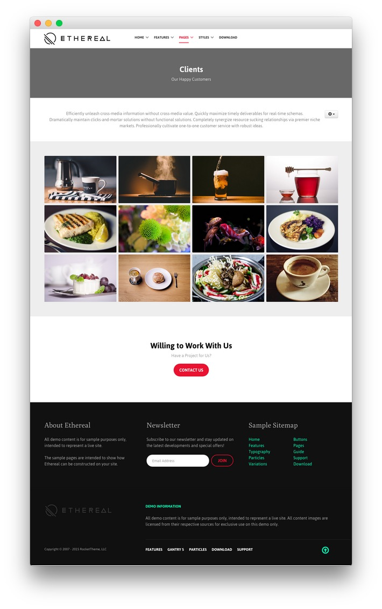
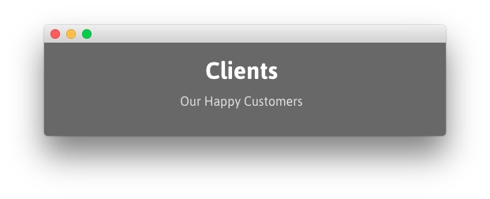
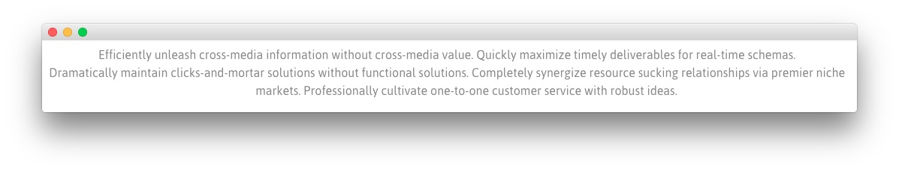
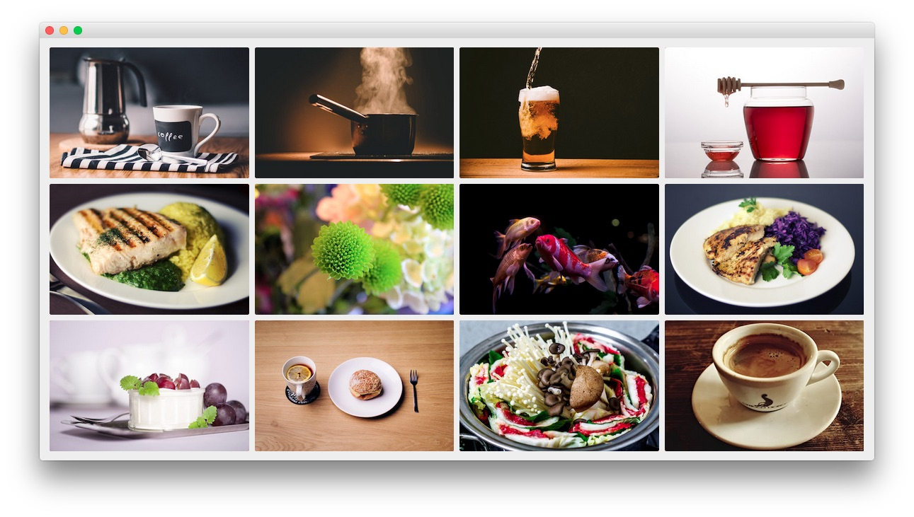

## Introduction

The **Clients** example page demonstrates how you can create a beautiful page with the Ethereal template. Here is some information to help you replicate this page as it appears in the demo.

>> Any **Custom HTML** particles are available and set in the **Layout Manager**, not as **Custom HTML** modules.

## Layout Manager

This is a look at the **Layout Manager** for the **Ethereal - Pages - Clients** outline. We have detailed the various particles represented here in the sections below.

## Modules and Particles

Below is a brief rundown of the modules and particles used to make up the demo page.

:   1. **Header - Logo** [6%, 9%, se]
    2. **Header - Icon Menu** [6%, 55%, se]
    3. **Navigation - Menu** [12%, 9%, se]
    4. **Navigation - Social** [12%, 78%, se]
    5. **Showcase - Custom HTML** [15%, 40%, se]
    6. **Mainbar - Image Grid** [23%, 9%, se]
    7. **Extension - Custom HTML** [65%, 30%, se]
    8. **Footer - Custom HTML** [78%, 11%, se]
    9. **Footer - Newsletter** [78%, 38%, se]
    10. **Footer - Custom HTML - Copyright** [78%, 65%, se]
    11. **Copyright - Copyright** [92%, 40%, se]

1. [Header](#header-section)
2. [Navigation](#navigation-section)
3. [Showcase](#showcase-section)
4. [Mainbar](#mainbar-section)
5. [Extension](#extension-section)
6. [Footer](#footer-section)
7. [Copyright](#copyright-section)

## Header Section

:   1. **Logo (Particle)** [40%, 5%, se]
    2. **Icon Menu (Particle)** [40%, 60%, se]

The **Header** section is made up of a position and two particles set in two rows. The first row hosts the **System Messages** position which remains invisible unless a system message is being displayed to the visitor.

In the second row, we have a **Logo** particle and an **Icon Menu** particle which make up the visual body of this area of the site. Settings used in our demo for each of these particles can be found below.

### Logo (Particle)

#### Particle Settings

| Field         | Setting    |
| :-----        | :-----     |
| Particle Name | `Logo`     |
| URL           | Blank      |
| Image         | Custom     |
| Text          | `Ethereal` |
| CSS Classes   | `g-logo`   |

#### Block Settings

| Field          | Setting        |
| :-----         | :-----         |
| CSS ID         | Blank          |
| CSS Classes    | `g-logo-block` |
| Variations     | Blank          |
| Tag Attributes | Blank          |
| Block Size     | `56%`          |

### Icon Menu (Particle)

#### Particle Settings

| Field                  | Setting          |
| :-----                 | :-----           |
| CSS Classes            | Blank            |
| Target                 | Self             |
| Icon Menu Item 1 Title | `Features`       |
| Icon Menu Item 1 Icon  | `fa fa-diamond`  |
| Icon Menu Item 1 Text  | `Features`       |
| Icon Menu Item 1 Link  | `#`              |
| Icon Menu Item 2 Title | `Gantry 5`       |
| Icon Menu Item 2 Icon  | `fa fa-rocket`   |
| Icon Menu Item 2 Text  | `Gantry 5`       |
| Icon Menu Item 2 Link  | `#`              |
| Icon Menu Item 3 Title | `Addons`         |
| Icon Menu Item 3 Icon  | `fa fa-gear`     |
| Icon Menu Item 3 Text  | `Addons`         |
| Icon Menu Item 3 Link  | `#`              |
| Icon Menu Item 4 Title | `Download`       |
| Icon Menu Item 4 Icon  | `fa fa-download` |
| Icon Menu Item 4 Text  | `Download`       |
| Icon Menu Item 4 Link  | `#`              |

#### Block Settings

| Field          | Setting |
| :-----         | :-----  |
| CSS ID         | Blank   |
| CSS Classes    | `flush` |
| Variations     | Blank   |
| Tag Attributes | Blank   |
| Block Size     | `44%`   |

## Navigation Section

:   1. **Menu (Particle)** [40%, 5%, se]
    2. **Social** [40%, 85%, se]

The **Navigation** section is made up of two particles. The first is a **Menu** particle which displays a CMS-sourced menu which can be enhanced through Gantry's **Menu Editor**. The second particle in the section is the **Social** particle, displaying social links.

Settings used in our demo for each of these particles can be found below.

### Menu (Particle)

#### Particle Settings

| Field         | Setting |
| :-----        | :-----  |
| Particle Name | `Menu`  |
| Base Path     | `/`     |
| Menu          | Custom  |
| Start Level   | `1`     |
| Max Levels    | `0`     |

#### Block Settings

| Field          | Setting        |
| :-----         | :-----         |
| CSS ID         | Blank          |
| CSS Classes    | `g-menu-block` |
| Variations     | Blank          |
| Tag Attributes | Blank          |
| Block Size     | `80%`          |

### Social (Particle)

#### Particle Settings

| Field               | Setting                                          |
| :-----              | :-----                                           |
| Title               | Social                                           |
| CSS Classes         | `social-items`                                   |
| Social Items        | `Features`                                       |
| Social Item 1 Title | `Twitter`                                        |
| Social Item 1 Icon  | `fa fa-twitter fa-fw`                            |
| Social Item 1 Text  | Blank                                            |
| Social Item 1 Link  | `http://twitter.com/rockettheme`                 |
| Social Item 2 Title | `Facebook`                                       |
| Social Item 2 Icon  | `fa fa-facebook fa-fw`                           |
| Social Item 2 Text  | Blank                                            |
| Social Item 2 Link  | `http://facebook.com/rockettheme`                |
| Social Item 3 Title | `Google`                                         |
| Social Item 3 Icon  | `fa fa-google fa-fw`                             |
| Social Item 3 Text  | Blank                                            |
| Social Item 3 Link  | `http://plus.google.com/+rockettheme`            |
| Social Item 4 Title | `RSS`                                            |
| Social Item 4 Icon  | `fa fa-rss fa-fw`                                |
| Social Item 4 Text  | Blank                                            |
| Social Item 4 Link  | `http://www.rockettheme.com/product-updates?rss` |

#### Block Settings

| Field          | Setting |
| :-----         | :-----  |
| CSS ID         | Blank   |
| CSS Classes    | Blank   |
| Variations     | Blank   |
| Tag Attributes | Blank   |
| Block Size     | `20%`   |

## Showcase Section

The **Showcase** section contains a single **Custom HTML** particle. Settings used in our demo for this particle can be found below.

### Custom HTML (Particle)

#### Particle Settings

| Field         | Setting   |
| :-----        | :-----    |
| Particle Name | `Clients` |

**Custom HTML**
~~~ .html

    <h2 class="g-layercontent-title">Clients</h2>
    
Our Happy Customers

~~~

#### Block Settings

| Field          | Setting         |
| :-----         | :-----          |
| CSS ID         | Blank           |
| CSS Classes    | `flush, center` |
| Variations     | Blank           |
| Tag Attributes | Blank           |
| Block Size     | `100%`          |

## Mainbar Section

The **Mainbar** section itself renders as 100% of the page width as there are no particles or positions assigned to the Sidebar section. With this in mind, the **Mainbar** section is set to `67`% width and the **Sidebar** section to `33`%.

Settings used in our demo for each of these particles can be found below.

### Image Grid (Particle)

#### Particle Settings

| Field                      | Setting            |
| :-----                     | :-----             |
| Particle Name              | `Image Grid`       |
| CSS Classes                | Blank              |
| Title                      | Blank              |
| Grid Column                | 4 Columns          |
| Album Name                 | `Ethereal Clients` |
| Images Item 1 Title        | `Client 1`         |
| Images Item 1 Promo Image  | Custom             |
| Images Item 1 Caption      | `Client 1`         |
| Images Item 2 Title        | `Client 2`         |
| Images Item 2 Promo Image  | Custom             |
| Images Item 2 Caption      | `Client 2`         |
| Images Item 3 Title        | `Client 3`         |
| Images Item 3 Promo Image  | Custom             |
| Images Item 3 Caption      | `Client 3`         |
| Images Item 4 Title        | `Client 4`         |
| Images Item 4 Promo Image  | Custom             |
| Images Item 4 Caption      | `Client 4`         |
| Images Item 5 Title        | `Client 5`         |
| Images Item 5 Promo Image  | Custom             |
| Images Item 5 Caption      | `Client 5`         |
| Images Item 6 Title        | `Client 6`         |
| Images Item 6 Promo Image  | Custom             |
| Images Item 6 Caption      | `Client 6`         |
| Images Item 7 Title        | `Client 7`         |
| Images Item 7 Promo Image  | Custom             |
| Images Item 7 Caption      | `Client 7`         |
| Images Item 8 Title        | `Client 8`         |
| Images Item 8 Promo Image  | Custom             |
| Images Item 8 Caption      | `Client 8`         |
| Images Item 9 Title        | `Client 9`         |
| Images Item 9 Promo Image  | Custom             |
| Images Item 9 Caption      | `Client 9`         |
| Images Item 10 Title       | `Client 10`        |
| Images Item 10 Promo Image | Custom             |
| Images Item 10 Caption     | `Client 10`        |
| Images Item 11 Title       | `Client 11`        |
| Images Item 11 Promo Image | Custom             |
| Images Item 11 Caption     | `Client 11`        |
| Images Item 12 Title       | `Client 12`        |
| Images Item 12 Promo Image | Custom             |
| Images Item 12 Caption     | `Client 12`        |

**Description**
~~~ .html
Efficiently unleash cross-media information without cross-media value. Quickly maximize timely deliverables for real-time schemas. Dramatically maintain clicks-and-mortar solutions without functional solutions. Completely synergize resource sucking relationships via premier niche markets. Professionally cultivate one-to-one customer service with robust ideas. 
~~~

#### Block Settings

| Field          | Setting         |
| :-----         | :-----          |
| CSS ID         | Blank           |
| CSS Classes    | `flush, center` |
| Variations     | Blank           |
| Tag Attributes | Blank           |
| Block Size     | `100%`          |

## Extension Section

The **Extension** section contains a single **Custom HTML** particle. Settings used in our demo for this particle can be found below.

### Custom HTML (Particle)

#### Particle Settings

| Field         | Setting                        |
| :-----        | :-----                         |
| Particle Name | `Willing to Work With Us` |

**Custom HTML**
~~~ .html

    <h2 class="g-layercontent-title">Willing to Work With Us</h2>
    
Have a Project for Us?

    <a href="#" class="button button-2">Contact Us</a>

~~~

#### Block Settings

| Field          | Setting         |
| :-----         | :-----          |
| CSS ID         | Blank           |
| CSS Classes    | `flush, center` |
| Variations     | `Box 1`         |
| Tag Attributes | Blank           |
| Block Size     | `100%`          |

## Footer Section

:   1. **Custom HTML 1** [30%, 5%, se]
    2. **Newsletter** [30%, 38%, se]
    3. **Custom HTML 2** [30%, 70%, se]

The **Footer** section is made up of three particles in a single row. This includes a **Newsletter** particle surrounded by two **Custom HTML** particles.

Settings used in our demo for each of these particles can be found below.

### Custom HTML 1 (Particle)

#### Particle Settings

| Field         | Setting          |
| :-----        | :-----           |
| Particle Name | `About Ethereal` |

**Custom HTML**
~~~ .html
<h2 class="g-title">About Ethereal</h2>

All demo content is for sample purposes only, intended to represent a live site.

The sample pages are intended to show how Ethereal can be constructed on your site.

~~~

#### Block Settings

| Field          | Setting          |
| :-----         | :-----           |
| CSS ID         | Blank            |
| CSS Classes    | Blank            |
| Variations     | Blank            |
| Tag Attributes | Blank            |
| Block Size     | `33.3333333333%` |

### Newsletter (Particle)

#### Particle Settings

| Field          | Setting           |
| :-----         | :-----            |
| Particle Name  | `Newsletter`      |
| CSS Classes    | Blank             |
| Title          | `Newsletter`      |
| Feedburner URI | `rocketthemeblog` |

**Heading Text**
~~~ .html
Subscribe to our newsletter and stay updated on the latest developments and special offers!
~~~

#### Block Settings

| Field          | Setting          |
| :-----         | :-----           |
| CSS ID         | Blank            |
| CSS Classes    | `flush, center`  |
| Variations     | `Box 1`          |
| Tag Attributes | Blank            |
| Block Size     | `33.3333666666%` |

### Custom HTML 2 (Particle)

#### Particle Settings

| Field         | Setting          |
| :-----        | :-----           |
| Particle Name | `Simple Sitemap` |

**Custom HTML**
~~~ .html
<h2 class="g-title">Sample Sitemap</h2>

    

        <ul class="nomarginall noliststyle">
            <li><a href="#">Home</a></li>
            <li><a href="#">Features</a></li>
            <li><a href="#">Typography</a></li>
            <li><a href="#">Particles</a></li>
            <li><a href="#">Variations</a></li>
        </ul>       
    

    

        <ul class="nomarginall noliststyle">
            <li><a href="#">Buttons</a></li>
            <li><a href="#">Pages</a></li>
            <li><a href="#">Guide</a></li>
            <li><a href="#">Support</a></li>
            <li><a href="#">Download</a></li>
        </ul>       
    
  

~~~

#### Block Settings

| Field          | Setting         |
| :-----         | :-----          |
| CSS ID         | Blank           |
| CSS Classes    | `flush, center` |
| Variations     | `Box 1`         |
| Tag Attributes | Blank           |
| Block Size     | `33.3333%`      |

## Copyright Section

The **Copyright** section contains a single **Copyright** particle. Settings used in our demo for this particle can be found below.

### Custom HTML (Particle)

#### Particle Settings

| Field           | Setting            |
| :-----          | :-----             |
| Particle Name   | `Copyright`        |
| Start Year      | `2007`             |
| End Year        | Now                |
| Copyright Owner | `RocketTheme, LLC` |

#### Block Settings

| Field          | Setting  |
| :-----         | :-----   |
| CSS ID         | Blank    |
| CSS Classes    | `center` |
| Variations     | Blank    |
| Tag Attributes | Blank    |
| Block Size     | `100%`   |
