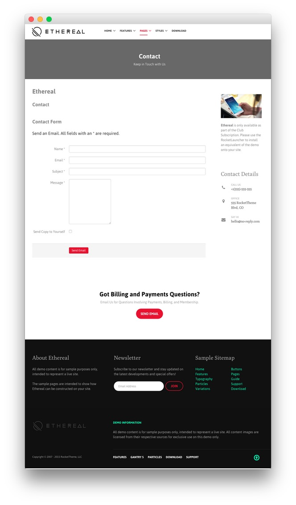
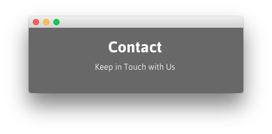
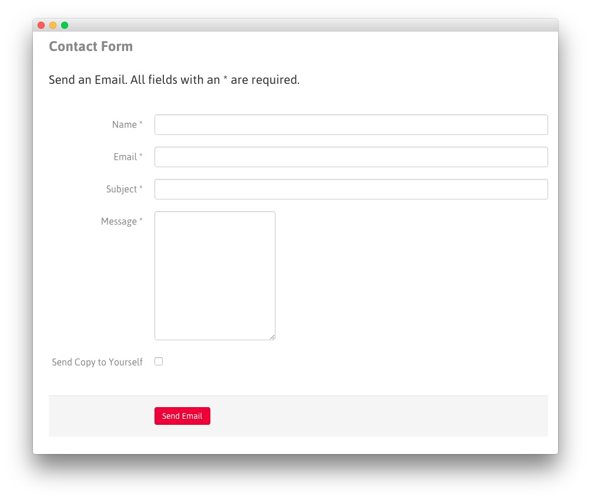
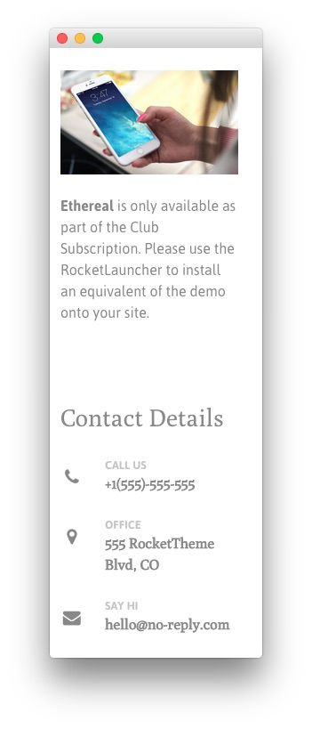
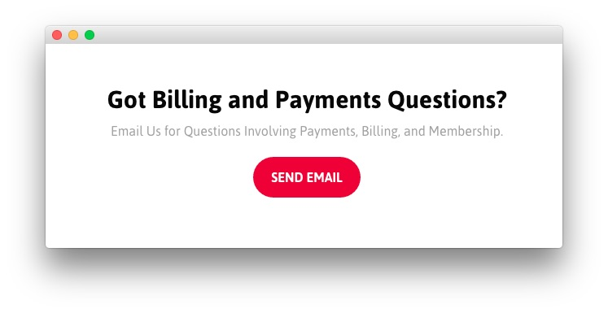

## Introduction

The **Contact** example page demonstrates how you can create a beautiful page with the Ethereal template. Here is some information to help you replicate this page as it appears in the demo.

## Modules and Particles

Below is a brief rundown of the modules and particles used to make up the demo page.

:   1. **Showcase - Custom HTML (Module)** [12%, 40%, se]
    2. **Mainbar - Page Content** [20%, 9%, se]
    3. **Sidebar - Custom HTML (Module)** [20%, 67%, se]
    4. **Bottom - Custom HTML (Module)** [60%, 30%, se]
    5. **Footer - Custom HTML (Module)** [70%, 10%, se]
    6. **Footer - Custom HTML (Module)** [70%, 38%, se]
    7. **Footer - Custom HTML (Module)** [70%, 65%, se]

1. [Showcase](#showcase-section)
2. [Mainbar](#mainbar-section)
3. [Sidebar](#sidebar-section)
4. [Bottom](#bottom-section)
5. [Footer](#footer-section)

## Showcase Section

This area of the page is a **Custom HTML** module. You will find the settings used in our demo below.

>> Any **mod_custom** (Custom HTML) modules are best handled using either RokPad or no editor as a WYSIWYG editor can cause issues with any code that exists in the **Custom Output** field.

### Custom HTML (Module)

### Details

| Field      | Setting            |
| :-----     | :-----             |
| Title      | `Contact - Header` |
| Show Title | Hide               |
| Position   | `showcase-a`       |
| Status     | Published          |

### Custom Output

Enter the following in the **Custom Output** text editor.

~~~ .html

    <h2 class="g-layercontent-title">Contact</h2>
    
Keep in Touch with Us

~~~

### Basic

| Option                    | Setting     |
| :----------               | :---------- |
| Prepare Content           | No          |
| Select a Background Image | Blank       |

### Advanced

| Option              | Setting        |
| :----------         | :----------    |
| Module Class Suffix | `flush center` |

## Mainbar Section

The **Mainbar** section is set to `60`% width and both the **Sidebar** and **Aside** sections are set to `20`%.

The page's content is sourced from a **Single Contact** menu item assigned to the outline. This creates the contact form as seen in our demo.

Settings used in our demo for each of these particles can be found below.

### Page Content

#### Particle Settings

| Field         | Setting        |
| :-----        | :-----         |
| Particle Name | `Page Content` |

#### Block Settings

| Field          | Setting       |
| :-----         | :-----        |
| CSS ID         | Blank         |
| CSS Classes    | `nomarginall` |
| Variations     | `Box 2`       |
| Tag Attributes | Blank         |
| Block Size     | `100%`        |

## Sidebar Section

The **Aside** section is set to `20`% width.

This area of the page is a **Custom HTML** module. You will find the settings used in our demo below.

>> Any **mod_custom** (Custom HTML) modules are best handled using either RokPad or no editor as a WYSIWYG editor can cause issues with any code that exists in the **Custom Output** field.

### Custom HTML (Module)

### Details

| Field      | Setting           |
| :-----     | :-----            |
| Title      | `Contact Details` |
| Show Title | Hide              |
| Position   | `aside`           |
| Status     | Published         |

### Custom Output

Enter the following in the **Custom Output** text editor.

~~~ .html

  

    

      

      
<strong>Ethereal</strong> is only available as part of the Club Subscription. Please use the RocketLauncher to install an equivalent of the demo onto your site.

    

  
  

  

    

      <h2 class="g-title">Contact Details</h2>
      

        

          

          
Call Us

          
+1(555)-555-555

        

        

          

          
Office

          
555 RocketTheme Blvd, CO

        

        

          

          
Say Hi

          
hello@no-reply.com

        

      

    

  
   

~~~

### Basic

| Option                    | Setting     |
| :----------               | :---------- |
| Prepare Content           | No          |
| Select a Background Image | Blank       |

### Advanced

| Option              | Setting     |
| :----------         | :---------- |
| Module Class Suffix | Blank       |

## Bottom Section

This area of the page is a **Custom HTML** module. You will find the settings used in our demo below.

>> Any **mod_custom** (Custom HTML) modules are best handled using either RokPad or no editor as a WYSIWYG editor can cause issues with any code that exists in the **Custom Output** field.

### Custom HTML (Module)

### Details

| Field      | Setting           |
| :-----     | :-----            |
| Title      | `Contact Details` |
| Show Title | Hide              |
| Position   | `bottom-a`        |
| Status     | Published         |

### Custom Output

Enter the following in the **Custom Output** text editor.

~~~ .html

    <h2 class="g-layercontent-title">Got Billing and Payments Questions?</h2>
    
Email Us for Questions Involving Payments, Billing, and Membership.

    <a href="http://www.rockettheme.com/joomla/templates/ethereal" class="button button-2">Send Email</a>

~~~

### Basic

| Option                    | Setting     |
| :----------               | :---------- |
| Prepare Content           | No          |
| Select a Background Image | Blank       |

### Advanced

| Option              | Setting        |
| :----------         | :----------    |
| Module Class Suffix | `flush center` |

## Footer Section

:   1. **Custom HTML (Module) 1** [20%, 5%, se]
    2. **Custom HTML (Module) 2** [20%, 38%, se]
    3. **Custom HTML (Module) 3** [20%, 65%, se]

This area of the page is made up of three **Custom HTML** modules spanning three different module positions: `footer-a`, `footer-b`, and `footer-c`. You will find the settings used in our demo below.

>> Any **mod_custom** (Custom HTML) modules are best handled using either RokPad or no editor as a WYSIWYG editor can cause issues with any code that exists in the **Custom Output** field.

### Custom HTML (Module) 1

### Details

| Field      | Setting          |
| :-----     | :-----           |
| Title      | `About Ethereal` |
| Show Title | Show             |
| Position   | `footer-a`       |
| Status     | Published        |

### Custom Output

Enter the following in the **Custom Output** text editor.

~~~ .html

All demo content is for sample purposes only, intended to represent a live site.

The sample pages are intended to show how Ethereal can be constructed on your site.

~~~

### Basic

| Option                    | Setting     |
| :----------               | :---------- |
| Prepare Content           | No          |
| Select a Background Image | Blank       |

### Advanced

| Option              | Setting     |
| :----------         | :---------- |
| Module Class Suffix | Blank       |

### Custom HTML (Module) 2

### Details

| Field      | Setting      |
| :-----     | :-----       |
| Title      | `Newsletter` |
| Show Title | Show         |
| Position   | `footer-b`   |
| Status     | Published    |

### Custom Output

Enter the following in the **Custom Output** text editor.

~~~ .html

  

    Subscribe to our newsletter and stay updated on the latest developments and special offers!
  

  <form onsubmit="window.open('http://feedburner.google.com/fb/a/mailverify?uri=rocketthemeblog', 'popupwindow', 'scrollbars=yes,width=550,height=520');return true" target="popupwindow" method="post" action="http://feedburner.google.com/fb/a/mailverify" class="g-newsletter-form">
    <input type="text" name="email" placeholder="Email Address" class="g-newsletter-inputbox"> <input type="hidden" name="uri" value="rocketthemeblog"> <input type="hidden" value="en_US" name="loc"> <input type="submit" value="Join" class="g-newsletter-button button button-3" name="Submit">
  </form>

~~~

### Basic

| Option                    | Setting     |
| :----------               | :---------- |
| Prepare Content           | No          |
| Select a Background Image | Blank       |

### Advanced

| Option              | Setting     |
| :----------         | :---------- |
| Module Class Suffix | Blank       |

### Custom HTML (Module) 3

### Details

| Field      | Setting          |
| :-----     | :-----           |
| Title      | `Sample Sitemap` |
| Show Title | Show             |
| Position   | `footer-c`       |
| Status     | Published        |

### Custom Output

Enter the following in the **Custom Output** text editor.

~~~ .html

    

        <ul class="nomarginall noliststyle">
            <li><a href="index.php">Home</a></li>
            <li><a href="index.php?option=com_content&amp;view=article&amp;id=1&amp;Itemid=105">Features</a></li>
            <li><a href="index.php?option=com_content&amp;view=article&amp;id=2&amp;Itemid=106">Typography</a></li>
            <li><a href="index.php?option=com_content&amp;view=article&amp;id=2&amp;Itemid=106">Particles</a></li>
            <li><a href="index.php?option=com_content&amp;view=article&amp;id=3&amp;Itemid=107">Variations</a></li>
        </ul>
    

    

        <ul class="nomarginall noliststyle">
            <li><a href="index.php?option=com_content&amp;view=article&amp;id=2&amp;Itemid=106">Buttons</a></li>
            <li><a href="index.php?option=com_content&amp;view=article&amp;id=4&amp;Itemid=111">Pages</a></li>
            <li><a href="http://www.rockettheme.com/docs/joomla/templates/ethereal">Guide</a></li>
            <li><a href="http://www.rockettheme.com/forum/joomla-template-ethereal">Support</a></li>
            <li><a href="http://www.rockettheme.com/joomla/templates/ethereal">Download</a></li>
        </ul>       
    
  

~~~

### Basic

| Option                    | Setting     |
| :----------               | :---------- |
| Prepare Content           | No          |
| Select a Background Image | Blank       |

### Advanced

| Option              | Setting     |
| :----------         | :---------- |
| Module Class Suffix | Blank       |
