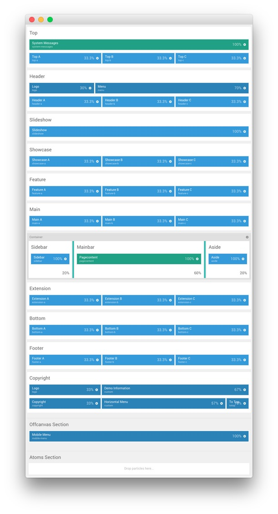

Layout Manager
-----

The following is a look at the default layout used in our demo for all of our sample pages (Portfolio, Blog, Pricing, Services, etc.). You can load this layout preset in the **Layout Manager**. It is listed as the **Default** preset.

### Gantry 5 Particles

