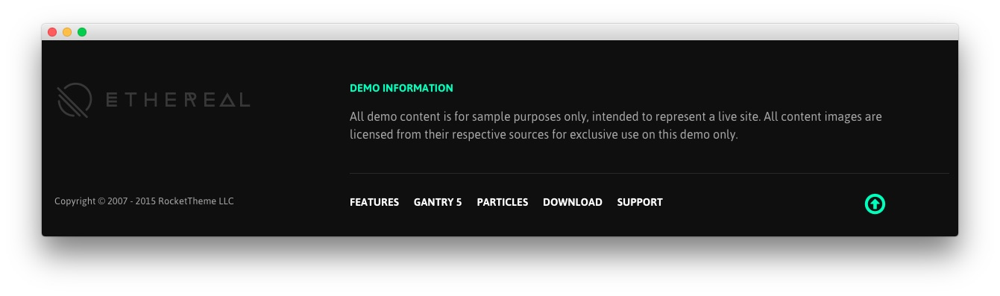
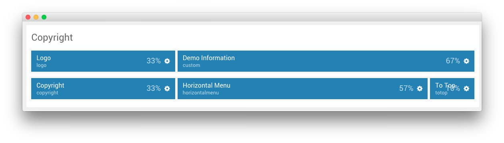
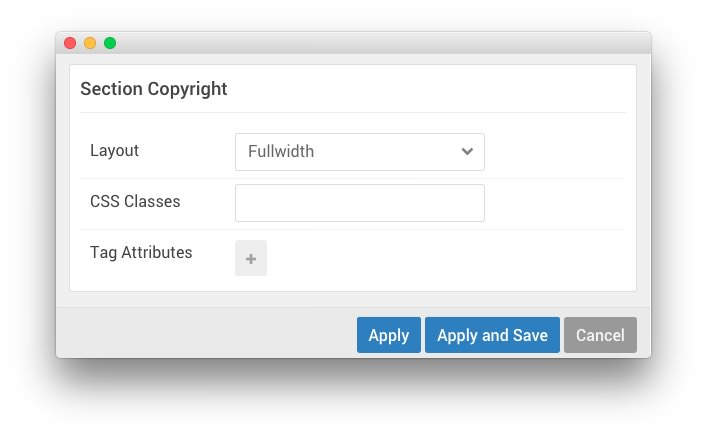

## Introduction

:   1. **Logo (Particle)** [25%, 5%, se]
    2. **Custom HTML (Particle)** [25%, 35%, se]
    3. **Copyright (Particle)** [65%, 5%, se]
    4. **Horizontal Menu (Particle)** [65%, 35%, se]
    5. **To Top (Particle)** [65%, 85%, se]

The **Copyright** section is made up of five particles displaying various information about the site, including its **Logo**, **Demo Information**, **Copyright**, a **Horizontal Menu**, and a **To Top** button.

Here is a breakdown of the particles that appear in this section:

* [Logo (Particle)](#logo-(particle))
* [Custom HTML (Particle)](#custom-html-(particle))
* [Copyright (Particle)](#copyright-(particle))
* [Horizontal Menu (Particle)](#horizontal-menu-(particle))
* [To Top (Particle)](#to-top-(particle))

Settings used in the demo for the particle used in this section can be found below.

## Section Settings

| Field          | Setting   |
| :-----         | :-----    |
| Layout         | Fullwidth |
| CSS Classes    | Blank     |
| Tag Attributes | Blank     |

### Logo (Particle)

#### Particle Settings

| Field         | Setting    |
| :-----        | :-----     |
| Particle Name | `Logo`     |
| URL           | Blank      |
| Image         | Custom     |
| Text          | `Ethereal` |
| CSS Classes   | `g-logo`   |

#### Block Settings

| Field          | Setting |
| :-----         | :-----  |
| CSS ID         | Blank   |
| CSS Classes    | Blank   |
| Variations     | Blank   |
| Tag Attributes | Blank   |
| Block Size     | `33%`   |

### Custom HTML (Particle)

#### Particle Settings

| Field           | Setting            |
| :-----          | :-----             |
| Particle Name   | `Demo Information`        |

**Custom HTML**
~~~ .html

<a href="#">Demo Information</a>

All demo content is for sample purposes only, intended to represent a live site. All content images are licensed from their respective sources for exclusive use on this demo only.

~~~

#### Block Settings

| Field          | Setting           |
| :-----         | :-----            |
| CSS ID         | Blank             |
| CSS Classes    | `bordered-bottom` |
| Variations     | Blank             |
| Tag Attributes | Blank             |
| Block Size     | `67%`             |

### Copyright (Particle)

#### Particle Settings

| Field           | Setting           |
| :-----          | :-----            |
| Particle Name   | `Copyright`       |
| Start Year      | `2007`            |
| End Year        | `now`             |
| Copyright Owner | `RocketTheme LLC` |

#### Block Settings

| Field          | Setting       |
| :-----         | :-----        |
| CSS ID         | Blank         |
| CSS Classes    | `g-copyright` |
| Variations     | Blank         |
| Tag Attributes | Blank         |
| Block Size     | `33%`         |

### Horizontal Menu (Particle)

#### Particle Settings

| Field            | Setting                                              |
| :-----           | :-----                                               |
| Particle Name    | `Horizontal Menu`                                    |
| CSS Classes      | Blank                                                |
| Target           | Self                                                 |
| Menu Item 1 Name | `Features`                                           |
| Menu Item 1 Text | `Features`                                           |
| Menu Item 1 Link | `http://docs.gantry.org/gantry5/basics/key-features` |

#### Block Settings

| Field          | Setting |
| :-----         | :-----  |
| CSS ID         | Blank   |
| CSS Classes    | Blank   |
| Variations     | Blank   |
| Tag Attributes | Blank   |
| Block Size     | `57%`   |

### To Top (Particle)

#### Particle Settings

| Field         | Setting                                               |
| :-----        | :-----                                                |
| Particle Name | `To Top`                                              |
| CSS Classes   | `particle_gantry_totop`                               |
| Text          | `<i class="fa fa-fw fa-2x fa-arrow-circle-o-up"></i>` |

#### Block Settings

| Field          | Setting |
| :-----         | :-----  |
| CSS ID         | Blank   |
| CSS Classes    | Blank   |
| Variations     | Blank   |
| Tag Attributes | Blank   |
| Block Size     | `10%`   |
