## Introduction

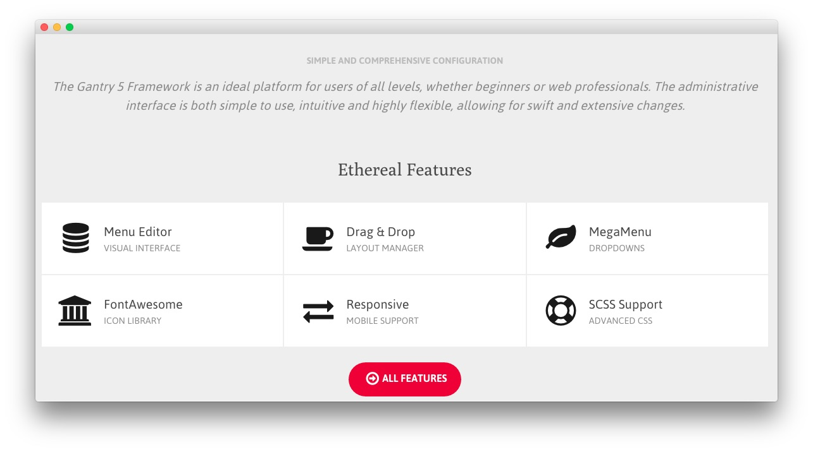

:   1. **Custom HTML (Particle)** [7%, 5%, se]
    2. **Icon Headline (Particle) / RokSprocket (Strips)** [40%, 5%, se]

The **Extension** section is made up of two particles. The first, a **Custom HTML** particle. The second, an **Icon Headline** particle which is placed on a second row, each at 100% width.

Here is a breakdown of the particles that appear in this section:

* [Custom HTML (Particle)](#image-block-(particle))
* [Icon Headline (Particle)](#custom-html-(particle))
    - [Alternative: RokSprocket (Strips)](#module-position-(extension-strips))

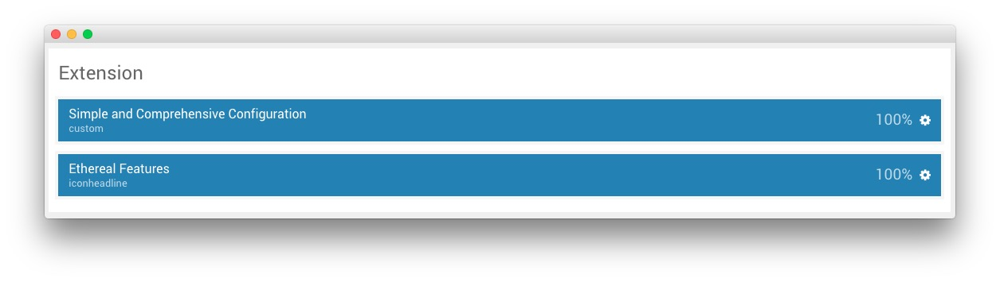

Settings used in our demo for each of these particles can be found below.

## Section Settings

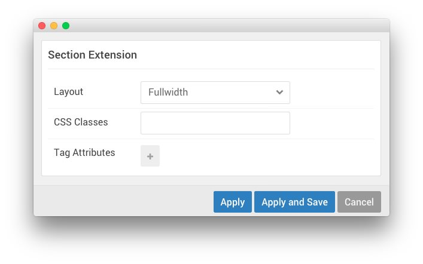

| Field          | Setting   |
| :-----         | :-----    |
| Layout         | Fullwidth |
| CSS Classes    | Blank     |
| Tag Attributes | Blank     |

## Custom HTML (Particle)

### Particle Settings

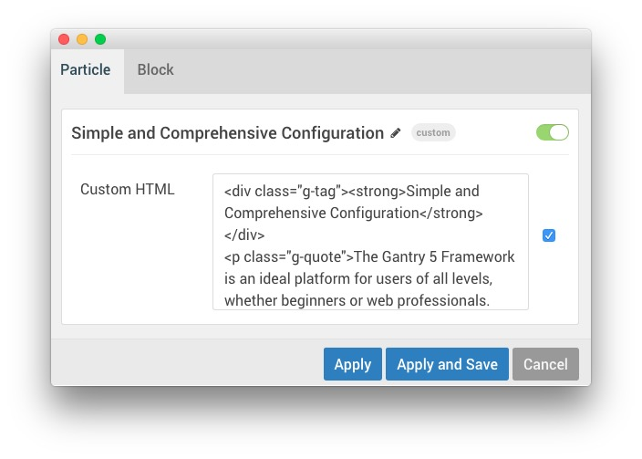

| Field         | Setting                                  |
| :-----        | :------                                  |
| Particle Name | `Simple and Comprehensive Configuration` |

**Custom HTML**
~~~ .html

<strong>Simple and Comprehensive Configuration</strong>

The Gantry 5 Framework is an ideal platform for users of all levels, whether beginners or web professionals. The administrative interface is both simple to use, intuitive and highly flexible, allowing for swift and extensive changes.

~~~

### Block Settings

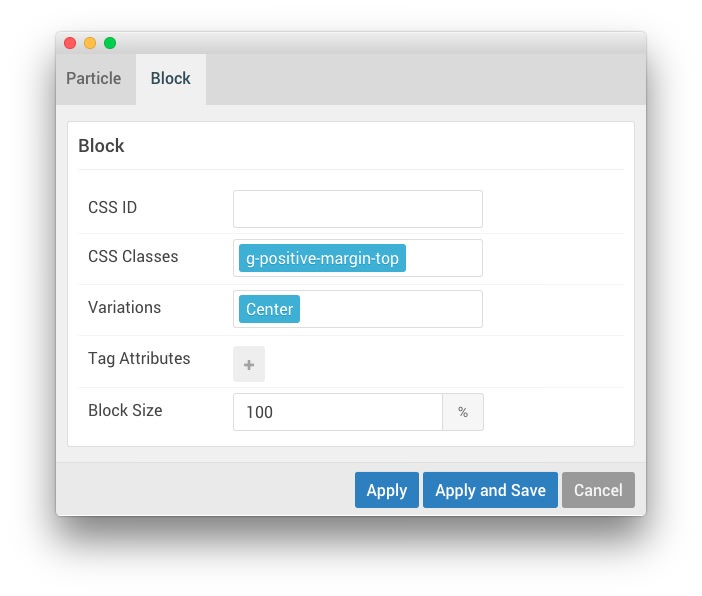

| Field          | Setting                 |
| :-----         | :-----                  |
| CSS ID         | Blank                   |
| CSS Classes    | `g-positive-margin-top` |
| Variations     | Center                  |
| Tag Attributes | Blank                   |
| Block Size     | `100%`                  |

## Icon Headline (Particle)

### Particle Settings

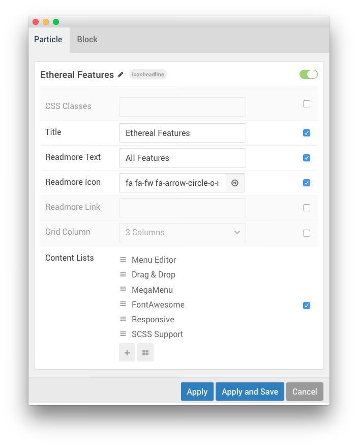

| Field                                | Setting                            |
| :-----                               | :------                            |
| Particle Name                        | `Ethereal Features`                |
| CSS Classes                          | Blank                              |
| Title                                | `Ethereal Features`                |
| Readmore Text                        | `All Features`                     |
| Readmore Icon                        | `fa fa-fw fa-arrow-circle-o-right` |
| Readmore Link                        | Blank                              |
| Grid Column                          | 3 Columns                          |
| Content Lists Item 1 Name            | `Menu Editor`                      |
| Content Lists Item 1 Icon            | `fa fa-fw fa-database`             |
| Content Lists Item 1 Headline        | `Menu Editor`                      |
| Content Lists Item 1 Subheading      | `Visual Interface`                 |
| Content Lists Item 1 Block Variation | `Box White`, `Spaced`              |
| Content Lists Item 1 CSS Classes     | Blank                                   |

### Block Settings

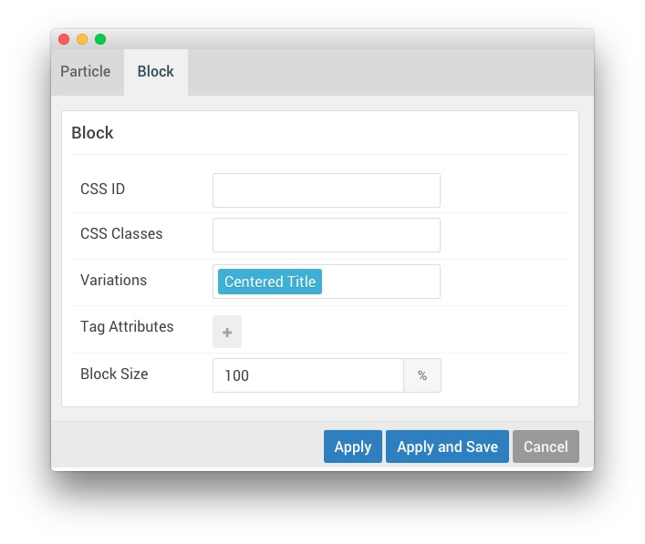

| Field          | Setting        |
| :-----         | :-----         |
| CSS ID         | Blank          |
| CSS Classes    | Blank          |
| Variations     | Centered Title |
| Tag Attributes | Blank          |
| Block Size     | `100%`         |

# Alternative Module

For folks that prefer **RokSprocket** to using a particle, we have included the instructions for creating a particle using RokSprocket below. 

## Module Position (extension-strips)

### Particle Settings

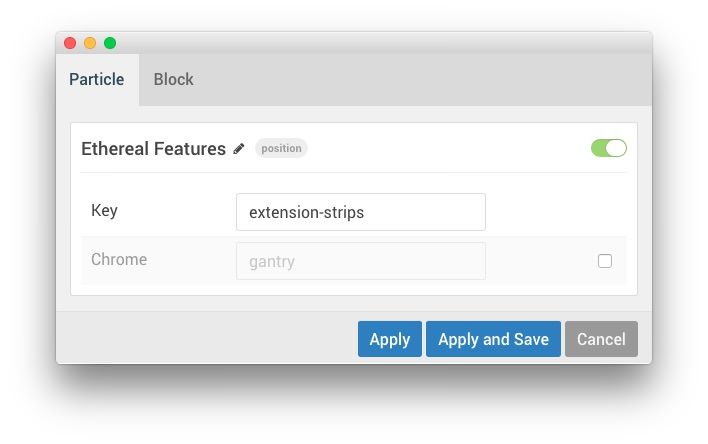

| Field         | Setting             |
| :-----        | :-----              |
| Particle Name | `Ethereal Features` |
| Key           | `extension-strips`  |
| Chrome        | `gantry`            |

### Block Settings

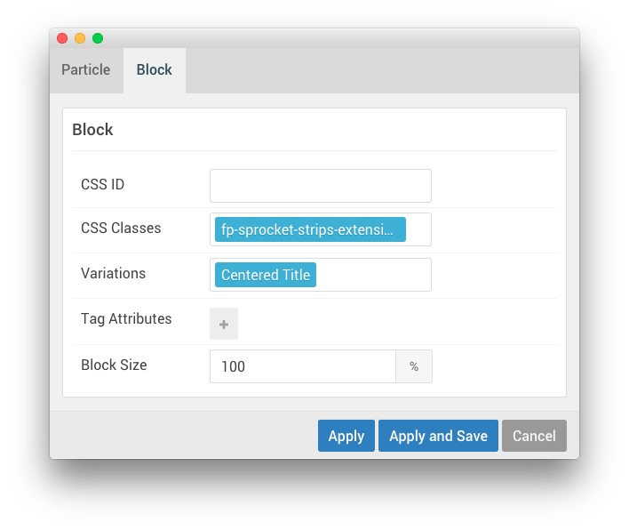

| Field          | Setting                        |
| :-----         | :-----                         |
| CSS ID         | Blank                          |
| CSS Classes    | `fp-sprocket-strips-extension` |
| Variations     | Centered Title                 |
| Tag Attributes | Blank                          |
| Block Size     | `100%`                         |

## Assigned Module(s)

We used a **RokSprocket** module with the **Strips** layout to make up this area of the front page. You will find the settings used in our demo below.

We utilized the **Simple** Content Provider, linking each item in the RokSprocket module to an article. You can find examples of the **Simple** items used in this module in the **Filtered Article List** section below.

### Details

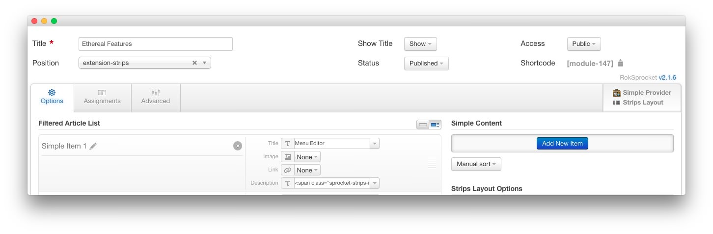

| Option           | Setting             |
| :-----           | :-----              |
| Title            | `Ethereal Features` |
| Show Title       | Hide                |
| Access           | Public              |
| Position         | extension-strips    |
| Status           | Published           |
| Content Provider | Simple              |
| Type             | Strips              |

### Filtered Article List

#### Item 1

| Option      | Setting                                                                                                                                              |
| :-----      | :------                                                                                                                                              |
| Title       | `Menu Editor`                                                                                                                                        |
| Image       | Custom                                                                                                                                               |
| Link        | Custom                                                                                                                                               |
| Description | `Visual Interface` |

#### Item 2

| Option      | Setting                                                                                                                                          |
| :-----      | :------                                                                                                                                          |
| Title       | `Drag &amp; Drop`                                                                                                                                |
| Image       | Custom                                                                                                                                           |
| Link        | Custom                                                                                                                                           |
| Description | `Layout Manager` |

#### Item 3

| Option      | Setting                                                                                                                                   |
| :-----      | :------                                                                                                                                   |
| Title       | `MegaMenu`                                                                                                                                |
| Image       | Custom                                                                                                                                    |
| Link        | Custom                                                                                                                                    |
| Description | `Dropdowns` |

### Layout Options

| Option            | Setting      |
| :----------       | :----------  |
| Theme             | Default      |
| Display Limit     | ∞            |
| Preview Length    | ∞            |
| Strip HTML Tags   | No           |
| Previews Per Page | `6`          |
| Items Per Row     | 3            |
| Arrow Navigation  | Hide         |
| Pagination        | Hide         |
| Animation         | Fade Delayed |
| Autoplay          | Disable      |
| Autoplay Delay    | 5            |
| Image Resize      | Disable      |

### Advanced

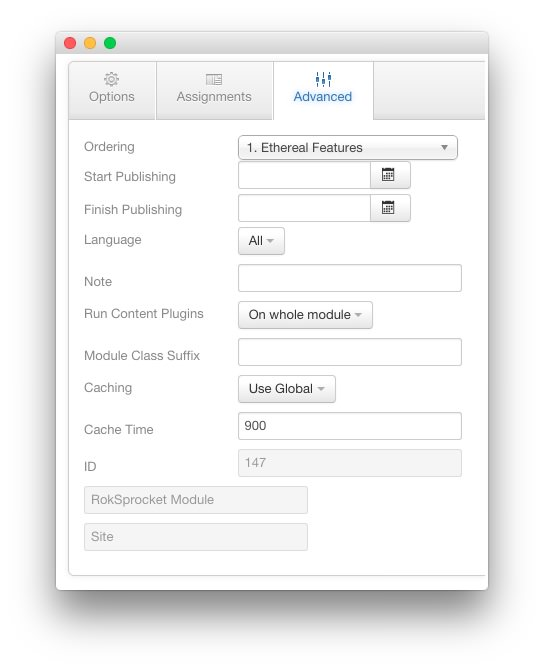

| Option              | Setting     |
| :----------         | :---------- |
| Module Class Suffix |             |

