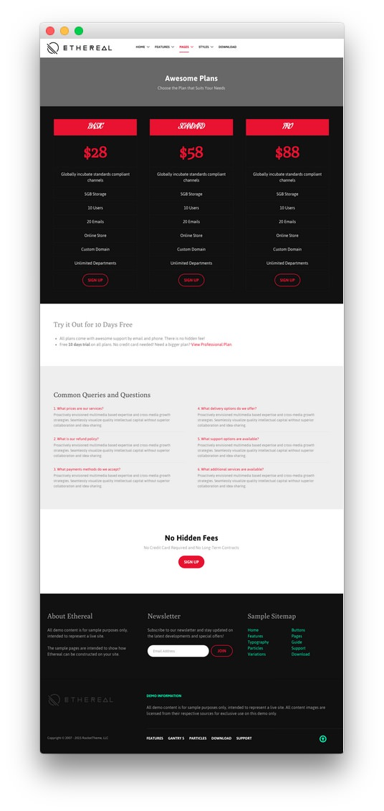
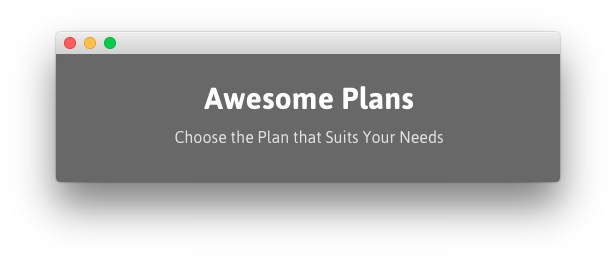
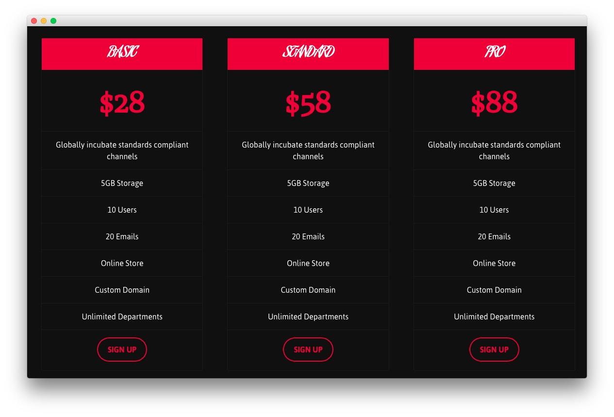
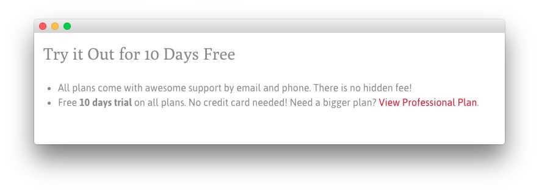
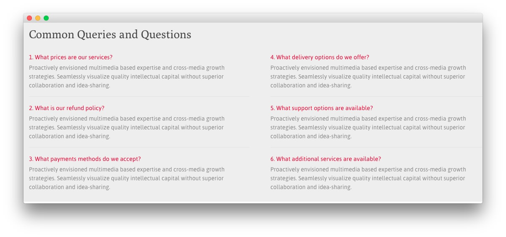
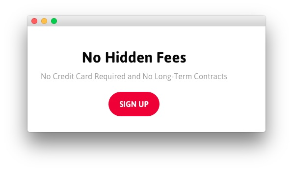
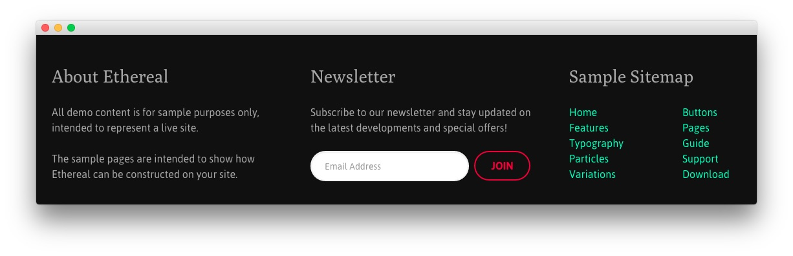

## Introduction

The **Pricing** example page demonstrates how you can create a beautiful page with the Ethereal template. Here is some information to help you replicate this page as it appears in the demo.

## Modules and Particles

Below is a brief rundown of the modules and particles used to make up the demo page.

:   1. **Showcase - Custom HTML (Module)** [11%, 40%, se]
    2. **Feature - Custom HTML (Module)** [15%, 12% se]
    3. **Mainbar - Page Content** [40%, 12%, se]
    4. **Extension - Custom HTML (Module)** [47%, 12%, se]
    5. **Bottom - Custom HTML (Module)** [67%, 40%, se]
    5. **Footer - Custom HTML (Module)** [75%, 10%, se]
    6. **Footer - Custom HTML (Module)** [75%, 38%, se]
    7. **Footer - Custom HTML (Module)** [75%, 64%, se]

1. [Showcase](#showcase-section)
2. [Feature](#feature-section)
2. [Mainbar](#mainbar-section)
3. [Extension](#extension-section)
4. [Bottom](#bottom-section)
4. [Footer](#footer-section)

## Showcase Section

This area of the page is a **Custom HTML** module. You will find the settings used in our demo below.

>> Any **mod_custom** (Custom HTML) modules are best handled using either RokPad or no editor as a WYSIWYG editor can cause issues with any code that exists in the **Custom Output** field.

### Custom HTML (Module)

### Details

| Field      | Setting            |
| :-----     | :-----             |
| Title      | `Awesome Plans - Header` |
| Show Title | Hide               |
| Position   | `showcase-a`       |
| Status     | Published          |

### Custom Output

Enter the following in the **Custom Output** text editor.

~~~ .html

    <h2 class="g-layercontent-title">Awesome Plans</h2>
    
Choose the Plan that Suits Your Needs

~~~

### Basic

| Option                    | Setting     |
| :----------               | :---------- |
| Prepare Content           | No          |
| Select a Background Image | Blank       |

### Advanced

| Option              | Setting        |
| :----------         | :----------    |
| Module Class Suffix | `flush center` |

## Feature Section

This area of the page is a **Custom HTML** module. You will find the settings used in our demo below.

>> Any **mod_custom** (Custom HTML) modules are best handled using either RokPad or no editor as a WYSIWYG editor can cause issues with any code that exists in the **Custom Output** field.

### Custom HTML (Module)

### Details

| Field      | Setting             |
| :-----     | :-----              |
| Title      | `Pricing Table` |
| Show Title | Hide                |
| Position   | `feature-a`        |
| Status     | Published           |

### Custom Output

Enter the following in the **Custom Output** text editor.

~~~ .html

  

    

      <ul class="g-pricingtable">
        <li class="g-pricingtable-title">Basic
        </li>
        <li class="g-pricingtable-price">$28
        </li>
        <li class="g-pricingtable-desc">Globally incubate standards compliant channels
        </li>
        <li class="g-pricingtable-item">5GB Storage
        </li>
        <li class="g-pricingtable-item">10 Users
        </li>
        <li class="g-pricingtable-item">20 Emails
        </li>
        <li class="g-pricingtable-item">Online Store
        </li>
        <li class="g-pricingtable-item">Custom Domain
        </li>
        <li class="g-pricingtable-item">Unlimited Departments
        </li>
        <li class="g-pricingtable-cta">
          <a class="button button-3" href="http://www.rockettheme.com/joomla/templates/ethereal">Sign Up</a>
        </li>
      </ul>
    

  

  

    

      <ul class="g-pricingtable">
        <li class="g-pricingtable-title">Standard
        </li>
        <li class="g-pricingtable-price">$58
        </li>
        <li class="g-pricingtable-desc">Globally incubate standards compliant channels
        </li>
        <li class="g-pricingtable-item">5GB Storage
        </li>
        <li class="g-pricingtable-item">10 Users
        </li>
        <li class="g-pricingtable-item">20 Emails
        </li>
        <li class="g-pricingtable-item">Online Store
        </li>
        <li class="g-pricingtable-item">Custom Domain
        </li>
        <li class="g-pricingtable-item">Unlimited Departments
        </li>
        <li class="g-pricingtable-cta">
          <a class="button button-3" href="http://www.rockettheme.com/joomla/templates/ethereal">Sign Up</a>
        </li>
      </ul>
    

  

  

    

      <ul class="g-pricingtable">
        <li class="g-pricingtable-title">Pro
        </li>
        <li class="g-pricingtable-price">$88
        </li>
        <li class="g-pricingtable-desc">Globally incubate standards compliant channels
        </li>
        <li class="g-pricingtable-item">5GB Storage
        </li>
        <li class="g-pricingtable-item">10 Users
        </li>
        <li class="g-pricingtable-item">20 Emails
        </li>
        <li class="g-pricingtable-item">Online Store
        </li>
        <li class="g-pricingtable-item">Custom Domain
        </li>
        <li class="g-pricingtable-item">Unlimited Departments
        </li>
        <li class="g-pricingtable-cta">
          <a class="button button-3" href="http://www.rockettheme.com/joomla/templates/ethereal">Sign Up</a>
        </li>
      </ul>
    

  

~~~

### Basic

| Option                    | Setting     |
| :----------               | :---------- |
| Prepare Content           | No          |
| Select a Background Image | Blank       |

### Advanced

| Option              | Setting     |
| :----------         | :---------- |
| Module Class Suffix | Blank       |

## Mainbar Section

The **Mainbar** section includes the **Pricing** article, displayed through the **Page Content** particle. Here are the settings found in the **Pricing** article.

| Option   | Setting        |
| :-----   | :-----         |
| Title    | `Pricing`      |
| Alias    | `pricing`      |
| Status   | Published      |
| Featured | No             |
| Category | `Sample Pages` |

**Content Body**

~~~ .html

  

    <h2 class="g-title">
      Try it Out for 10 Days Free
    </h2>
    <ul>
      <li>All plans come with awesome support by email and phone. There is no hidden fee!
      </li>
      <li>Free <strong>10 days trial</strong> on all plans. No credit card needed! Need a bigger plan? <a href="http://www.rockettheme.com/joomla/templates/ethereal">View Professional Plan</a>.
      </li>
    </ul>
  

~~~

## Extension Section

This area of the page is a **Custom HTML** module. You will find the settings used in our demo below.

>> Any **mod_custom** (Custom HTML) modules are best handled using either RokPad or no editor as a WYSIWYG editor can cause issues with any code that exists in the **Custom Output** field.

### Custom HTML (Module)

### Details

| Field      | Setting                        |
| :-----     | :-----                         |
| Title      | `Common Queries and Questions` |
| Show Title | Hide                           |
| Position   | `extension-a`                  |
| Status     | Published                      |

### Custom Output

Enter the following in the **Custom Output** text editor.

~~~ .html

  

    

      <h2 class="g-title">
        Common Queries and Questions
      </h2>
      

        

          

            

              <a href="#">1. What prices are our services?</a>
            

            

              Proactively envisioned multimedia based expertise and cross-media growth strategies. Seamlessly visualize quality intellectual capital without superior collaboration and idea-sharing.
            

          

        

        

          

            

              <a href="#">2. What is our refund policy?</a>
            

            

              Proactively envisioned multimedia based expertise and cross-media growth strategies. Seamlessly visualize quality intellectual capital without superior collaboration and idea-sharing.
            

          

        

        

          

            

              <a href="#">3. What payments methods do we accept?</a>
            

            

              Proactively envisioned multimedia based expertise and cross-media growth strategies. Seamlessly visualize quality intellectual capital without superior collaboration and idea-sharing.
            

          

        

      

    

  

  

    

      <h2 class="g-title">
        &nbsp;More Common Queries and Questions
      </h2>
      

        

          

            

              <a href="#">4. What delivery options do we offer?</a>
            

            

              Proactively envisioned multimedia based expertise and cross-media growth strategies. Seamlessly visualize quality intellectual capital without superior collaboration and idea-sharing.
            

          

        

        

          

            

              <a href="#">5. What support options are available?</a>
            

            

              Proactively envisioned multimedia based expertise and cross-media growth strategies. Seamlessly visualize quality intellectual capital without superior collaboration and idea-sharing.
            

          

        

        

          

            

              <a href="#">6. What additional services are available?</a>
            

            

              Proactively envisioned multimedia based expertise and cross-media growth strategies. Seamlessly visualize quality intellectual capital without superior collaboration and idea-sharing.
            

          

        

      

    

  

~~~

### Basic

| Option                    | Setting     |
| :----------               | :---------- |
| Prepare Content           | No          |
| Select a Background Image | Blank       |

### Advanced

| Option              | Setting     |
| :----------         | :---------- |
| Module Class Suffix | Blank       |

## Bottom Section

This area of the page is a **Custom HTML** module. You will find the settings used in our demo below.

>> Any **mod_custom** (Custom HTML) modules are best handled using either RokPad or no editor as a WYSIWYG editor can cause issues with any code that exists in the **Custom Output** field.

### Custom HTML (Module)

### Details

| Field      | Setting          |
| :-----     | :-----           |
| Title      | `No Hidden Fees` |
| Show Title | Hide             |
| Position   | `bottom-a`       |
| Status     | Published        |

### Custom Output

Enter the following in the **Custom Output** text editor.

~~~ .html

    <h2 class="g-layercontent-title">No Hidden Fees</h2>
    
No Credit Card Required and No Long-Term Contracts

    <a href="http://www.rockettheme.com/joomla/templates/ethereal" class="button button-2">Sign Up</a>

~~~

### Basic

| Option                    | Setting     |
| :----------               | :---------- |
| Prepare Content           | No          |
| Select a Background Image | Blank       |

### Advanced

| Option              | Setting        |
| :----------         | :----------    |
| Module Class Suffix | `flush center` |

## Footer Section

:   1. **Custom HTML (Module) 1** [20%, 5%, se]
    2. **Custom HTML (Module) 2** [20%, 38%, se]
    3. **Custom HTML (Module) 3** [20%, 65%, se]

This area of the page is made up of three **Custom HTML** modules spanning three different module positions: `footer-a`, `footer-b`, and `footer-c`. You will find the settings used in our demo below.

>> Any **mod_custom** (Custom HTML) modules are best handled using either RokPad or no editor as a WYSIWYG editor can cause issues with any code that exists in the **Custom Output** field.

### Custom HTML (Module) 1

### Details

| Field      | Setting          |
| :-----     | :-----           |
| Title      | `About Ethereal` |
| Show Title | Show             |
| Position   | `footer-a`       |
| Status     | Published        |

### Custom Output

Enter the following in the **Custom Output** text editor.

~~~ .html

All demo content is for sample purposes only, intended to represent a live site.

The sample pages are intended to show how Ethereal can be constructed on your site.

~~~

### Basic

| Option                    | Setting     |
| :----------               | :---------- |
| Prepare Content           | No          |
| Select a Background Image | Blank       |

### Advanced

| Option              | Setting     |
| :----------         | :---------- |
| Module Class Suffix | Blank       |

### Custom HTML (Module) 2

### Details

| Field      | Setting      |
| :-----     | :-----       |
| Title      | `Newsletter` |
| Show Title | Show         |
| Position   | `footer-b`   |
| Status     | Published    |

### Custom Output

Enter the following in the **Custom Output** text editor.

~~~ .html

  

    Subscribe to our newsletter and stay updated on the latest developments and special offers!
  

  <form onsubmit="window.open('http://feedburner.google.com/fb/a/mailverify?uri=rocketthemeblog', 'popupwindow', 'scrollbars=yes,width=550,height=520');return true" target="popupwindow" method="post" action="http://feedburner.google.com/fb/a/mailverify" class="g-newsletter-form">
    <input type="text" name="email" placeholder="Email Address" class="g-newsletter-inputbox"> <input type="hidden" name="uri" value="rocketthemeblog"> <input type="hidden" value="en_US" name="loc"> <input type="submit" value="Join" class="g-newsletter-button button button-3" name="Submit">
  </form>

~~~

### Basic

| Option                    | Setting     |
| :----------               | :---------- |
| Prepare Content           | No          |
| Select a Background Image | Blank       |

### Advanced

| Option              | Setting     |
| :----------         | :---------- |
| Module Class Suffix | Blank       |

### Custom HTML (Module) 3

### Details

| Field      | Setting          |
| :-----     | :-----           |
| Title      | `Sample Sitemap` |
| Show Title | Show             |
| Position   | `footer-c`       |
| Status     | Published        |

### Custom Output

Enter the following in the **Custom Output** text editor.

~~~ .html

    

        <ul class="nomarginall noliststyle">
            <li><a href="index.php">Home</a></li>
            <li><a href="index.php?option=com_content&amp;view=article&amp;id=1&amp;Itemid=105">Features</a></li>
            <li><a href="index.php?option=com_content&amp;view=article&amp;id=2&amp;Itemid=106">Typography</a></li>
            <li><a href="index.php?option=com_content&amp;view=article&amp;id=2&amp;Itemid=106">Particles</a></li>
            <li><a href="index.php?option=com_content&amp;view=article&amp;id=3&amp;Itemid=107">Variations</a></li>
        </ul>
    

    

        <ul class="nomarginall noliststyle">
            <li><a href="index.php?option=com_content&amp;view=article&amp;id=2&amp;Itemid=106">Buttons</a></li>
            <li><a href="index.php?option=com_content&amp;view=article&amp;id=4&amp;Itemid=111">Pages</a></li>
            <li><a href="http://www.rockettheme.com/docs/joomla/templates/ethereal">Guide</a></li>
            <li><a href="http://www.rockettheme.com/forum/joomla-template-ethereal">Support</a></li>
            <li><a href="http://www.rockettheme.com/joomla/templates/ethereal">Download</a></li>
        </ul>       
    
  

~~~

### Basic

| Option                    | Setting     |
| :----------               | :---------- |
| Prepare Content           | No          |
| Select a Background Image | Blank       |

### Advanced

| Option              | Setting     |
| :----------         | :---------- |
| Module Class Suffix | Blank       |
