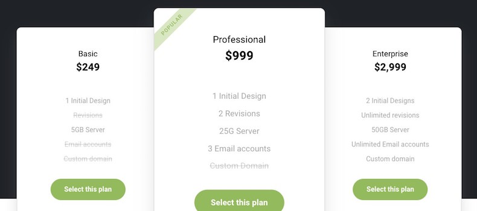
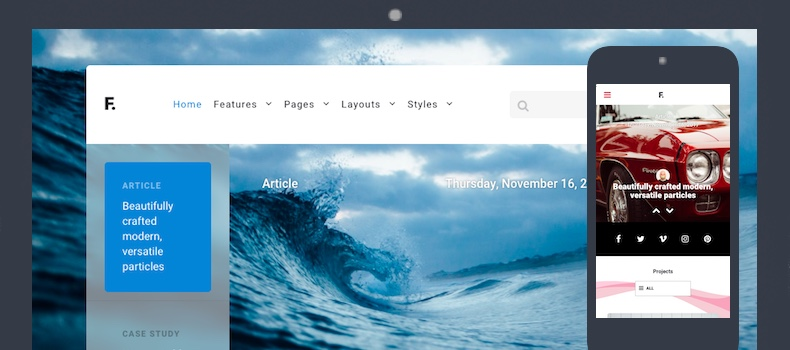

Introduction
-----

Fluent is a clean design with modern, transparent elements and powerful sliders. It features exclusive particles that make creating a gorgeous, responsive website a breeze. The perfect template for startups and bloggers.

Requirements
-----

* Apache 2.2+ or Microsoft IIS 7
* PHP 7.1+ 
* MySQL 5.1+
* Joomla 3.4+

>> NOTE: Gantry v5.4.19+ is required for Fluent to work correctly. For more details on the Gantry Framework, please visit its [Dedicated Website](http://gantry.org).

Key Features
-----

### Included Particles

* Block Content
* Case Studies
* Grid Content
* Grid Statistic
* Image Grid
* Joomla Articles
* Newsletter
* News Slider
* Pricing Table
* Simple Counter
* Search
* Social
* Testimonial Slider
* Vertical Slider
* Video

### Template Features

* Responsive Layout
* 5 Preset Styles
* Block Variations
* Custom Typography
* Unlimited Positions
* Popup Module
* Custom Particles
* Social Icons
* Mobile Menu
* Coming Soon Page
* Font Awesome Icons 

### Gantry Core Features

* YAML-based Configuration
* Twig Templating
* Powerful Particle System
* Visual Menu Editor
* MegaMenu Support
* Off-Canvas Panel
* Ajax Admin
* Layout Manager
* Inheritance System
* Fluid Width Option
* Fixed Width Option
* SCSS Support
* Sophisticated Fields
* Unlimited Undo/Redo
* Styles Panel

## Typography

Typography is an important instrument in not only the site design, but how your content is portrayed and utilized by your visitors. Therefore, Fluent offers a rich selection of elegant typography to provide focus to varying content types.

## Responsive

Fluent is a responsive template which means it adapts to the viewing device's width, such as mobile, tablet or desktop. Mobile modes have a unique menu to aid usability. Support classes can also be used to display or hide various types of content for each device.

## Inheritance

Fluent takes full advantage of Gantry’s new inheritance system, making it easier than ever to configure and manage your website through synced particles, atoms, sections, and layouts. Save time by using inheritance to avoid repetitive changes!