## Introduction

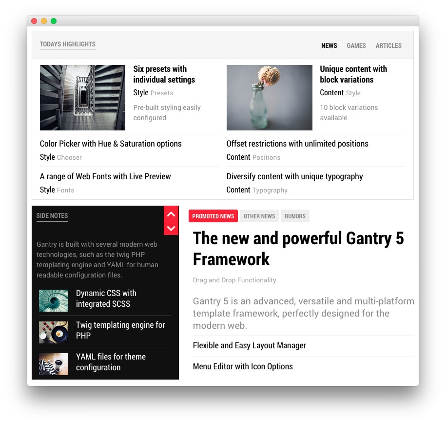

:   1. **RokSprocket (Tabs) 1 / Info List (Particle)** [7%, 7%, se]
    2. **RokSprocket (Headlines) / Info List (Particle)** [50%, 7%, se]
    3. **RokSprocket (Tabs) 1 / Info List (Particle)** [50%, 42%, se]

The **Mainbar** section contains three **Module Position** particles, each containing a RokSprocket module. Some of the RokSprocket modules load **Gantry 5 Particle** modules which enable you to embed particles within RokSprocket items.

Here is a breakdown of the particles that appear in this section:

* [Module Position (mainbar)](#module-position-(mainbar))
    * [RokSprocket (Tabs)](#assigned-module(s)---roksprocket-(tabs))
        * [Gantry 5 Particle (Module)](#gantry-5-particle-(module))
            * [Info List (Particle)](#info-list-(particle))
* [Module Position (mainleft)](#module-position-(mainleft))
    * [RokSprocket (Headlines)](#assigned-module(s)---roksprocket-(headlines))
        * [Gantry 5 Particle (Module)](#gantry-5-particle-(module)-2)
            * [Info List (Particle)](#inf-list-(particle)-2)
* [Module Position (mainright)](#module-position-(mainright))
    * [RokSprocket (Tabs)](#assigned-module(s)---roksprocket-(tabs)-2)
        * [Gantry 5 Particle (Module)](#gantry-5-particle-(module)-3)
            * [Info List (Particle)](#info-list-(particle)-3)

Settings used in this section can be found below.

## Section Settings

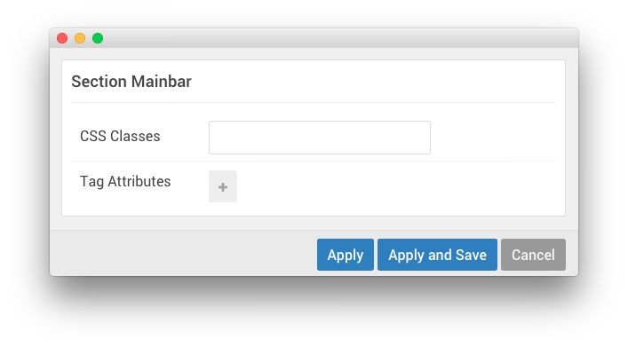

| Field          | Setting   |
| :-----         | :-----    |
| CSS Classes    | Blank     |
| Tag Attributes | Blank     |
| Width          | `67%`     |

## Module Position (mainbar)

There is an important aspect of this module position used in our demo you should be aware of. First, the `mainbar` module position contains a RokSprocket (Tabs) module. This module loads multiple module positions through its simple items' descriptions. These module positions are then used to assign **Gantry 5 Particle** modules which enable you to embed Gantry 5 particles within RokSprocket.

### Particle Settings

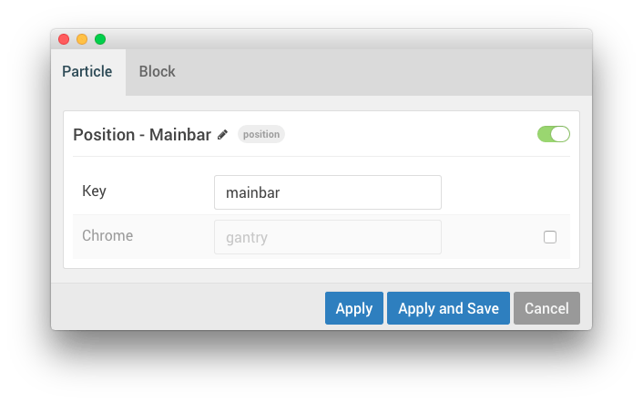

| Field         | Setting              |
| :-----        | :-----               |
| Particle Name | `Position - Mainbar` |
| Key           | `mainbar`            |
| Chrome        | `gantry`             |

### Block Settings

| Field          | Setting          |
| :-----         | :-----           |
| CSS ID         | Blank            |
| CSS Classes    | `fp-mainbar-tab` |
| Variations     | No Padding       |
| Tag Attributes | Blank            |
| Block Size     | `100%`           |

### Assigned Module(s) - RokSprocket (Tabs)

The `mainbar` module position is host to a single **RokSprocket** module.

We utilized the **Simple** Content Provider, linking each item in the RokSprocket module to an article. You can find examples of the **Simple** items used in this module in the **Filtered Article List** section below.

#### Details

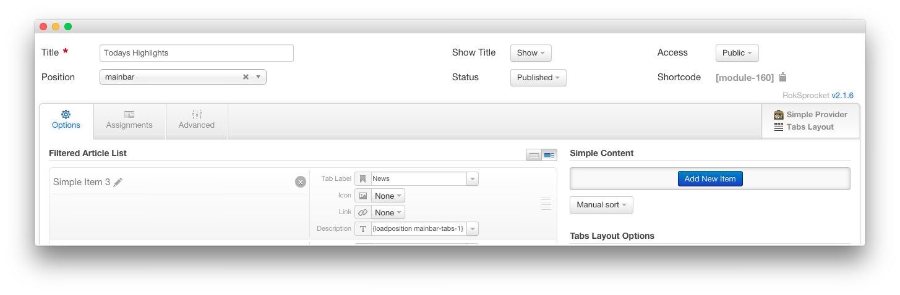

| Option           | Setting             |
| :-----           | :-----              |
| Title            | `Todays Highlights` |
| Show Title       | Show                |
| Access           | Public              |
| Position         | `mainbar`           |
| Status           | Published           |
| Content Provider | Simple              |
| Type             | Tabs                |

#### Filtered Article List

##### Item 1

| Option      | Setting                         |
| :-----      | :-----                          |
| Tab Label   | `News`                          |
| Icon        | None                            |
| Link        | None                            |
| Description | `{loadposition mainbar-tabs-1}` |

##### Item 2

| Option      | Setting                         |
| :-----      | :-----                          |
| Tab Label   | `Games`                         |
| Icon        | None                            |
| Link        | None                            |
| Description | `{loadposition mainbar-tabs-2}` |

##### Item 3

| Option      | Setting                         |
| :-----      | :-----                          |
| Tab Label   | `Articles`                       |
| Icon        | None                            |
| Link        | None                            |
| Description | `{loadposition mainbar-tabs-3}` |

>> NOTE: The description fields for these items load module positions (for example: `mainbar-tabs-1`), which have been assigned **Gantry 5 Particle** modules, each of which contain a single **Tab Image** particle. You will find the details for the **Tab Image** particle assigned to the **Gantry 5 Particle** module, and assigned to the `mainbar-tabs-1` position loaded in the `News` tab in the [Info List (Particle)](#info-list-(particle)) section below.

#### Layout Options

| Option                | Setting               |
| :-----                | :-----                |
| Theme                 | Default               |
| Display Limit         | `∞`                   |
| Tabs Position         | Top                   |
| Animation             | Slide and Fade        |
| Autoplay              | Disable               |
| Autoplay Delay        | `5`                   |
| Image Resize          | Disable               |
| Default Title         | Default Article Title |
| Default Article Text  | Default Article Text  |
| Default Article Image | Default Article Image |
| Default Link          | Default Article Link  |

#### Advanced

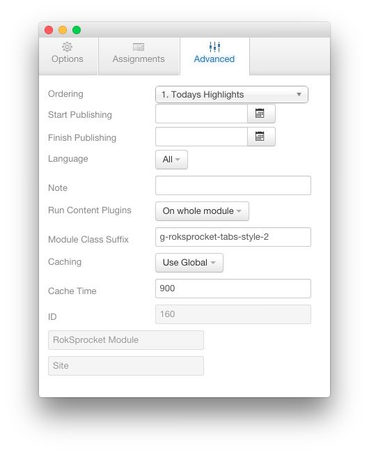

| Option              | Setting                      |
| :-----              | :-----                       |
| Module Class Suffix | `g-roksprocket-tabs-style-2` |

### Gantry 5 Particle (Module)

In this section, we will cover one of the embedded particles that appear in the **RokSprocket** module assigned to the `mainbar` position. This **Gantry 5 Particle** module loads a single **Tab Image** particle.

#### Details

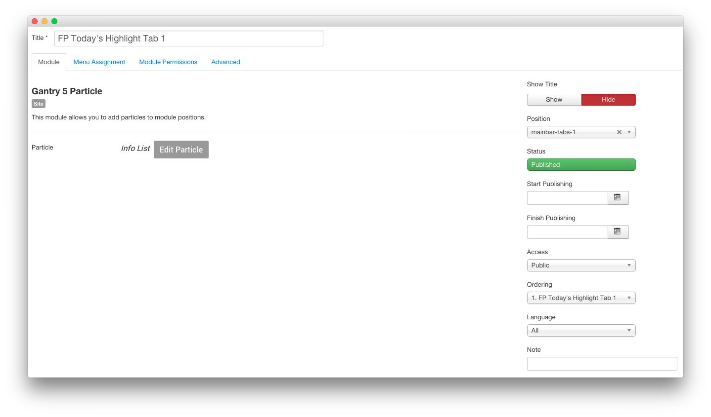

| Option     | Setting                      |
| :-----     | :-----                       |
| Title      | `FP Today's Highlight Tab 1` |
| Show Title | Hide                         |
| Position   | `mainbar-tabs-1`             |
| Particle   | Info List                    |

### Info List (Particle)

#### Particle Settings

| Field         | Setting     |
| :-----        | :-----      |
| Particle Name | `Info List` |
| CSS Classes   | Blank       |
| Title         | None        |
| Intro         | None        |
| Grid Column   | 2 Columns   |

#### Tab Image Example

| Field                           | Setting                                |
| :-----                          | :-----                                 |
| Info List Item 1 Name           | `Six presets with individual settings` |
| Info List Item 1 Image Location | Left                                   |
| Info List Item 1 Text Style     | Bold                                   |
| Info List Item 1 Image Style    | Large                                  |
| Info List Item 1 Description    | `Pre-built styling easily configured`  |
| Info List Item 1 Tag            | `Style`                                |
| Info List Item 1 Sub Tag        | `Presets`                              |
| Info List Item 1 Label          | Blank                                  |
| Info List Item 1 Link           | `#`                                    |
| Info List Item 1 Icon           | Blank                                  |
| Info List Item 1 CSS Classes    | Blank                                  |

## Module Position (mainleft)

There is an important aspect of this module position used in our demo you should be aware of. First, the `mainleft` module position contains a RokSprocket (Tabs) module. This module loads multiple module positions through its simple items' descriptions. These module positions are then used to assign **Gantry 5 Particle** modules which enable you to embed Gantry 5 particles within RokSprocket.

### Particle Settings

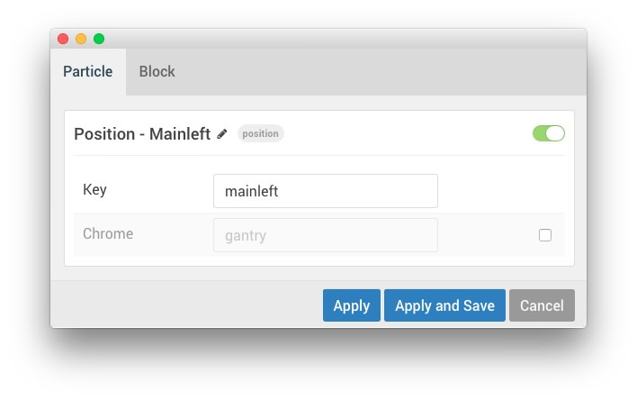

| Field         | Setting               |
| :-----        | :-----                |
| Particle Name | `Position - Mainleft` |
| Key           | `mainleft`            |
| Chrome        | `gantry`              |

### Block Settings

| Field          | Setting           |
| :-----         | :-----            |
| CSS ID         | Blank             |
| CSS Classes    |                   |
| Variations     | No Padding, Box 3 |
| Tag Attributes | Blank             |
| Block Size     | `40%`             |

### Assigned Module(s) - RokSprocket (Headlines)

The `mainleft` module position is host to a single **RokSprocket** module.

We utilized the **Simple** Content Provider, linking each item in the RokSprocket module to an article. You can find examples of the **Simple** items used in this module in the **Filtered Article List** section below.

#### Details

| Option           | Setting                             |
| :-----           | :-----                              |
| Title            | `FP RokSprocket Headlines Mainleft` |
| Show Title       | hide                                |
| Access           | Public                              |
| Position         | `mainleft`                          |
| Status           | Published                           |
| Content Provider | Simple                              |
| Type             | Headlines                           |

#### Filtered Article List

##### Item 1

| Option      | Setting                               |
| :-----      | :-----                                |
| Image       | None                                  |
| Link        | None                                  |
| Description | `{loadposition mainleft-headlines-1}` |

##### Item 2

| Option      | Setting                               |
| :-----      | :-----                                |
| Image       | None                                  |
| Link        | None                                  |
| Description | `{loadposition mainleft-headlines-2}` |

##### Item 3

| Option      | Setting                               |
| :-----      | :-----                                |
| Image       | None                                  |
| Link        | None                                  |
| Description | `{loadposition mainleft-headlines-3}` |

>> NOTE: The description fields for these items load module positions (for example: `mainleft-headlines-1`), which have been assigned **Gantry 5 Particle** modules, each of which contain a single **Tab Image** particle. You will find the details for the **Tab Image** particle assigned to the **Gantry 5 Particle** module, and assigned to the `mainleft-headlines-1` position loaded in the `News` tab in the [Info List (Particle)](#info-list-(particle)-2) section below.

#### Layout Options

| Option                | Setting               |
| :-----                | :-----                |
| Theme                 | Default               |
| Display Limit         | `2`                   |
| Label Text            | `Side Notes`          |
| Preview Length        | `∞`                   |
| Strip HTML Tags       | No                    |
| Arrow Navigation      | Show                  |
| Animation             | Fade                  |
| Autoplay              | Disable               |
| Autoplay Delay        | `5`                   |
| Image Resize          | Disable               |
| Default Title         | Default Article Title |
| Default Article Text  | Default Article Text  |
| Default Article Image | Default Article Image |
| Default Link          | Default Article Link  |

#### Advanced

| Option              | Setting                           |
| :-----              | :-----                            |
| Module Class Suffix | `g-roksprocket-headlines-style-2` |

### Gantry 5 Particle (Module) 2

In this section, we will cover one of the embedded particles that appear in the **RokSprocket** module assigned to the `mainleft` position. This **Gantry 5 Particle** module loads a single **Tab Image** particle.

#### Details

| Option     | Setting                   |
| :-----     | :-----                    |
| Title      | `FP Mainleft Headlines 1` |
| Show Title | Hide                      |
| Position   | `mainleft-headlines-1`    |
| Particle   | Info List                 |

### Info List (Particle) 2

#### Particle Settings

| Field         | Setting     |
| :-----        | :-----      |
| Particle Name | `Info List` |
| CSS Classes   | Blank       |
| Title         | None        |
| Grid Column   | 1 Column    |

**Intro**
~~~ .html
Gantry benefits from an extensive, and ever expanding, catalog of online and free documentation covering basic to more advanced topics.
~~~

#### Tab Image Example

| Field                           | Setting                                    |
| :-----                          | :-----                                     |
| Info List Item 1 Name           | `Gantry 5 is packed full of rich features` |
| Info List Item 1 Image Location | Left                                       |
| Info List Item 1 Text Style     | Compact                                    |
| Info List Item 1 Image Style    | Compact                                    |
| Info List Item 1 Description    | Blank                                      |
| Info List Item 1 Tag            | Blank                                      |
| Info List Item 1 Sub Tag        | Blank                                      |
| Info List Item 1 Label          | Blank                                      |
| Info List Item 1 Link           | `#`                                        |
| Info List Item 1 Icon           | Blank                                      |
| Info List Item 1 CSS Classes    | Blank                                      |

## Module Position (mainright)

There is an important aspect of this module position used in our demo you should be aware of. First, the `mainright` module position contains a RokSprocket (Tabs) module. This module loads multiple module positions through its simple items' descriptions. These module positions are then used to assign **Gantry 5 Particle** modules which enable you to embed Gantry 5 particles within RokSprocket.

### Particle Settings

| Field         | Setting              |
| :-----        | :-----               |
| Particle Name | `Position - Mainbar` |
| Key           | `mainright`            |
| Chrome        | `gantry`             |

### Block Settings

| Field          | Setting            |
| :-----         | :-----             |
| CSS ID         | Blank              |
| CSS Classes    | `fp-mainright-tab` |
| Variations     | No Padding         |
| Tag Attributes | Blank              |
| Block Size     | `60%`              |

### Assigned Module(s) - RokSprocket (Tabs) 2

The `mainright` module position is host to a single **RokSprocket** module.

We utilized the **Simple** Content Provider, linking each item in the RokSprocket module to an article. You can find examples of the **Simple** items used in this module in the **Filtered Article List** section below.

#### Details

| Option           | Setting                         |
| :-----           | :-----                          |
| Title            | `FP RokSprocket Tabs Mainright` |
| Show Title       | Hide                            |
| Access           | Public                          |
| Position         | `mainright`                     |
| Status           | Published                       |
| Content Provider | Simple                          |
| Type             | Tabs                            |

#### Filtered Article List

##### Item 1

| Option      | Setting                           |
| :-----      | :-----                            |
| Tab Label   | `Promoted News`                   |
| Icon        | None                              |
| Link        | None                              |
| Description | `{loadposition mainright-tabs-1}` |

##### Item 2

| Option      | Setting                           |
| :-----      | :-----                            |
| Tab Label   | `Other News`                      |
| Icon        | None                              |
| Link        | None                              |
| Description | `{loadposition mainright-tabs-2}` |

##### Item 3

| Option      | Setting                           |
| :-----      | :-----                            |
| Tab Label   | `Rumors`                          |
| Icon        | None                              |
| Link        | None                              |
| Description | `{loadposition mainright-tabs-3}` |

>> NOTE: The description fields for these items load module positions (for example: `mainright-tabs-1`), which have been assigned **Gantry 5 Particle** modules, each of which contain a single **Tab Image** particle. You will find the details for the **Tab Image** particle assigned to the **Gantry 5 Particle** module, and assigned to the `mainright-tabs-1` position loaded in the `News` tab in the [Info List (Particle)](#info-list-(particle)-3) section below.

#### Layout Options

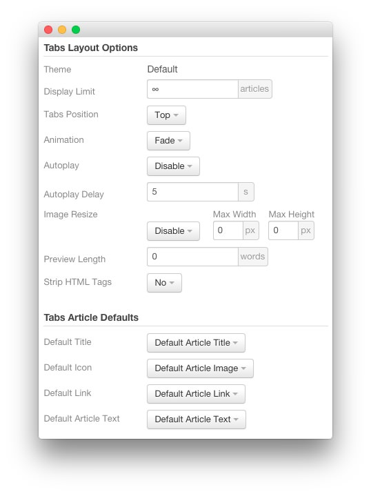

| Option                | Setting               |
| :-----                | :-----                |
| Theme                 | Default               |
| Display Limit         | `∞`                   |
| Tabs Position         | Top                   |
| Animation             | Fade                  |
| Autoplay              | Disable               |
| Autoplay Delay        | `5`                   |
| Image Resize          | Disable               |
| Default Title         | Default Article Title |
| Default Article Text  | Default Article Text  |
| Default Article Image | Default Article Image |
| Default Link          | Default Article Link  |

#### Advanced

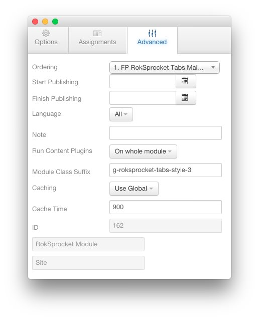

| Option              | Setting                      |
| :-----              | :-----                       |
| Module Class Suffix | `g-roksprocket-tabs-style-3` |

### Gantry 5 Particle (Module) 3

In this section, we will cover one of the embedded particles that appear in the **RokSprocket** module assigned to the `mainright` position. This **Gantry 5 Particle** module loads a single **Tab Image** particle.

#### Details

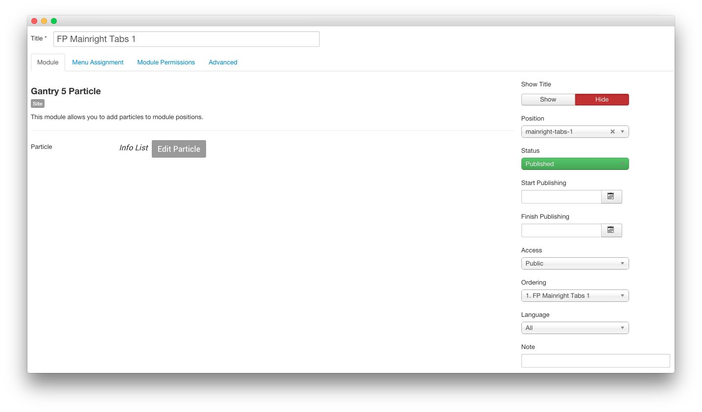

| Option     | Setting               |
| :-----     | :-----                |
| Title      | `FP Mainright Tabs 1` |
| Show Title | Hide                  |
| Position   | `mainright-tabs-1`    |
| Particle   | Info List             |

### Info List (Particle) 3

#### Particle Settings

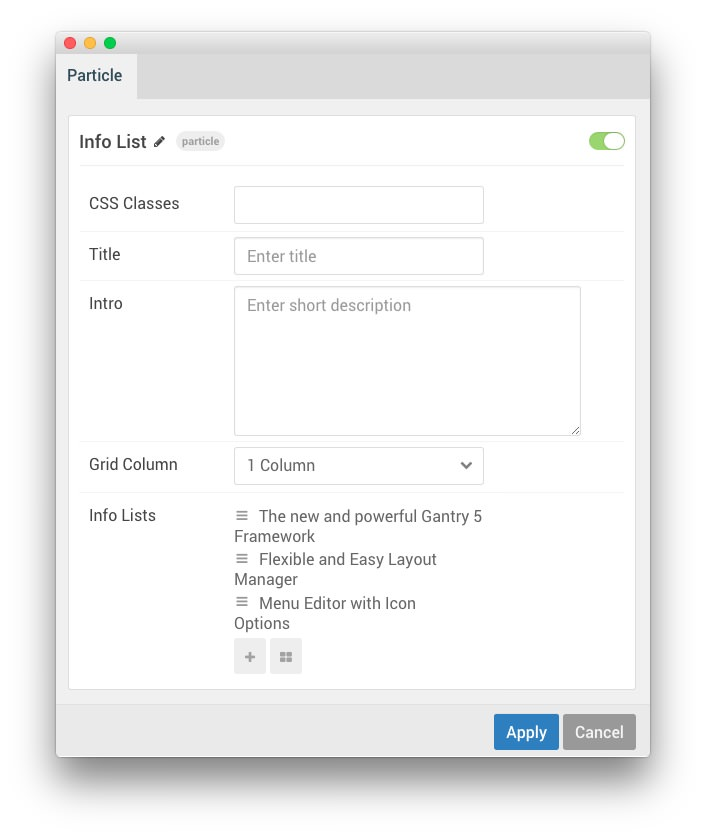

| Field         | Setting     |
| :-----        | :-----      |
| Particle Name | `Info List` |
| CSS Classes   | Blank       |
| Title         | None        |
| Intro         | None        |
| Grid Column   | 1 Column    |

#### Tab Image Example

| Field                           | Setting                                                                                                            |
| :-----                          | :-----                                                                                                             |
| Info List Item 1 Name           | `The new and powerful Gantry 5 Framework`                                                                          |
| Info List Item 1 Image          | Blank                                                                                                              |
| Info List Item 1 Image Location | Left                                                                                                               |
| Info List Item 1 Text Style     | Large                                                                                                              |
| Info List Item 1 Image Style    | Compact                                                                                                            |
| Info List Item 1 Description    | `Gantry 5 is an advanced, versatile and multi-platform template framework, perfectly designed for the modern web.` |
| Info List Item 1 Tag            | Blank                                                                                                              |
| Info List Item 1 Sub Tag        | `Drag and Drop Functionality`                                                                                      |
| Info List Item 1 Label          | Blank                                                                                                              |
| Info List Item 1 Link           | `#`                                                                                                                |
| Info List Item 1 Icon           | Blank                                                                                                              |
| Info List Item 1 CSS Classes    | Blank                                                                                                              |
