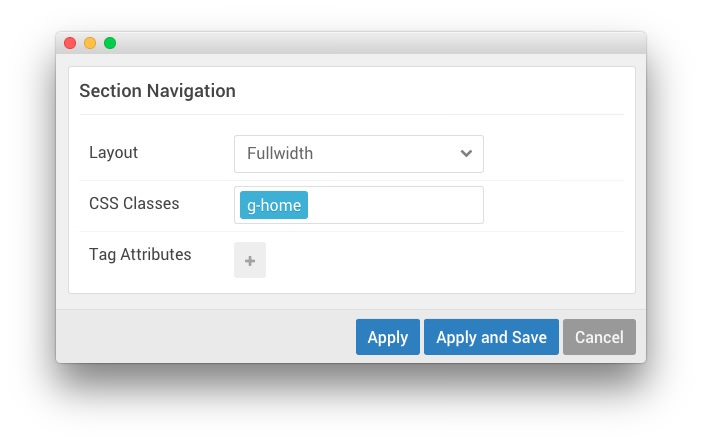

## Introduction

The **Navigation** section hosts the **Menu** particle, which displays the main menu near the top of the page.

## Section Settings

| Option          | Setting   |
| :-----         | :-----    |
| Layout         | Fullwidth |
| CSS Classes    | `g-home`  |
| Tag Attributes | Blank     |

## Menu (Particle)

### Particle Settings

| Option        | Setting          |
| :-----        | :-----           |
| Base Path     | `/`              |
| Menu          | Use Default Menu |
| Start Level   | Blank            |
| Max Levels    | `0`              |
| Mobile Target | Unchecked        |

### Block Settings

| Option          | Setting           |
| :-----         | :-----            |
| CSS ID         | Blank             |
| CSS Classes    | `g-ambrosia-menu` |
| Variations     | Blank             |
| Tag Attributes | Blank             |
| Block Size     | `100%`            |
