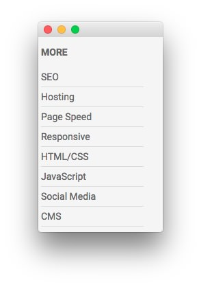
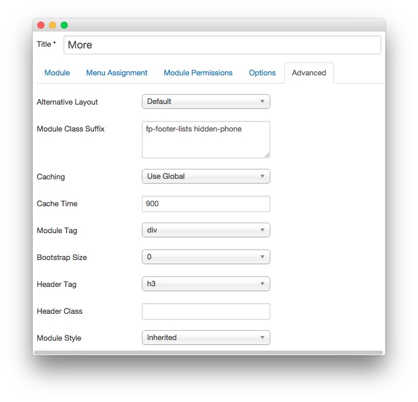

More
-----

This area of the front page is a **Custom HTML** module. You will find the settings used in our demo below.

>> Any **mod_custom** (Custom HTML) modules are best handled using either RokPad or no editor as a WYSIWYG editor can cause issues with any code that exists in the **Custom Output** field.

### Details

| Option     | Setting      |
| :--------- | :----------- |
| Title      | `More`       |
| Show Title | Show         |
| Position   | footer-e     |
| Status     | Published    |
| Access     | Public       |

### Custom Output

Enter the following in the **Custom Output** text editor.

~~~ .html
<ul>
    <li><a href="#">SEO</a></li>
    <li><a href="#">Hosting</a></li>
    <li><a href="#">Page Speed</a></li>
    <li><a href="#">Responsive</a></li>
    <li><a href="#">HTML/CSS</a></li>
    <li><a href="#">JavaScript</a></li>
    <li><a href="#">Social Media</a></li>
    <li><a href="#">CMS</a></li>
</ul>
~~~

### Basic

| Option                    | Setting |
| :------------------------ | :------ |
| Prepare Content           | No      |
| Select a Background Image | Blank   |

### Advanced

| Option              | Setting                           |
| :------------------ | :-------------------------------- |
| Module Class Suffix | `fp-footer-lists hidden-phone`    |
