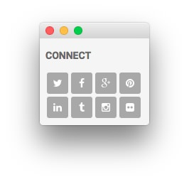
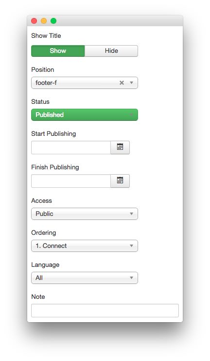
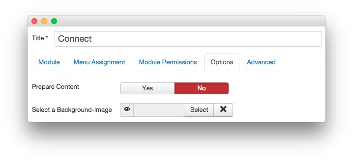
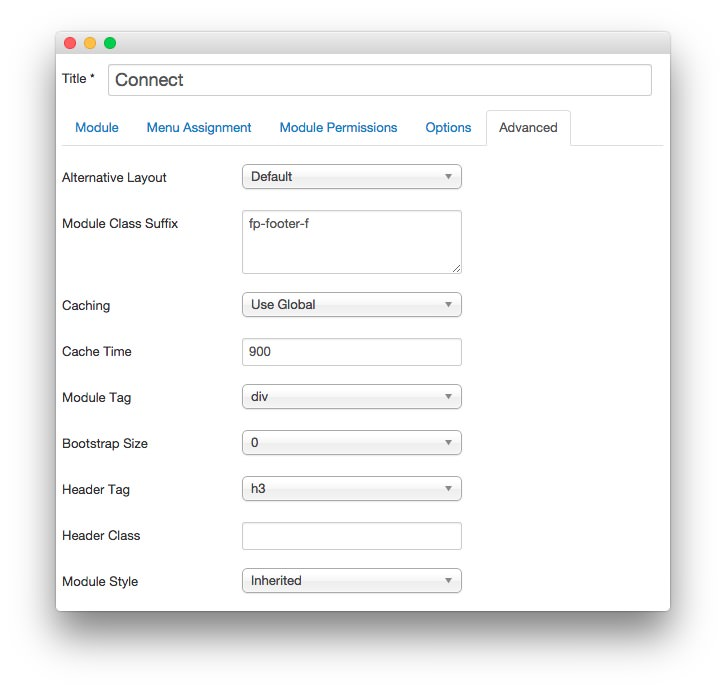

Connect
-----

This area of the front page is a **Custom HTML** module. You will find the settings used in our demo below.

>> Any **mod_custom** (Custom HTML) modules are best handled using either RokPad or no editor as a WYSIWYG editor can cause issues with any code that exists in the **Custom Output** field.

### Details

| Option     | Setting   |
| :-----     | :-----    |
| Title      | `Connect` |
| Show Title | Show      |
| Position   | footer-f  |
| Status     | Published |
| Access     | Public    |

### Custom Output

Enter the following in the **Custom Output** text editor.

~~~ .html

    <a href="#" class="social-button">
        
    </a>        
    <a href="#" class="social-button">
        
    </a>        
    <a href="#" class="social-button">
        
    </a>        
    <a href="#" class="social-button">
        
    </a>
    <a href="#" class="social-button">
        
    </a>        
    <a href="#" class="social-button">
        
    </a>        
    <a href="#" class="social-button">
        
    </a>        
    <a href="#" class="social-button">
        
    </a>        
    

~~~

### Basic

| Option                    | Setting |
| :-----                    | :-----  |
| Prepare Content           | No      |
| Select a Background Image | Blank   |

### Advanced

| Option              | Setting       |
| :-----              | :-----        |
| Module Class Suffix | `fp-footer-f` |
