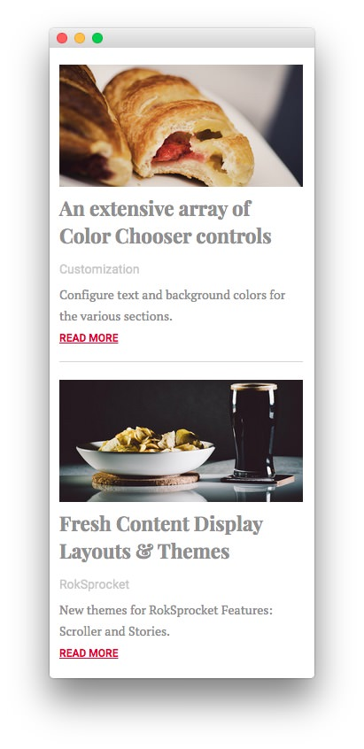
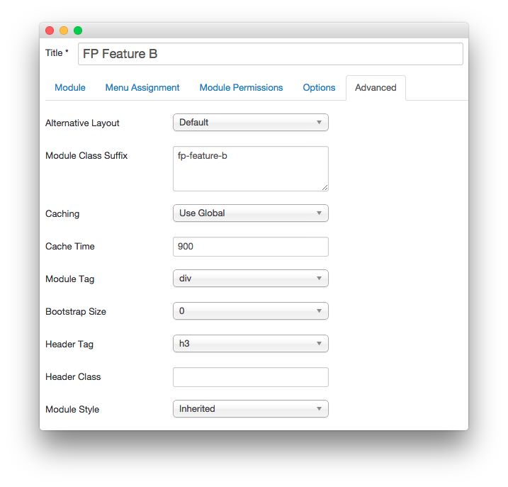

FP Feature B
-----

This area of the page is a **Custom HTML** module. You will find the settings used in our demo below.

>> Any **mod_custom** (Custom HTML) modules are best handled using either RokPad or no editor as a WYSIWYG editor can cause issues with any code that exists in the **Custom Output** field.

### Details

| Option      | Setting        |
| :---------- | :----------    |
| Title       | `FP Feature B` |
| Show Title  | Hide           |
| Position    | feature-b      |
| Status      | Published      |
| Access      | Public         |

### Custom Output

Enter the following in the **Custom Output** text editor.

~~~ .html

    
    <h2 class="title">An eExtensive array of Color Chooser controls</h2>
    
Customization

    
Configure text and background colors for the various sections.

    <a href="index.php?option=com_content&amp;view=article&amp;id=1&amp;Itemid=111" class="readon3">Read More</a>

    
    <h2 class="title">Fresh Content Display Layouts &amp; Themes</h2>
    
RokSprocket

    
New themes for RokSprocket Features: Scroller and Stories.

    <a href="index.php?option=com_content&amp;view=article&amp;id=1&amp;Itemid=111" class="readon3">Read More</a>

~~~

### Basic

| Option                    | Setting     |
| :----------               | :---------- |
| Prepare Content           | No          |
| Select a Background Image | Blank       |

### Advanced

| Option              | Setting        |
| :----------         | :----------    |
| Module Class Suffix | `fp-feature-b` |