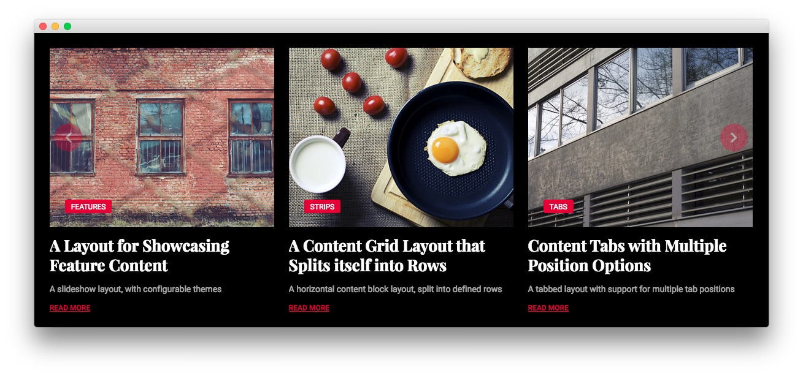
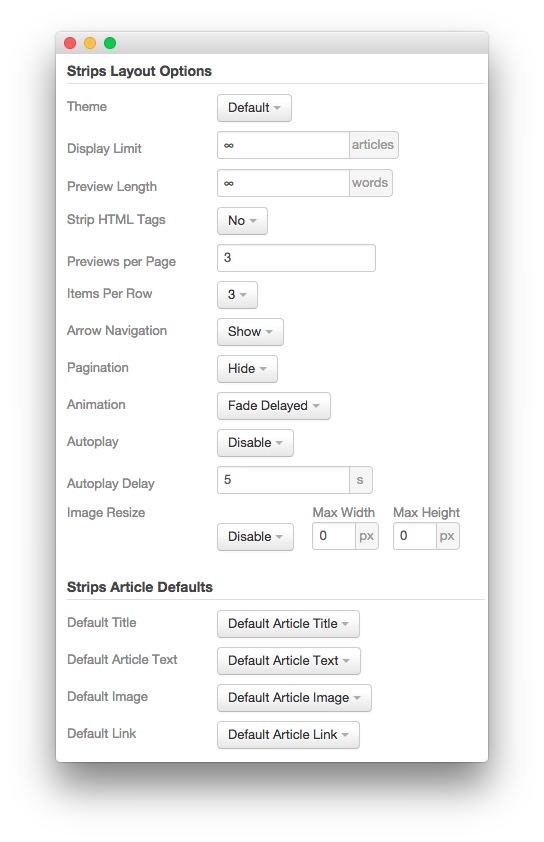

FP RokSprocket Strips
-----

We used a **RokSprocket** module with the **Strips** layout to make up this area of the front page. You will find the settings used in our demo below.

We utilized the **Simple** Content Provider, linking each item in the RokSprocket module to an article. You can find examples of the **Simple** items used in this module in the **Filtered Article List** section below.

### Details

| Option           | Setting                 |
| :----------      | :----------             |
| Title            | `FP RokSprocket Strips` |
| Show Title       | Hide                    |
| Access           | Public                  |
| Position         | extension-a             |
| Status           | Published               |
| Content Provider | Simple                  |
| Type             | Strips                  |

### Filtered Article List

#### Article 1

| Option      | Setting                                                                                           |
| :-----      | :------                                                                                           |
| Title       | `FeaturesA Layout for Showcasing Feature Content` |
| Image       | Custom                                                                                            |
| Link        | Custom                                                                                            |
| Description | `A slideshow layout, with configurable themes`                                                    |

#### Article 2

| Option      | Setting                                                                                                    |
| :-----      | :------                                                                                                    |
| Title       | `StripsA Content Grid Layout that Splits itself into Rows` |
| Image       | Custom                                                                                                     |
| Link        | Custom                                                                                                     |
| Description | `A horizontal content block layout, split into defined rows`                                               |

#### Article 3

| Option      | Setting                                                                                           |
| :-----      | :------                                                                                           |
| Title       | `TabsContent Tabs with Multiple Position Options` |
| Image       | Custom                                                                                            |
| Link        | Custom                                                                                            |
| Description | `A tabbed layout with support for multiple tab positions`                                         |

### Layout Options

| Option            | Setting      |
| :----------       | :----------  |
| Theme             | Default      |
| Display Limit     | ∞            |
| Preview Length    | ∞            |
| Strip HTML Tags   | No           |
| Previews Per Page | `3`          |
| Items Per Row     | 3            |
| Arrow Navigation  | Show         |
| Pagination        | Hide         |
| Animation         | Fade Delayed |
| Autoplay          | Disable      |
| Autoplay Delay    | 5            |
| Image Resize      | Disable      |

### Advanced

| Option              | Setting                           |
| :----------         | :----------                       |
| Module Class Suffix | `fp-roksprocket-strips-extension` |
