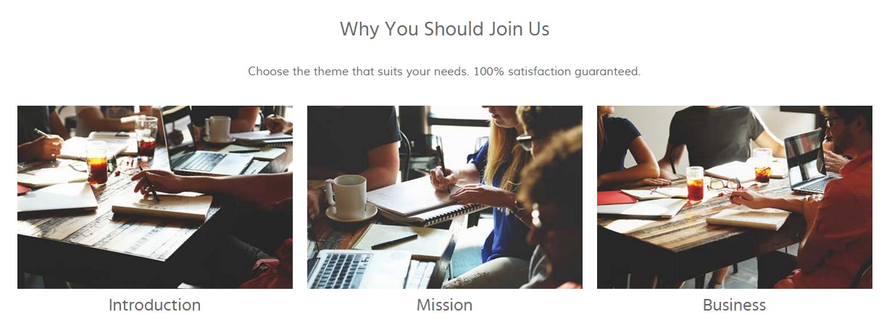

# Introduction

The **About Us** example page demonstrates how you can create a beautiful page with the Galatea template. Here is some information to help you replicate this page as it appears in the demo.

# Modules and Particles

Below is a brief rundown of the modules and particles used to make up the demo page.

:   1. **Slideshow** Own Carousel (particle) [7%, 40%, se]
    2. **Header** Mosaic Grid (particle) [20%, 7%, se]
    3. **Utility** Grid Statistic (particle) [38%, 7%, se]
    4. **Feature** Image Grid (particle) [45%, 7%, se]
    5. **Mainbar** Block Content (particle) [64%, 25%, se]
    6. **Extension** Block Content (particle) [80%, 8%, se]

* [Slideshow](#slideshow-section)
* [Header](#header-section)
* [Utility](#utility-section)
* [Feature](#feature-section)
* [Mainbar](#mainbar-section)
* [Extension](#extension-section)

# Slideshow Section

This area of the page is an **Owl Carousel** particle. You will find the settings used in our demo below.

## Section Settings

| Field          | Setting                     |
| :-----         | :-----                      |
| Layout         | Fullwidth (Flushed Content) |
| CSS Classes    | Blank                       |
| Tag Attributes | Blank                       |

## Particle Settings

| Option                  | Setting                                                             |
| :-----                  | :-----                                                              |
| Particle Name           | `Owl Carousel`                                                      |
| CSS Classes             | `center-block`                                                      |
| Title                   | Blank                                                               |
| Width                   | Compact                                                             |
| Out Animation           | fadeOut                                                             |
| In Animation            | fadeIn                                                              |
| Prev / Next             | Enable                                                              |
| Prev Text               | `&larr;`                                                            |
| Next Text               | `&larr;`                                                            |
| Dots                    | Disable                                                             |
| Loop                    | Enable                                                              |
| Autoplay                | Disable                                                             |
| Autoplay Speed          | `5000`                                                              |
| Pause on Hoven          | Enable                                                              |
| Footer Shadow           | Enable                                                              |
| Footer Shadow Color     | `#20232a`                                                           |
| Item 1 Name             | `Slide 1`                                                           |
| Item 1 Background Image | `gantry-media://rocketlauncher/pages/about-us/slideshow/img-01.jpg` |
| Item 1 Title            | `Owl Carousel Slideshow`                                            |
| Item 1 Description      |                                                                     |
| Item 1 Link             | `#`                                                                 |
| Item 1 Link Text        | `Get Started`                                                       |
| Item 1 Target           | Self                                                                |
| Item 1 Button Class     | `button-2`                                                          |

## Block Settings

| Option         | Setting   |
| :-----         | :-----    |
| CSS ID         | Blank     |
| CSS Classes    | Blank     |
| Variations     | Blank     |
| Tag Attributes | Blank     |
| Fixed Size     | Unchecked |
| Block Size     | `100%`    |

# Header Section

This area of the page is an **Mosaic Grid** particle. You will find the settings used in our demo below.

## Section Settings

| Field          | Setting                   |
| :-----         | :-----                    |
| Layout         | Fullwidth (Boxed Content) |
| CSS Classes    | Blank                     |
| Tag Attributes | Blank                     |

## Particle Settings

| Option                      | Setting                                                                                   |
| :-----                      | :-----                                                                                    |
| Particle Name               | `Mosaic Grid`                                                                             |
| CSS Classes                 | `nopadding` `nomargin`                                                                    |
| Title                       | Blank                                                                                     |
| Grid Columns                | 4 Columns                                                                                 |
| Item 1 Name                 | `Sam`                                                                                     |
| Item 1 Style                | Style 1                                                                                   |
| Item 1 Image                | Custom                                                                                    |
| Item 1 Title Label          | `Sam`                                                                                     |
| Item 1 Title Link           | `index.php/pages/portfolio`                                                               |
| Item 1 Title Link Target    | Self                                                                                      |
| Item 1 Description          | `A great valuable team member who is very creative, successful and loved by our clients.` |
| Item 1 Animations           | `g-mosaicgrid-zoom`                                                                       |
| Item 1 Button Label         | Blank                                                                                     |
| Item 1 Button Link          | Blank                                                                                     |
| Item 1 Button Link Target   | Self                                                                                      |
| Item 1 Button Classes       | Blank                                                                                     |
| Item 1 Tag                  | `Layout`                                                                                  |
| Item 1 Tag Icon 1 Name      | `Tag 1`                                                                                   |
| Item 1 Tag Icon 1 Icon      | `fa fa-heart-o fa-fw`                                                                     |
| Item 1 Tag Icon 1 Icon Text | `Stylish`                                                                                 |

## Block Settings

| Option         | Setting   |
| :-----         | :-----    |
| CSS ID         | Blank     |
| CSS Classes    | Blank     |
| Variations     | Blank     |
| Tag Attributes | Blank     |
| Fixed Size     | Unchecked |
| Block Size     | `100%`    |

# Utility Section

This area of the page is an **Grid Statistic** particle. You will find the settings used in our demo below.

## Section Settings

| Field          | Setting                   |
| :-----         | :-----                    |
| Layout         | Fullwidth (Boxed Content) |
| CSS Classes    | Blank                     |
| Tag Attributes | Blank                     |

## Particle Settings

| Option                  | Setting            |
| :-----                  | :-----             |
| Particle Name           | `Grid Statistic`   |
| CSS Classes             | `center`           |
| Title                   | Blank              |
| Description             | Blank              |
| Readmore Text           | Blank              |
| Readmore Link           | Blank              |
| Readmore Style          | Button 3           |
| Footer Description      | `Aliquam ante augue, iaculis eget fringilla vel, gravida non nibh. Nullam dignissim, felis eu imperdiet feugiat, libero ipsum gravida arcu, eu fermentum elit metus vel mauris. In sed nunc tincidunt, faucibus quam vel, finibus arcu. Proin nec euismod nisi, id tristique augue. Nam in erat est.`                   |
| Grid Column             | 4 Columns          |
| Item 1 Name             | `Item 1`           |
| Item 1 Statistic Number | `25`               |
| Item 1 Statistic Text   | `Years Experience` |

## Block Settings

| Option         | Setting   |
| :-----         | :-----    |
| CSS ID         | Blank     |
| CSS Classes    | Blank     |
| Variations     | Blank     |
| Tag Attributes | Blank     |
| Fixed Size     | Unchecked |
| Block Size     | `100%`    |

# Feature Section

This area of the page is an **Image Grid** particle. You will find the settings used in our demo below.

## Section Settings

| Field          | Setting                   |
| :-----         | :-----                    |
| Layout         | Fullwidth (Boxed Content) |
| CSS Classes    | Blank                     |
| Tag Attributes | Blank                     |

## Particle Settings

| Option             | Setting                                                           |
| :-----             | :-----                                                            |
| Particle Name      | `Image Grid`                                                      |
| CSS Classes        | Blank                                                             |
| Title              | Blank                                                             |
| Description        | Blank                                                             |
| Grid Column        | 4 Columns                                                         |
| Album Name         | `clients`                                                         |
| Item 1 Name        | `Image 1`                                                         |
| Item 1 Promo Image | `gantry-media://rocketlauncher/pages/about-us/feature/img-01.jpg` |
| Item 1 Caption     | `Image 1`                                                         |

## Block Settings

| Option         | Setting   |
| :-----         | :-----    |
| CSS ID         | Blank     |
| CSS Classes    | Blank     |
| Variations     | Blank     |
| Tag Attributes | Blank     |
| Fixed Size     | Unchecked |
| Block Size     | `100%`    |

# Mainbar Section

This area of the page is an **Block Content** particle. You will find the settings used in our demo below.

## Section Settings

| Field          | Setting                   |
| :-----         | :-----                    |
| Layout         | Fullwidth (Boxed Content) |
| CSS Classes    | Blank                     |
| Tag Attributes | Blank                     |

## Particle Settings

| Option                | Setting                                                                 |
| :-----                | :-----                                                                  |
| Particle Name         | `Block Content`                                                         |
| CSS Classes           | `center`                                                                |
| Title                 | Blank                                                                   |
| Icon                  | Blank                                                                   |
| Image                 | Blank                                                                   |
| Headline              | `Why You Should Join Us`                                                |
| Description           | `Choose the theme that suits your needs. 100% satisfaction guaranteed.` |
| Button Label          | Blank                                                                   |
| Button Link           | Blank                                                                   |
| Button Classes        | Blank                                                                   |
| Target                | Self                                                                    |
| Item 1 Name           | `Introduction`                                                          |
| Item 1 Title          | `Introdocution`                                                         |
| Item 1 Icon           | Blank                                                                   |
| Item 1 Image          | Custom                                                                  |
| Item 1 RokBo Image    | Blank                                                                   |
| Item 1 Caption        | Blank                                                                   |
| Item 1 Subtitle       | Blank                                                                   |
| Item 1 Description    | Blank                                                                   |
| Item 1 CSS Classes    | `nopaddingall`                                                          |
| Item 1 Button Label   | Blank                                                                   |
| Item 1 Button Link    | Blank                                                                   |
| Item 1 Button Classes | Blank                                                                   |
| Item 1 Target         | Self                                                                    |

## Block Settings

| Option         | Setting   |
| :-----         | :-----    |
| CSS ID         | Blank     |
| CSS Classes    | Blank     |
| Variations     | Blank     |
| Tag Attributes | Blank     |
| Fixed Size     | Unchecked |
| Block Size     | `100%`    |

# Extension Section

This area of the page is an **Block Content** particle. You will find the settings used in our demo below.

## Section Settings

| Field          | Setting                   |
| :-----         | :-----                    |
| Layout         | Fullwidth (Boxed Content) |
| CSS Classes    | Blank                     |
| Tag Attributes | Blank                     |

## Particle Settings

| Option                | Setting                                                                                    |
| :-----                | :-----                                                                                     |
| Particle Name         | `Block Content`                                                                            |
| CSS Classes           | `title-center`                                                                             |
| Title                 | `We are a very creative team`                                                              |
| Image                 | Blank                                                                                      |
| Headline              | Blank                                                                                      |
| Description           | `
We love what we do and you will love it too, that's a promise.
` |
| Button Label          | Blank                                                                                      |
| Button Link           | Blank                                                                                      |
| Button Classes        | Blank                                                                                      |
| Target                | Self                                                                                       |
| Item 1 Name           | `Sophisticated`                                                                            |
| Item 1 Title          | `Sophisticated`                                                                            |
| Item 1 Icon           | `fa fa-align-right`                                                                        |
| Item 1 Image          | Custom                                                                                     |
| Item 1 RokBo Image    | Blank                                                                                      |
| Item 1 Caption        | Blank                                                                                      |
| Item 1 Subtitle       | Blank                                                                                      |
| Item 1 Description    | `Dynamically procrastinate B2C users after installed base benefits.`                       |
| Item 1 CSS Classes    | `box4` `title4`                                                                            |
| Item 1 Button Label   | Blank                                                                                      |
| Item 1 Button Link    | Blank                                                                                      |
| Item 1 Button Classes | Blank                                                                                      |
| Item 1 Target         | Self                                                                                       |

## Block Settings

| Option         | Setting   |
| :-----         | :-----    |
| CSS ID         | Blank     |
| CSS Classes    | Blank     |
| Variations     | Blank     |
| Tag Attributes | Blank     |
| Fixed Size     | Unchecked |
| Block Size     | `100%`    |