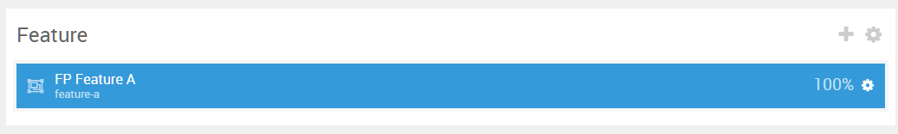
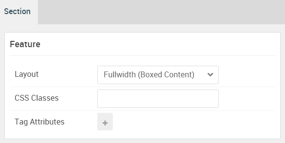

## Introduction

The **Feature** section includes two particles: **Pricing Table** and **Block Content**. These particles are placed within the **Feature A** and **Feature B** module positions.

Here is a breakdown of the module(s) and particle(s) that appear in this section:

* [Pricing Table (particle)](#image-grid-(particle))

## Section Settings

| Option           | Setting                   |
| :--------------- | :----------               |
| Layout           | Fullwidth (Boxed Content) |
| CSS Classes      | Blank                     |
| Tag Attributes   | Blank                     |

## Pricing Table (Particle)

The **Pricing Table** particle is a **Gantry 5 Particle** module placed within the **feature-a** module position. Adding a particle to a module position can be done by creating a **Gantry 5 Particle** module, adding the particle using the settings found in the section below, and assigning it to the position.

### Module Position Particle Settings

#### Particle Settings

| Option        | Setting        |
| :-----        | :-----         |
| Particle Name | `FP Feature A` |
| Key           | `feature-a`    |
| Chrome        | `gantry`       |

#### Block Settings

| Option         | Setting        |
| :-----         | :-----         |
| CSS ID         | Blank          |
| CSS Classes    | `fp-feature-a` |
| Variations     | Blank          |
| Tag Attributes | Blank          |
| Fixed Size     | Unchecked      |
| Block Size     | `100%`         |

### Pricing Table Particle Settings

#### Particle Settings

| Option                 | Setting                                                                                                                             |
| :-----                 | :-----                                                                                                                              |
| Particle Name          | `Pricing Table`                                                                                                                     |
| CSS Classes            | `center` `g-title-large`                                                                                                            |
| Title                  | `Our Pricing`                                                                                                                       |
| Header Text            | `Lorem ipsum dolor sit amet, consectetur adipiscing elit. Vestibulum nec leo dolor. Proin laoreet neque et nisi mollis consequat. ` |
| Footer Text            | `Any questions about our pricing? <strong>Call us at +1-888-1234-5678</strong>`                                                     |
| Grid Columns           | 4 Columns                                                                                                                           |
| Item 1 Name            | `Bronze`                                                                                                                            |
| CSS Classes            | Blank                                                                                                                               |
| Ribbon Text            | Blank                                                                                                                               |
| Icon                   | Blank                                                                                                                               |
| Price                  | `Free`                                                                                                                              |
| Period                 | `monthly`                                                                                                                           |
| Description            | `Some short description to explain this awesome plan`                                                                               |
| Button Label           | `Choose`                                                                                                                            |
| Button Link            | `#`                                                                                                                                 |
| Target                 | Self                                                                                                                                |
| Button Classes         | `button-2` `button-grey`                                                                                                            |
| Subitem 1 Name         | `Item 1`                                                                                                                            |
| Subitem 1 Text         | `5 web pages`                                                                                                                       |
| Subitem 1 Item Classes | `g-bold`                                                                                                                            |